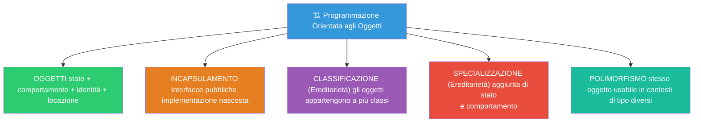
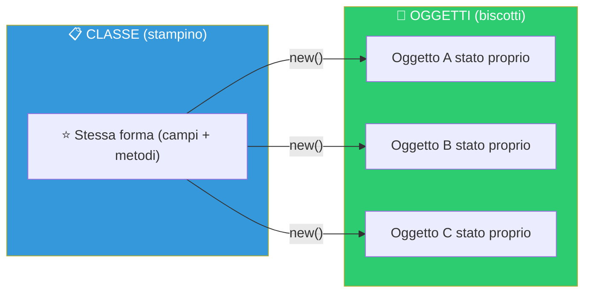
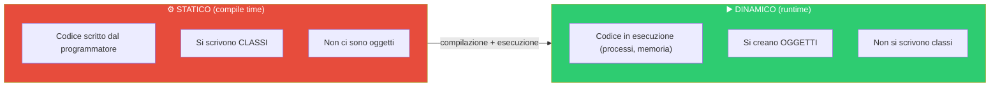
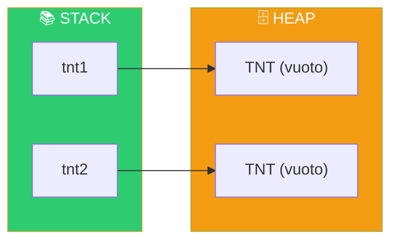
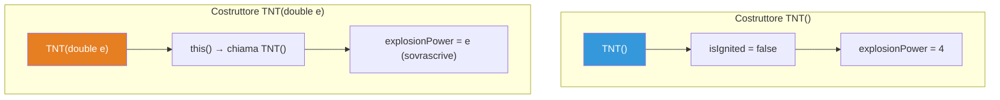
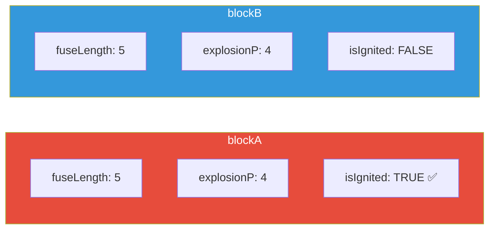
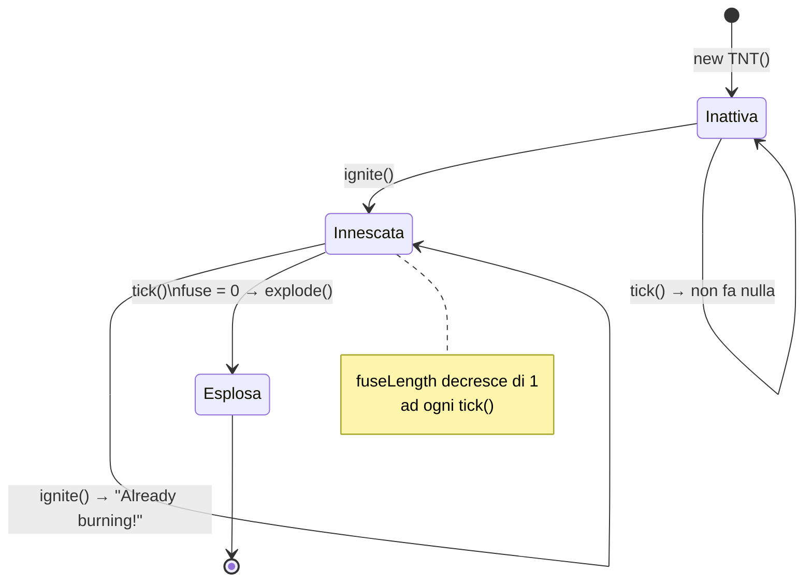
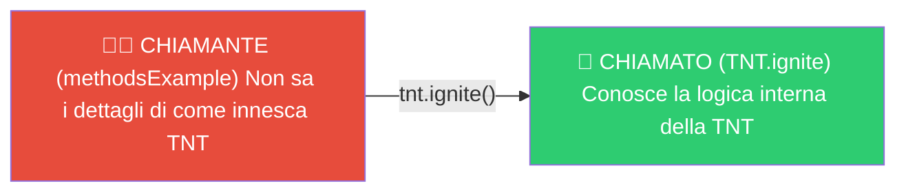
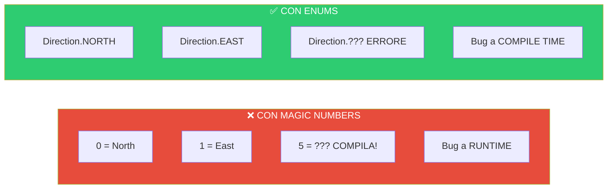
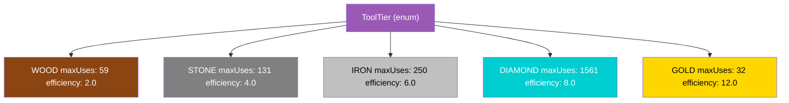

> [!abstract] Panoramica
> **Bloom's Taxonomy:** Remember & Understand
>
> In questa lezione introduciamo i concetti fondamentali della [[Programmazione Orientata agli Oggetti|OOP]]: **[[Classe]]**, **[[Oggetti]]**, **[[Campo]]**, **[[Costruttore]]**, **[[Metodo]]** e **[[Enum]]**. Usiamo il dominio di Minecraft per illustrare ogni concetto con esempi concreti.


---

## Indice

- [[#Motivazione — Programming in the Large]]
- [[#Concetti Chiave dell'OOP]]
- [[#Terminologia OOP]]
- [[#Esempio: Minecraft come dominio]]
- [[#Classi e Oggetti]]
  - [[#Aspetto Statico vs Dinamico]]
  - [[#La classe TNT v1 — La classe più semplice]]
  - [[#Allocazione di Oggetti con `new`]]
- [[#Campi e Stato]]
  - [[#La classe TNT v2 — Campi e Costruttori]]
  - [[#Costruttori]]
  - [[#La keyword `this`]]
- [[#Metodi e Comportamento]]
  - [[#La classe TNT v3 — Metodi]]
  - [[#Chiamante vs Chiamato]]
- [[#Enums (Enumerazioni)]]
  - [[#La enum `Direction`]]
  - [[#La enum `ToolTier` — Enum con campi e metodi]]
- [[#Concetti Chiave per Collegamenti Obsidian]]

---

## Motivazione — Programming in the Large

Quando programmiamo "in the large" (su scala ampia), non scriviamo un unico file monolitico: creiamo un **progetto** composto da **sotto-parti**. Il codice:

- **Evolve nel tempo** → cambiano le funzionalità
- **Cambia manutentore** → persone diverse ci lavorano
- **Deve massimizzare il riuso** → meno codice duplicato = meno errori

Per studiare i principi OOP usiamo **[[Java]]**, con cenni ad altri linguaggi.

> [!info] Perché Java?
> - È **[[Fortemente tipato]]** (anche se ha dei limiti con gli array)
> - È **modulare** (package, classi, interfacce)
> - Non è il massimo dell'efficienza, ma spesso questo si lascia al [[Compilatore]]

---

## Concetti Chiave dell'OOP



```
╔══════════════════════════════════════════════════════════════╗
║                 I 5 PILASTRI DELL'OOP                        ║
╠══════════════════════════════════════════════════════════════╣
║                                                              ║
║  1. OGGETTI                                                  ║
║     → stato + comportamento + identità + locazione           ║
║                                                              ║
║  2. INCAPSULAMENTO                                           ║
║     → interfacce pubbliche / implementazione nascosta        ║
║                                                              ║
║  3. CLASSIFICAZIONE (Ereditarietà)                           ║
║     → gli oggetti appartengono a più classi                  ║
║                                                              ║
║  4. SPECIALIZZAZIONE (Ereditarietà)                          ║
║     → aggiunta di stato e comportamento                      ║
║                                                              ║
║  5. POLIMORFISMO                                             ║
║     → stesso oggetto usabile in contesti di tipo diversi     ║
║                                                              ║
╚══════════════════════════════════════════════════════════════╝
```

> [!tip] Collegamento tra i pilastri
> - **Incapsulamento** e **Oggetti** si vedono da questa lezione
> - **Classificazione** e **Specializzazione** (ereditarietà) dalla [[Lezione 05 - Ereditarietà, Polimorfismo, Object]]
> - **[[Polimorfismo]]** dalla Lezione 06


---

## Terminologia [[Programmazione Orientata agli Oggetti|OOP]]

> [!info] Glossario fondamentale
> | Termine | Significato |
> |---|---|
> | **[[Classe]]** | Tipo definito dall'utente. Uno "schema" per creare oggetti con stesso comportamento e stessa forma di stato ([[Memory Footprint]]) |
> | **[[Oggetto]]** | Istanza di una classe. Ha un proprio stato che varia da oggetto a oggetto |
> | **[[Metodo]]** | Comportamento definito da una classe, invocabile su un oggetto (con parametri) |
> | **[[Funzione]]** | Funzionalità che **non** si chiama su un oggetto |
> | **[[Campo]] / [[Variabile d'istanza]]** | Parte dello stato di un oggetto |
> | **[[Firma]]** | Tipo di input e di output di un metodo (o di una funzione) |


---

## Esempio: Minecraft come dominio

L'analogia classica per capire Classe vs Oggetto è lo **stampino dei biscotti**:

```
    CLASSE (stampino)              OGGETTI (biscotti)
    ┌─────────────┐          ┌─────┐  ┌─────┐  ┌─────┐
    │  ★ forma ★  │  ──────► │ ★🔴 │  │ ★🔵 │  │ ★🟢 │
    │  (unica)    │          │decA │  │decB │  │decC │
    └─────────────┘          └─────┘  └─────┘  └─────┘
     Stessa forma             Decorazioni diverse!
```



In **Minecraft** il concetto è uguale:
- Tutti i **blocchi** condividono comportamento comune (puoi scavarli)
- Ma ogni blocco è **indipendente**: scavarne uno non tocca gli altri
- Blocchi di **tipo diverso** hanno comportamento diverso (terra ≠ TNT)

> [!note] Dominio del corso
> In questo corso useremo **Minecraft** come progetto per capire tutti i principi OOP: classi, oggetti, incapsulamento, ereditarietà, polimorfismo, eccezioni, collections, JavaFX e design patterns.


---

## Classi e Oggetti

### Aspetto [[Statico]] vs [[Dinamico]]

Il codice ha due aspetti fondamentali:



```
    ┌──────────────────────┐         ┌──────────────────────┐
    │     STATICO          │         │     DINAMICO         │
    │  (compile time)      │         │  (runtime)           │
    ├──────────────────────┤         ├──────────────────────┤
    │ Codice scritto dal   │         │ Codice in esecuzione  │
    │ programmatore        │ ──────► │ (processi, memoria)  │
    │                      │         │                      │
    │ Si scrivono CLASSI   │         │ Si creano OGGETTI    │
    │ Non ci sono oggetti  │         │ Non si scrivono      │ 
    │                      │         │ classi               │  
    └──────────────────────┘         └──────────────────────┘
```

> [!tip] Regola Fondamentale
> Il programmatore scrive **classi** (statico), a runtime queste vengono **istanziate** in oggetti (dinamico).


---

### Struttura del file principale — `Lecture2.java`

> [!note] Dipendenze
> Il file principale importa classi dagli stessi package del progetto. I [[Package]] saranno approfonditi nella [[Lezione 03 - Package, Visibilità, Final, Static|Lezione 03]].

```java
// Siamo dentro al package "lecture02": una struttura organizzativa del progetto.
// Per ora, pensate ai package come un modo per fare ordine in un grande progetto.
package lecture02;

// Le righe di import rendono visibili classi da altri package.
// Ne parleremo insieme ai package nella Lezione 03.
import lecture02.v_enums.Direction;
import lecture02.v_enums.ToolTier;
import lecture02.v1.TNT;

// Tutto in Java è una classe — non esistono metodi "scollegati" da una classe.
// Per questo dichiariamo la classe Lecture2.
public class Lecture2 {

    // "main" è un nome speciale: Java sa che l'esecuzione può iniziare da qui.
    // Quando parte, il Runtime di Java crea un processo che inizia da questo metodo.
    // Ci possono essere più metodi main in uno stesso progetto.
    // Firma di main: String[] -> void (prende un array di String, non ritorna nulla)
    // Per ora ignoriamo le keyword "public" e "static".
    public static void main(String[] args) {
        System.out.println("---------------- Classi ----------------");
        classExample();
        System.out.println("---------------- Campi ----------------");
        fieldsExample();
        System.out.println("---------------- Costruttori ----------------");
        constructorsExample();
        System.out.println("---------------- Metodi ----------------");
        methodsExample();
        System.out.println("---------------- Enums ----------------");
        enumExample();
        richEnumExample();
    }
```


---

### La classe TNT v1 — La classe più semplice

Java conosce una serie di **[tipi primitivi](https://docs.oracle.com/javase/tutorial/java/nutsandbolts/datatypes.html)** (`int`, `boolean`, `char`, `double`) e tipi dalla libreria di base (`String`, `Date`). Ma in ogni progetto dobbiamo **modellare un dominio specifico** — nel nostro caso, Minecraft.

Definiamo quindi un nuovo tipo: `TNT`.

```java
package lecture02.v1;

// Definendo questa classe, aggiungiamo un NUOVO TIPO al programma: il tipo "TNT".
// Sarà diverso da Zombie, Cobblestone, String, int, ecc.
// Questa è la versione più semplice possibile: una classe VUOTA.
public class TNT {
}
```

> [!info] Classe vuota
> Anche una classe vuota è un tipo valido! Possiamo istanziarla con `new`. Il compilatore genera automaticamente un [[Costruttore di default]].


---

### Allocazione di [[Oggetti]] con `new`

```java
    // La keyword "new" crea un nuovo OGGETTO di tipo TNT e lo salva nella
    // variabile locale "tnt1". Il tipo "TNT" all'inizio definisce il tipo della variabile.
    private static void classExample() {
        TNT tnt1 = new TNT();
        System.out.println("My first block: " + tnt1);

        // Possono esistere PIÙ ISTANZE della stessa classe,
        // cioè più oggetti di quel tipo, ciascuno indipendente.
        TNT tnt2 = new TNT();
    }
```



```
  Memoria dopo classExample():

  Stack                          Heap
  ┌──────────┐            ┌──────────────┐
  │ tnt1 ───────────────► │  TNT (vuoto) │
  ├──────────┤            └──────────────┘
  │ tnt2 ───────────────► ┌──────────────┐
  └──────────┘            │  TNT (vuoto) │
                          └──────────────┘
  Due oggetti diversi in aree di memoria diverse!
```

> [!warning] Attenzione
> Ogni `new` crea un oggetto **separato** nell'[[heap]]. Anche se la classe è la stessa, `tnt1` e `tnt2` sono **indipendenti**.


---

## Campi e Stato

Col termine **stato** identifichiamo i **dati contenuti dentro un oggetto**.

> [!info] Regole sui campi
> - Per permettere agli oggetti di avere uno stato, la loro **classe** deve avere dei **campi**
> - Ogni oggetto ha la **propria copia** dei campi dichiarati nella classe
> - Modificare i campi di un oggetto **non** modifica altri oggetti (occupano aree di memoria diverse)


---

### La classe TNT v2 — Campi e Costruttori

```java
package lecture02.v2;

public class TNT {
    // Ogni campo ha: modificatore di visibilità + tipo + nome
    // Per ora usiamo "public" (visibile a tutti)
    public int fuseLength = 5;        // Lunghezza del fuso (valore di default: 5)
    public double explosionPower;     // Potenza dell'esplosione
    public boolean isIgnited;         // La TNT è stata innescata?

    // ═══════════════════ COSTRUTTORI ═══════════════════
    // I costruttori sono metodi speciali per INIZIALIZZARE i campi di un oggetto.
    // Si riconoscono perché:
    //   1. Hanno lo STESSO NOME della classe
    //   2. NON hanno tipo di ritorno (ritornano implicitamente un'istanza della classe)
    //
    // Ogni classe può avere QUANTI COSTRUTTORI VUOLE, purché con firma diversa.

    // Costruttore 1: senza parametri — inizializza i campi a valori predefiniti
    public TNT() {
        this.isIgnited = false;
        this.explosionPower = 4;
    }

    // Costruttore 2: con un parametro — richiama il primo con this() e poi
    // sovrascrive explosionPower col valore passato
    public TNT(double e){
        this();                    // Chiama il costruttore senza parametri (sopra)
        this.explosionPower = e;   // Poi sovrascrive il valore di explosionPower
    }
}
```

> [!tip] Valori di default dei tipi primitivi
> In assenza di costruttori, il compilatore crea un **costruttore di default** (senza parametri) che inizializza ogni campo al suo [valore di default](https://docs.oracle.com/javase/tutorial/java/nutsandbolts/datatypes.html):
> - `int` → `0`
> - `boolean` → `false`
> - `double` → `0.0`
> - Oggetti e array → `null` (assenza di un valore vero e proprio)




---

### Esempio: utilizzo dei campi

```java
    // Crea due blocchi, modifica lo stato di uno solo, e ne stampa i valori.
    // Questo dimostra che ogni oggetto ha la propria copia dei campi.
    public static void fieldsExample() {
        lecture02.v2.TNT blockA = new lecture02.v2.TNT();
        lecture02.v2.TNT blockB = new lecture02.v2.TNT();
        System.out.println("Igniting Block A...");
        blockA.isIgnited = true;
        // blockA è innescato, blockB NO — sono oggetti indipendenti!
        System.out.println("Block A Ignited?" + blockA.isIgnited);  // true
        System.out.println("Block B Ignited?" + blockB.isIgnited);  // false
    }
```

> [!question] 📱 Quiz del Prof
> Cosa viene stampato da `fieldsExample()`?

> [!success] Risposta
> `Block A Ignited? true`, `Block B Ignited? false`
> Ogni oggetto ha la **propria copia** dei campi → modificare `blockA` non tocca `blockB`.



```
  blockA                    blockB
  ┌────────────────┐        ┌────────────────┐
  │ fuseLength: 5  │        │ fuseLength: 5  │
  │ explosionP: 4  │        │ explosionP: 4  │
  │ isIgnited: TRUE│        │ isIgnited:FALSE│  ← indipendenti!
  └────────────────┘        └────────────────┘
```


---

### Esempio: utilizzo dei costruttori

```java
    private static void constructorsExample(){
        // Costruttore base (senza parametri) → valori di default
        lecture02.v2.TNT blockA = new lecture02.v2.TNT();
        lecture02.v2.TNT blockB = new lecture02.v2.TNT();
        System.out.println("blockA e blockB: " +
                "" +blockA.isIgnited+ " "+blockB.isIgnited+ "\n " +
                "" +blockA.fuseLength+ " "+blockB.fuseLength+ "\n " +
                "" +blockA.explosionPower+ " "+blockB.explosionPower );

        // Costruttore con parametro → explosionPower customizzata
        lecture02.v2.TNT blockC = new lecture02.v2.TNT(10);
        lecture02.v2.TNT blockD = new lecture02.v2.TNT(20);
        System.out.println("blockC e blockD: " +
                "" +blockC.isIgnited+ " "+blockD.isIgnited+ "\n " +
                "" +blockC.fuseLength+ " "+blockD.fuseLength+ "\n " +
                "" +blockC.explosionPower+ " "+blockD.explosionPower );

        // blockE è solo DICHIARATA ma non inizializzata.
        // Non punta a nessun oggetto — nessun costruttore è stato chiamato.
        TNT blockE;
        // Quiz: che valore contiene blockE? → Non è inizializzata, usarla dà errore!
    }
```

> [!question] 📱 Quiz del Prof
> Che valore contiene `blockE`?

> [!success] Risposta
> `blockE` **non è inizializzata** — non punta a nessun oggetto. Provare ad usarla dà un **errore di compilazione** ("variable blockE might not have been initialized").


---

### La keyword `this`

> [!info] La keyword [`this`](https://docs.oracle.com/javase/tutorial/java/javaOO/thiskey.html)
> La keyword `this` si usa per **disambiguare** e **far riferimento** allo stato dell'oggetto corrente:
>
> - **Nei costruttori:** identifica l'oggetto che si **sta creando**
> - **Nei metodi:** identifica l'oggetto **su cui** è chiamato il metodo
> - **`this()`:** chiama un altro costruttore della stessa classe ([constructor chaining](https://www.baeldung.com/java-chain-constructors))


---

## Metodi e Comportamento

I **[metodi](https://docs.oracle.com/javase/tutorial/java/javaOO/methods.html)** definiscono cosa possono fare gli oggetti, cioè il loro **comportamento**.

> [!info] Metodi vs Funzioni
> | | Metodo | Funzione |
> |---|---|---|
> | **Si chiama su** | un oggetto | nulla (standalone) |
> | **Accesso a `this`** | ✅ Sì | ❌ No |
> | **Esempio** | `tnt.ignite()` | `Math.sqrt(4)` |

- Si invocano con la **dot notation**: `oggetto.metodo(parametri...)`
- Un metodo **appartiene** alla classe che lo definisce → lo si può chiamare solo su oggetti di quella classe
- L'invocazione di un metodo e l'accesso a un campo si differenziano per le **parentesi**: `tnt.fuseLength` (campo) vs `tnt.ignite()` (metodo)
- Permettono di raggruppare la **logica** coerentemente
- Lasciano la definizione del comportamento **all'implementatore**, non all'utilizzatore


---

### La classe TNT v3 — Metodi

```java
package lecture02.v3;

public class TNT {
    public int fuseLength = 10;
    public double explosionPower;
    public boolean isIgnited;

    // ═══════════════════ METODO ignite() ═══════════════════
    // Innesca la TNT. Se è già innescata, non fa nulla.
    // NOTA: è giusto che questa logica sia QUI (nel "chiamato"),
    // perché è chi definisce TNT che sa cosa fare quando la si innesca.
    // Non avrebbe senso mettere questo controllo nel codice "chiamante".
    public void ignite() {
        if (this.isIgnited) {
            System.out.println(">> It is already burning!");
            return;     // Esce dal metodo senza fare nulla
        }
        this.isIgnited = true;
        System.out.println(">> Fuse lit!");
    }

    // ═══════════════════ METODO tick() ═══════════════════
    // Simula il passaggio di un "tick" di gioco.
    // Se la TNT è innescata e ha ancora del fuso, lo decrementa.
    // Quando il fuso arriva a 0, chiama explode().
    public void tick() {
        if (this.isIgnited && this.fuseLength >0) {
            this.fuseLength = this.fuseLength - 1;
            System.out.println(">> Ticking... " + this.fuseLength);
            if (this.fuseLength <= 0) {
                this.explode();
            }
        }
    }

    // ═══════════════════ METODO explode() ═══════════════════
    // Fa esplodere la TNT e la disinnesca.
    public void explode() {
        System.out.println(">> BOOM! (Block destroyed)");
        this.isIgnited = false;
    }
}
```



```
  Ciclo di vita di una TNT v3:

  ┌─────────┐   ignite()   ┌───────────┐   tick() x10   ┌───────────┐
  │ INATTIVA│ ────────────► │ INNESCATA │ ──────────────► │ ESPLOSA!  │
  │ fuse=10 │               │ fuse=10   │                 │ fuse=0    │
  │ ign=F   │               │ ign=T     │                 │ ign=F     │
  └─────────┘               └───────────┘                 └───────────┘
                               │    ▲
                               │    │ ignite() → "Already burning!"
                               └────┘
```


---

### Chiamante vs Chiamato

> [!tip] Principio: la logica va nel chiamato
> La logica specifica di una classe va nel **chiamato** (la classe stessa), non nel **chiamante**. Se ci fossero 100 TNT, non vorremmo 100 controlli nel chiamante!



```
  ┌─────────────────────────┐          ┌─────────────────────────┐
  │     CHIAMANTE           │          │      CHIAMATO           │
  │  (methodsExample)       │          │     (TNT.ignite)        │
  ├─────────────────────────┤          ├─────────────────────────┤
  │ Non sa i dettagli       │  chiama  │ Conosce la logica       │
  │ di come innesca una TNT │ ───────► │ interna della TNT       │
  │                         │          │ e controlla lo stato    │
  └─────────────────────────┘          └─────────────────────────┘
```


---

### Esempio: utilizzo dei metodi

```java
    private static void methodsExample() {
        lecture02.v3.TNT tnt = new lecture02.v3.TNT();
        System.out.println(">> Sending ignite signal...");
        tnt.ignite();                 // Innesca la TNT (fuse lit!)
        for (int i = 0; i < 20; i++) {
            tnt.tick();               // Simula 20 tick → il fuso va a 0 → BOOM!
        }
    }
```

> [!exercise] Esercizi del Prof
> - Provate a chiamare `ignite()` **più volte** sullo stesso oggetto — che succede?
> - Create **più oggetti** con fusi di lunghezza diversa e chiamate `tick` su tutti.

> [!success] Risposte
> - Chiamando `ignite()` una seconda volta: stampa `">> It is already burning!"` e non fa nulla, perché l'`if` controlla `this.isIgnited`
> - Ogni oggetto ha il **proprio** `fuseLength` → i tick di uno sono indipendenti dagli altri


---

## [[Enum]] (Enumerazioni)

[[Enum]] è una keyword che sta per **enumerazione**: definisce un tipo con un numero **fisso** di valori possibili (varianti), scritte per convenzione in `UPPER_CASE`.

### Il problema dei Magic Numbers (Anti-pattern!)

> [!warning] Anti-pattern: [[Magic Numbers]]
> Usare numeri interi per rappresentare categorie è pericoloso: il compilatore non può verificare che i valori siano corretti. Le **enums** spostano il controllo da runtime a compile time!



```
  ❌ CON MAGIC NUMBERS              ✅ CON ENUMS
  ┌────────────────────┐           ┌────────────────────┐
  │ 0 = North          │           │ Direction.NORTH     │
  │ 1 = East           │           │ Direction.EAST      │
  │ 2 = South          │           │ Direction.SOUTH     │
  │ 3 = West           │           │ Direction.WEST      │
  │ 5 = ???  COMPILA!  │           │ Direction.??? ERRORE│
  └────────────────────┘           └────────────────────┘
   Errori scoperti a RUNTIME        Errori scoperti a COMPILE TIME
   (= BUG)                          (= il compilatore ti avvisa)
```


---

### La enum `Direction`

```java
package lecture02.v_enums;

// Una enum standard: elenca le varianti per le direzioni di un gioco.
// Non si può inserire un valore che non faccia parte delle varianti!
public enum Direction {
    NORTH,
    EAST,
    SOUTH,
    WEST,
    UP,
    DOWN
}
```


---

### Esempio: Magic Numbers vs Enums

```java
    public static void enumExample() {
        System.out.println("=== 1. THE BAD WAY (MAGIC NUMBERS) ===");
        // Problema 1: LEGGIBILITÀ → Cosa significa 0?
        movePlayer(0);
        // Problema 2: SICUREZZA → 99 non è una direzione! Ma compila lo stesso...
        movePlayer(99);
        System.out.println("\n=== 2. THE GOOD WAY (ENUMS) ===");
        // Con le enums, si può passare solamente un valore valido.
        // Direction.PIPPO → ERRORE DI COMPILAZIONE! Non esiste questa variante!
        movePlayerEnum(Direction.NORTH);
    }

    // ❌ CATTIVO: usa magic numbers (int) — non c'è controllo sui valori
    private static void movePlayer(int direction) {
        if (direction == 0) {
            System.out.println("Moving NORTH");
        } else if (direction == 1) {
            System.out.println("Moving EAST");
        } else {
            System.out.println("Unknown direction! (Bug)");
        }
    }

    // ✅ BUONO: usa enums — il compilatore garantisce che il valore sia valido
    // Le enums si analizzano tramite SWITCH.
    // Ci sono 2 modi: switch STATEMENT e switch EXPRESSION.
    // Qui usiamo una switch EXPRESSION (con ->), che:
    //   - Ritorna un valore
    //   - Deve essere ESAUSTIVA (coprire tutti i casi, o avere un default)
    private static void movePlayerEnum(Direction dir) {
        String dirName = switch (dir) {
            case NORTH -> "NORTH";
            case EAST -> "EAST";
            default -> "UP";
        };
        System.out.println("Moving" + dirName);
    }
```

> [!question] 📱 Quiz del Prof
> Qual è la differenza tra uno **statement** e un'**expression**?

> [!success] Risposta
> Un'**[expression](https://docs.oracle.com/javase/tutorial/java/nutsandbolts/expressions.html)** produce un **valore** (es. `2 + 3`, oppure `switch(dir) { ... }` con `→`), uno **statement** no (es. `if/else`, `for`). Una switch expression deve essere **esaustiva**.


---

### La enum `ToolTier` — Enum con campi e metodi

> [!info] Le enum in Java sono classi!
> Le enums in Java sono **[classi vere e proprie](https://www.baeldung.com/a-guide-to-java-enums)**! Possono avere campi, metodi e costruttori. Ogni variante è un **oggetto singleton**.

```java
package lecture02.v_enums;

public enum ToolTier {
    // Ogni variante è un OGGETTO di cui esiste UNA SOLA ISTANZA.
    // Quando si "crea" una variante, il costruttore viene chiamato automaticamente.
    // Es: WOOD(59, 2.0f) → chiama ToolTier(59, 2.0f)
    WOOD(59, 2.0f),
    STONE(131, 4.0f),
    IRON(250, 6.0f),
    DIAMOND(1561, 8.0f),
    GOLD(32, 12.0f);

    // Campi della enum — ogni variante ha i propri valori
    public int maxUses;
    public float efficiency;

    // Il costruttore delle enums è IMPLICITAMENTE PRIVATO.
    // Nessuno può chiamarlo dall'esterno → non si possono aggiungere varianti!
    ToolTier(int maxUses, float efficiency) {
        this.maxUses = maxUses;
        this.efficiency = efficiency;
    }

    public float getEfficiency() {
        return this.efficiency;
    }

    public int getMaxUses() {
        return this.maxUses;
    }

    // Override del metodo toString() per una rappresentazione leggibile
    @Override
    public String toString(){
        String ret =
                "Selected Material: " + this.name() + "\n" +
                "Durability: " + this.getMaxUses() + "\n" +
                "Mining Speed: " + this.getEfficiency();
        return ret;
    }
}
```



```
  Enum ToolTier — ogni variante è un oggetto singleton:

  ┌──────────┬──────────┬─────────────┐
  │ Variante │ maxUses  │ efficiency  │
  ├──────────┼──────────┼─────────────┤
  │ WOOD     │    59    │    2.0      │
  │ STONE    │   131    │    4.0      │
  │ IRON     │   250    │    6.0      │
  │ DIAMOND  │  1561    │    8.0      │
  │ GOLD     │    32    │   12.0      │
  └──────────┴──────────┴─────────────┘
  Il costruttore è PRIVATO → nessuno può aggiungere varianti!
```


---

### Esempio: utilizzo della enum ToolTier

```java
    public static void richEnumExample() {
        ToolTier myTier = ToolTier.GOLD;
        ToolTier myTier2 = ToolTier.GOLD;
        // ATTENZIONE: myTier e myTier2 puntano allo STESSO OGGETTO
        // (esiste una sola istanza per variante!)
        System.out.println(""+ myTier.getEfficiency() + " " + myTier2.getEfficiency());
        // Modificando uno, si modifica "l'altro" — perché è lo STESSO oggetto!
        myTier2.efficiency = 0;
        System.out.println(""+ myTier.getEfficiency() + " " + myTier2.getEfficiency());
        // Stampa: 0.0 0.0 — perché sono la stessa istanza!
    }
}
```

> [!warning] Le varianti di una enum sono [[Singleton]]!
> `ToolTier.GOLD` è sempre lo **stesso oggetto** in memoria. Se qualcuno modifica `myTier2.efficiency = 0`, **tutti** i riferimenti a `GOLD` vedranno il cambiamento!

> [!question] 📱 Quiz del Prof
> Cosa stampa `richEnumExample()` dopo `myTier2.efficiency = 0`?

> [!success] Risposta
> Stampa `0.0 0.0` — perché `myTier` e `myTier2` puntano allo **stesso oggetto** singleton `GOLD`. Nella [[Lezione 03 - Package, Visibilità, Final, Static|Lezione 03]] vedremo come prevenire questo problema con `private final`.


---

## Concetti Chiave per Collegamenti Obsidian

| Concetto | Descrizione |
|---|---|
| [[Classe]] | Tipo definito dall'utente, schema per creare oggetti |
| [[Oggetto]] | Istanza di una classe, ha un proprio stato |
| [[Costruttore]] | Metodo speciale per inizializzare un oggetto |
| [[Metodo]] | Comportamento invocabile su un oggetto |
| [[Campo]] | Variabile d'istanza, parte dello stato dell'oggetto |
| [[Firma di un metodo]] | Tipo di input e output |
| [[Keyword this]] | Riferimento all'oggetto corrente |
| [[Keyword new]] | Crea una nuova istanza (oggetto) |
| [[Enum]] | Tipo con un numero finito di varianti |
| [[Magic Numbers]] | Anti-pattern, usare costanti numeriche senza nome |
| [[Tipo Primitivo]] | `int`, `boolean`, `char`, `double` |
| [[Valore null]] | Assenza di un valore, default per oggetti e array |
| [[Statico vs Dinamico]] | Compile time vs runtime |
| [[Dot Notation]] | `oggetto.metodo()` / `oggetto.campo` |
| [[Switch Expression]] | Costrutto switch che ritorna un valore (esaustivo) |
| [[Override toString]] | Personalizzare la rappresentazione testuale di un oggetto |
| [[Package]] | Struttura organizzativa del progetto (approfondito in [[Lezione 03 - Package, Visibilità, Final, Static]]) |

---

> **Prossima lezione:** [[Lezione 03 - Package, Visibilità, Final, Static]]
