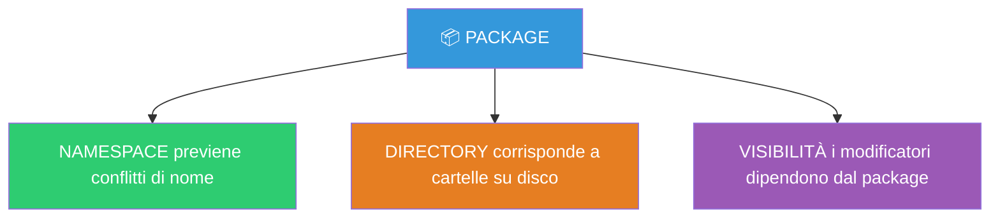
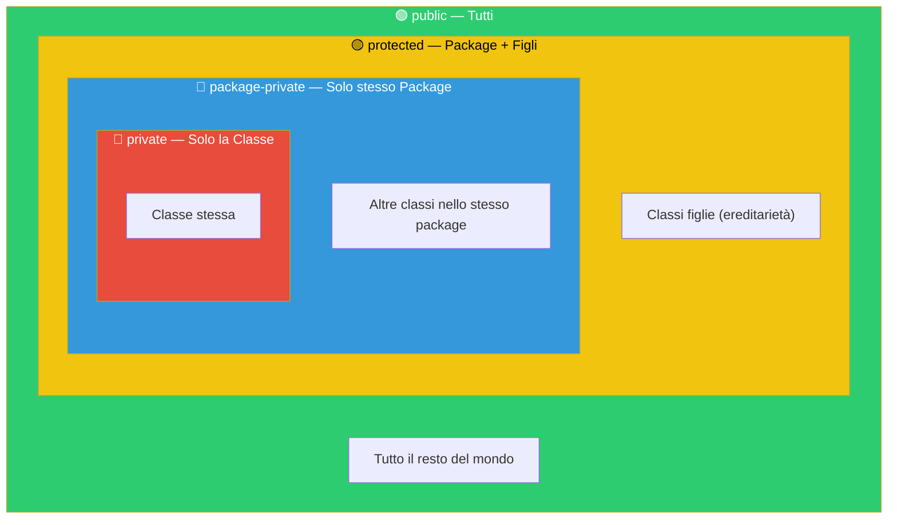
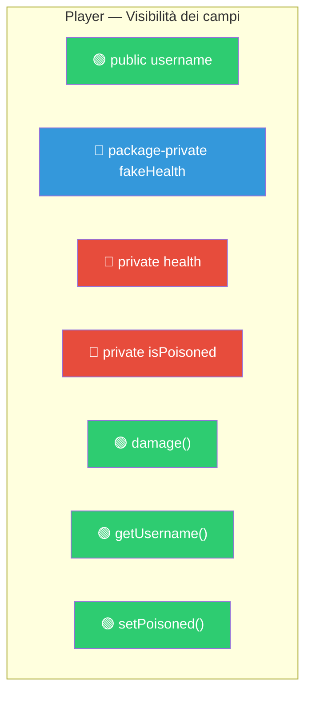
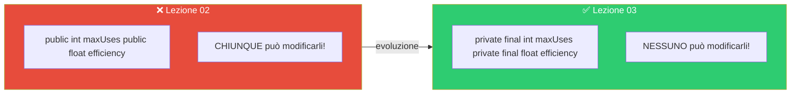
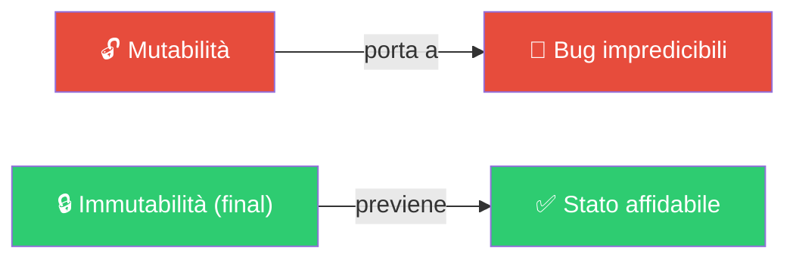
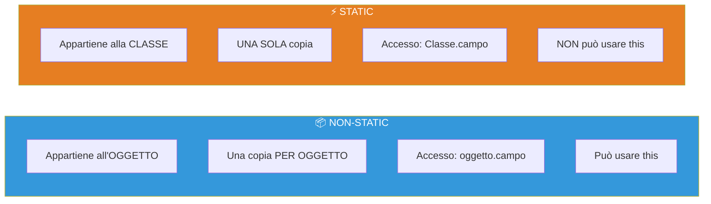
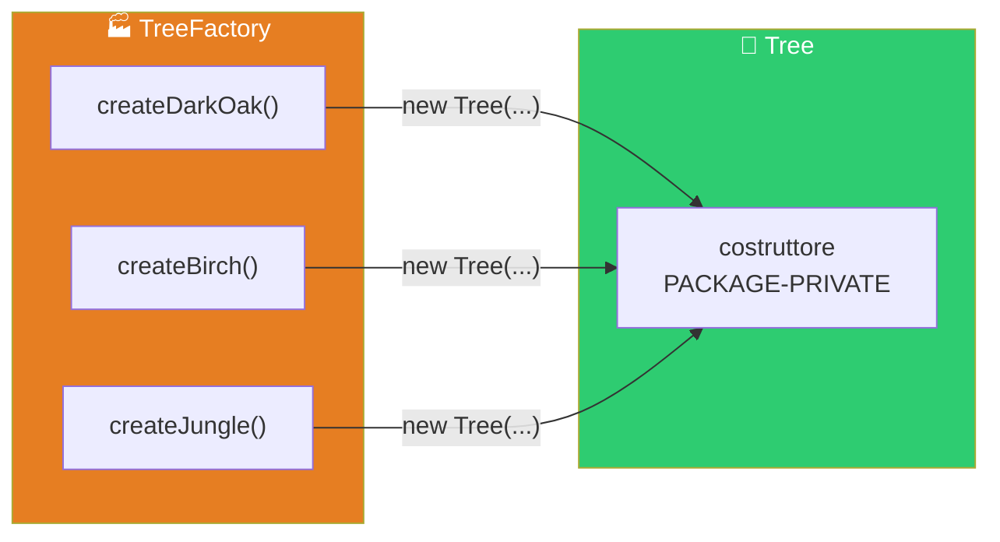
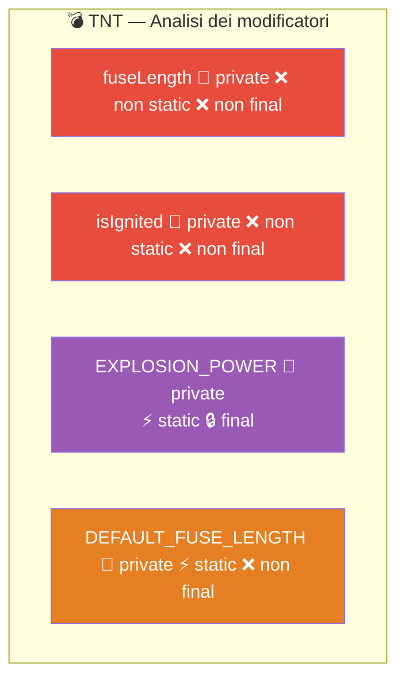

> [!abstract] Panoramica
> **Bloom's Taxonomy:** Remember & Understand
>
> In questa lezione affrontiamo l'organizzazione del codice in **[[Package]]**, i **modificatori di visibilità** (`public`, `private`, package-private), le keyword **`final`** e **`static`**, e due **[[Design Pattern]]** fondamentali: **[[Singleton Method]]** e **[[Factory Method]]**.

---

## Indice

- [[#Package — Organizzare il codice]]
- [[#Modificatori di Visibilità e Incapsulamento]]
  - [[#La classe `Player`]]
  - [[#La classe `Witch`]]
  - [[#Modificatori in altri linguaggi (C++)]]
- [[#La keyword `final`]]
  - [[#`FinalPlayer` — Campi final]]
  - [[#`ToolTier` — Enum con campi final]]
  - [[#Nota sull'Immutabilità]]
- [[#La keyword `static`]]
  - [[#`GameConstants` — Variabili e metodi globali]]
  - [[#Design Pattern: Singleton]]
  - [[#Design Pattern: Factory Method]]
- [[#La classe `TNT` — Versione con incapsulamento]]
- [[#Concetti Chiave per Collegamenti Obsidian]]

---

## File principale — `Lecture3.java`

```java
package lecture03;
import lecture03.final_mod.FinalPlayer;
import lecture03.final_mod.ToolTier;
import lecture03.ackages.entities.Player;
import lecture03.ackages.blocks.TNT;
import lecture03.ackages.entities.Witch;
import lecture03.static_globals.DragonEgg;
import lecture03.static_globals.GameConstants;
import lecture03.static_globals.factory_methods.Tree;
import lecture03.static_globals.factory_methods.TreeFactory;

public class Lecture3 {
    public static void main(String[] args) {
        System.out.println("---------------- Packages ----------------");
        packagesExample();
        packagePrivateExample();
        System.out.println("---------------- Modificatori di Accesso/Visibilita` ----------------");
        visibilityExample();
        System.out.println("---------------- Final ----------------");
        finalExample();
        System.out.println("---------------- Static ----------------");
        staticExample();
        singletonExample();
        factoryMethodExample();
    }
```

---

## Package — Organizzare il codice

Un progetto piccolo potrebbe avere una decina di file; **Minecraft ne ha più di 5.000**. Non si possono mettere tutti in una sola cartella!

> [!warning] Per l'esame
> Non usare i packages vi costa punti!

### Cos'è un Package?

> [!info] Package = 3 concetti in uno
> Un [[Package]] è **tante cose contemporaneamente**:
>
> 1. **[[Namespace]]** → previene conflitti di nome (`lecture03.ackages.blocks.TNT ≠ lecture02.v1.TNT`)
> 2. **Struttura delle cartelle** → i package corrispondono alle directory su disco
> 3. **Unità di visibilità** → i modificatori di accesso dipendono dai package



```
  ╔════════════════════════════════════════════════════════════╗
  ║  PACKAGE = 3 concetti in uno                              ║
  ╠════════════════════════════════════════════════════════════╣
  ║                                                            ║
  ║  1. NAMESPACE                                              ║
  ║     → previene conflitti di nome                           ║
  ║     → lecture03.ackages.blocks.TNT ≠ lecture02.v1.TNT      ║
  ║                                                            ║
  ║  2. STRUTTURA DELLE CARTELLE                               ║
  ║     → i package corrispondono alle directory su disco      ║
  ║                                                            ║
  ║  3. UNITÀ DI VISIBILITÀ                                    ║
  ║     → i modificatori di accesso dipendono dai package      ║
  ║                                                            ║
  ╚════════════════════════════════════════════════════════════╝
```

Struttura usata in questa lezione:

```
  lecture03/
  ├── Lecture3.java          ← file principale (runner)
  ├── ackages/
  │   ├── entities/
  │   │   ├── Player.java    ← package lecture03.ackages.entities
  │   │   └── Witch.java     ← package lecture03.ackages.entities
  │   └── blocks/
  │       └── TNT.java       ← package lecture03.ackages.blocks
  ├── final_mod/
  │   ├── FinalPlayer.java
  │   └── ToolTier.java
  └── static_globals/
      ├── DragonEgg.java
      ├── GameConstants.java
      └── factory_methods/
          ├── Tree.java
          ├── TreeFactory.java
          └── Tree_Bad.java
```

> [!tip] Import
> Per usare una classe da un altro package, bisogna **importarla** con le righe [[import]] in cima al file.

### Esempio: Package

```java
    // Questo metodo stampa le informazioni di package di due oggetti.
    // Per capire i tipi, controllare gli import in cima al file.
    // NOTA: getClass() non si dovrebbe MAI usare in produzione
    // (se non per debug o override della equals) — si capirà perché
    // quando si parlerà di polimorfismo, casting e instanceof.
    private static void packagesExample() {
        Player p = new Player();
        TNT b = new TNT();
        System.out.println("Loaded " + p.getClass().getName());
        // Stampa: lecture03.ackages.entities.Player
        System.out.println("Loaded " + b.getClass().getName());
        // Stampa: lecture03.ackages.blocks.TNT
    }
```

---

## Modificatori di Visibilità e Incapsulamento

I modificatori ci permettono di regolare l'accesso a campi e metodi, realizzando l'**[[Incapsulamento]]** ([encapsulation](https://en.wikipedia.org/wiki/Encapsulation_(computer_programming)) / information hiding).

> [!info] Tabella dei Modificatori di Visibilità
> | Modificatore | Classe | Package | Figli | Tutti |
> |---|---|---|---|---|
> | `private` | ✅ | ❌ | ❌ | ❌ |
> | *(nulla)* — Package-Private | ✅ | ✅ | ❌ | ❌ |
> | `protected` | ✅ | ✅ | ✅ | ❌ |
> | `public` | ✅ | ✅ | ✅ | ✅ |
>
> *(nulla)* = se non scrivi nulla, è il default (Package-Private)
> `protected` = ne parleremo in [[Lezione 05 - Ereditarietà, Polimorfismo, Object|Lezione 05]] ([[Ereditarietà]])



```
  ╔═══════════════════════════════════════════════════════════════════╗
  ║  MODIFICATORI DI VISIBILITÀ IN JAVA                              ║
  ╠════════════════╦═══════════╦══════════╦══════════╦═══════════════╣
  ║  Modificatore  ║ Classe    ║ Package  ║ Figli    ║ Tutti         ║
  ╠════════════════╬═══════════╬══════════╬══════════╬═══════════════╣
  ║  private       ║    ✅     ║    ❌    ║    ❌    ║     ❌        ║
  ║  (nulla)       ║    ✅     ║    ✅    ║    ❌    ║     ❌        ║
  ║  protected     ║    ✅     ║    ✅    ║    ✅    ║     ❌        ║
  ║  public        ║    ✅     ║    ✅    ║    ✅    ║     ✅        ║
  ╚════════════════╩═══════════╩══════════╩══════════╩═══════════════╝

  (nulla) = Package-Private: se non scrivi nulla, è il default
  protected = ne parleremo in Lezione 05 (ereditarietà)
```

---

### La classe `Player`

```java
package lecture03.ackages.entities;

public class Player {
    // ═══════════════════ CAMPI ═══════════════════

    // PUBLIC: tutti possono vederlo (leggere E scrivere!)
    // ⚠️ Attenzione: chiunque può modificare username!
    public String username;

    // PRIVATE: solo la classe Player può accedere a questo campo.
    // Impedisce ad altre classi (es. Witch) di modificare la vita
    // direttamente, magari bypassando l'armatura!
    private int health = 20;

    // PRIVATE: anche lo stato di avvelenamento è nascosto
    private boolean isPoisoned = false;

    // PACKAGE-PRIVATE (nessun modificatore): visibile solo alle classi
    // nello STESSO package (lecture03.ackages.entities)
    int fakeHealth = 10;

    // ═══════════════════ SETTER e GETTER ═══════════════════
    // Per modificare lo stato private in modo consono, si usano i metodi.
    // I getter ritornano il valore di un campo.
    // I setter modificano il valore di un campo.
    //
    // ⚠️ ERRORE GRAVE: creare un campo private e poi mettere getter+setter
    //    che lo espongono completamente → è come renderlo public!

    public void setPoisoned(boolean p){
        this.isPoisoned = p;
    }

    public String getUsername(){
        return this.username;
    }

    // ═══════════════════ METODI ═══════════════════

    // Metodo per applicare danno. Si può estendere con logica ulteriore,
    // per esempio ridurre il danno in caso di armatura.
    public void damage(int amount) {
        this.health = this.health - amount;
        if (this.health <= 0) {
            System.out.println("Player died!");
        }
    }

    public void isAlive(){
        if (this.health <= 0 ){
            System.out.println("Giocatore morto");
        }else{
            System.out.println("Giocatore vivo");
        }
    }

    public void poison() {
        this.setPoisoned(true);
    }

    // poisonDamage: logica interna del danno da veleno.
    // Non fa nulla se il giocatore non è avvelenato.
    // Non fa danno se la vita è minore di 2 (il veleno non uccide).
    public void poisonDamage(){
        if (!this.isPoisoned){
            return;
        }
        if (this.isPoisoned && this.health < 2 ){
            return;
        }
        this.health -= 1;
    }
}
```



```
  Player — visibilità dei campi:

  ┌──────────────────────────────────────────────┐
  │                   Player                     │
  │                                              │
  │  🟢 public    username     ← tutti vedono    │
  │  📦 pkg-priv  fakeHealth   ← solo stesso pkg │
  │  🔴 private   health       ← solo Player     │
  │  🔴 private   isPoisoned   ← solo Player     │
  │                                              │
  │  🟢 public    damage()     ← tutti chiamano  │
  │  🟢 public    getUsername() ← tutti chiamano │
  │  🔴 private   (nessuno qui, ma potrebbe)     │
  └──────────────────────────────────────────────┘
```

> [!warning] Anti-pattern: Getter/Setter che espongono tutto
> Creare un campo `private` e poi aggiungere un getter + setter che lo espongono completamente è **equivalente** a renderlo `public`! I getter/setter hanno senso solo quando aggiungono **logica di controllo**.

---

### Esempio: accesso ai campi

```java
    public static void visibilityExample() {
        Player steve = new Player();
        steve.damage(5);
        // steve.health → ERRORE! health è private, non accessibile da qui
        // steve.fakeHealth → ERRORE! fakeHealth è package-private,
        //   e Lecture3 è in un package diverso da entities
    }
```

> [!question] 📱 Quiz del Prof
> Perché `steve.fakeHealth` non compila da `Lecture3.java`?

> [!success] Risposta
> `fakeHealth` è **package-private** (nessun modificatore). `Lecture3` si trova in `lecture03`, mentre `Player` è in `lecture03.ackages.entities` — sono package **diversi**! Solo le classi nello **stesso** package possono accedere ai campi package-private.

---

### La classe `Witch`

```java
package lecture03.ackages.entities;

// Witch è nello STESSO PACKAGE di Player (lecture03.ackages.entities),
// quindi può accedere ai campi package-private di Player.
public class Witch {

    // Può accedere a fakeHealth perché è package-private
    // e Witch è nello stesso package di Player
    public void fakeAttack(Player p) {
        p.fakeHealth = 0;
    }

    // Il campo health è PRIVATE → rimane accessibile SOLO dentro Player.
    // p.health = 0; → NON COMPILA!
    public void attack(Player p){
    }
}
```

### Esempio: Package-Private in azione

```java
    public static void packagePrivateExample(){
        Witch w = new Witch();
        Player p = new Player();
        w.fakeAttack(p);    // Funziona: Witch accede a fakeHealth (pkg-private)
        p.isAlive();        // Giocatore vivo (fakeHealth non è il vero health!)
        w.attack(p);        // attack è vuoto — non può accedere a health
        p.isAlive();        // Giocatore vivo
    }
```

> [!exercise] Quiz del Prof
> Ordinate i metodi dentro `attack` per uccidere `p`.

> [!success] Risposta
> `Witch` non può accedere direttamente a `health` (è `private`). Deve usare **solo i metodi pubblici** di `Player`:
> ```java
> public void attack(Player p) {
>     p.damage(20);  // damage() è public → può essere chiamato
> }
> ```

---

### Modificatori in altri linguaggi (C++)

> [!info] Java vs C++: incapsulamento
> In Java i modificatori sono **rispettati a livello di linguaggio** — non si possono aggirare. In [[C++]], invece, si possono bypassare con l'[[Aritmetica dei puntatori]]:

```cpp
// Esempio C++: i campi private sono bypassabili con i puntatori!
#include <iostream>
using namespace std;
class Player {
    int vita = 10;        // private di default in C++
public:
    char name = 's';
    void damage(){
        this->vita -= 5;
    }
};
int main() {
    Player* p1 = new Player();
    Player* p2 = new Player();
    p1->name = 'r';
    // Trucco sporco: castiamo il puntatore a int* per leggere la memoria raw
    int* bo = (int*)p1;
    cout << "p1: vita " << *bo << "\n";     // Legge il campo private!
    bo++;
    cout << "p1: name " << *bo << "\n";
    bo++;
    cout << "?? " << *bo << "\n";
    bo++;
    cout << "?? " << *bo << "\n";
    bo++;
    cout << "p2: vita " << *bo << "\n";
    p2->damage();
    cout << "p2: vita " << *bo << "\n";
    bo++;
    cout << "p2: name " << *bo << "\n";
}
```

> [!warning] Java è più sicuro
> In Java questo è **impossibile** — non c'è aritmetica dei puntatori. L'[[Incapsulamento]] è **garantito dal linguaggio**.

---

## La keyword `final`

> [!info] Cos'è [[final]]?
> La keyword `final` su un **[[Campo]]** lo rende una **[[Costante]]**: si può inizializzare e leggere, ma **non** più scrivere dopo l'inizializzazione.
>
> `final` si applica anche ai metodi (significato diverso, visto più avanti con l'ereditarietà).

---

### `FinalPlayer` — Campi final

```java
package lecture03.final_mod;

public class FinalPlayer {
    // Il campo name è public (tutti lo vedono) E final (nessuno può cambiarlo).
    // Un campo final DEVE essere inizializzato:
    //   - o nella dichiarazione (es: public final String name = "Steve";)
    //   - o nel costruttore
    public final String name;

    // Costruttore con parametro: inizializza name
    public FinalPlayer(String name){
        this.name = name;
    }

    // Costruttore di default: delega al costruttore sopra con this("Steve")
    public FinalPlayer(){
        this("Steve");
    }
}
```

> [!question] 📱 Quiz del Prof
> Cosa succede se commentiamo il corpo del costruttore di default `FinalPlayer()`?

> [!success] Risposta
> **Errore di compilazione!** Il campo `final` `name` non verrebbe inizializzato. Un campo `final` **deve** essere assegnato **esattamente una volta**: o nella dichiarazione, o in **ogni** costruttore.

---

### `ToolTier` — [[Enum]] con campi final

```java
package lecture03.final_mod;

public enum ToolTier {
    WOOD(59, 2.0f),
    STONE(131, 4.0f),
    IRON(250, 6.0f),
    DIAMOND(1561, 8.0f),
    GOLD(32, 12.0f);

    // I campi ora sono PRIVATE e FINAL!
    // → private: nessuno li modifica dall'esterno
    // → final: una volta settati dal costruttore, non possono più cambiare
    // Questo GARANTISCE che il Diamante sia sempre più veloce del Legno
    // e nessun codice può (anche accidentalmente!) violare questa proprietà.
    private final int maxUses;
    private final float efficiency;

    ToolTier(int maxUses, float efficiency) {
        this.maxUses = maxUses;
        this.efficiency = efficiency;
    }

    public float getEfficiency() {
        return this.efficiency;
    }

    public int getMaxUses() {
        return this.maxUses;
    }
}
```

> [!tip] Confronto con la [[Lezione 02 - Introduzione all'OOP|Lezione 02]]
> Nella Lezione 02 i campi erano `public` → chiunque poteva modificarli. Ora sono `private final` → nessuno può violare le proprietà dei materiali!



```
  Lezione 02 (v_enums):              Lezione 03 (final_mod):
  ┌──────────────────────┐           ┌──────────────────────┐
  │ public int maxUses   │           │ private final int    │
  │ public float effic.  │           │ private final float  │
  │ → CHIUNQUE può       │           │ → NESSUNO può        │
  │   modificarli!       │           │   modificarli!       │
  └──────────────────────┘           └──────────────────────┘
```

---

### Esempio: final in azione

```java
    public static void finalExample() {
        FinalPlayer fp = new FinalPlayer();
        // fp.name = "Alex";  → ERRORE! name è final, non si può riscrivere

        ToolTier currentTier = ToolTier.DIAMOND;
        System.out.println("Selected: " + currentTier);
        System.out.println("Speed: " + currentTier.getEfficiency());
        System.out.println("Durability: " + currentTier.getMaxUses());
        // currentTier.efficiency = 0; → ERRORE! efficiency è private E final
    }
```

> [!warning] Cosa NON si può fare con `final`
> ```java
> fp.name = "Alex";            // ❌ ERRORE! name è final
> currentTier.efficiency = 0;  // ❌ ERRORE! efficiency è private E final
> ```

---

### Nota sull'Immutabilità

> [!tip] Principio di Ingegneria del Software: [[Immutabilità]]
> La **mutazione** (permettere che i dati cambino) è una delle maggiori fonti di **bug**.
>
> Se una variabile cambia valore inaspettatamente, il comportamento del programma diventa **impredicibile**.
>
> L'**immutabilità** (`final`) ci permette di fidarci che lo stato di un oggetto non cambierà — né per un attacco hacker, né per un errore del programmatore.



---

## La keyword `static`

> [!info] Cos'è `static`?
> La keyword [`static`](https://www.baeldung.com/java-static) identifica campi e metodi **globali** — che appartengono alla **[classe](https://docs.oracle.com/javase/tutorial/java/javaOO/classvars.html)**, non all'oggetto.



```
  ╔═══════════════════════════════════════════════════════════════╗
  ║                    STATIC vs NON-STATIC                       ║
  ╠══════════════════════════════╦════════════════════════════════╣
  ║        NON-STATIC            ║          STATIC                ║
  ╠══════════════════════════════╬════════════════════════════════╣
  ║ Appartiene all'OGGETTO       ║ Appartiene alla CLASSE         ║
  ║ Una copia PER OGGETTO        ║ UNA SOLA copia in totale       ║
  ║ Accesso: oggetto.campo       ║ Accesso: Classe.campo          ║
  ║ Metodo: usa this             ║ Metodo: NON può usare this     ║
  ║ Può accedere a tutto         ║ Solo ad altri static           ║
  ║ Es: player.health            ║ Es: Math.sqrt(4)               ║
  ╚══════════════════════════════╩════════════════════════════════╝

  Math.sqrt(...) → non ha bisogno di un oggetto!
  player.damage() → opera su una PRECISA istanza di Player
```

> [!note] Metodo static = funzione
> Un metodo `static` è concettualmente una **funzione**: non necessita di un oggetto, non può usare `this` e può far riferimento solo ad altri campi/metodi `static`.

### Casi d'uso principali di `static`:

| Caso d'uso                | Esempio                        | Descrizione                         |
| ------------------------- | ------------------------------ | ----------------------------------- |
| **Costanti globali**      | `GameConstants.MAX_STACK_SIZE` | Informazioni condivise da tutti     |
| **[[Singleton Pattern]]** | `DragonEgg.getInstance()`      | Un solo oggetto di una classe       |
| **[[Factory Methods]]**   | `TreeFactory.createBirch()`    | Metodi per creare oggetti complessi |

---

### `GameConstants` — Variabili e metodi globali

```java
package lecture03.static_globals;

public class GameConstants {
    // Costante globale: il valore di uno stack è tipicamente 64.
    // Non vogliamo segnare questo valore in ogni oggetto — spreco di memoria!
    // Lo segniamo UNA volta sola, nella classe, con static.
    public static int MAX_STACK_SIZE = 64;
    public static int SMALL_MAX_STACK_SIZE = 16;

    // Un metodo static (utility): non ha bisogno di conoscere lo stato
    // di alcun oggetto per svolgere il suo compito.
    public static void printMOTD() {
        System.out.println(">> Welcome to the Minecraft Course!");
    }

    // Questi sono campi e metodi NON-static, per le domande quiz
    public int field;
    public void method(){}
}
```

### Esempio: static

```java
    private static void staticExample() {
        // Accesso al campo static tramite il nome della classe
        System.out.println("Max Stack Size: " + GameConstants.MAX_STACK_SIZE);

        // Si può anche accedere tramite un oggetto, ma è EQUIVALENTE
        // a scrivere GameConstants.MAX_STACK_SIZE
        GameConstants g = new GameConstants();

        // ⚠️ Le variabili static possono MUTARE! (se non sono final)
        GameConstants.MAX_STACK_SIZE = 1;

        System.err.println("Print on the error stream");

        // Altre utility static di System:
        System.currentTimeMillis();  // Timing
        System.gc();                 // Chiama il garbage collector
    }
```

> [!question] 📱 Quiz del Prof — Serie di domande su `static`
> 1. Come prevenire la mutazione di `MAX_STACK_SIZE`?
> 2. Cosa è `static` in `System.out.println()`?
> 3. Quali di queste righe compilano?
>    - `g.field`
>    - `g.method()`
>    - `GameConstants.field`
>    - `GameConstants.method()`

> [!success] Risposte
> 1. Aggiungere la keyword **`final`**: `public static final int MAX_STACK_SIZE = 64;`
> 2. `out` è un **campo `static`** di `System` (`System.out`). `println()` è un metodo **non-static** chiamato sull'oggetto `out`
> 3. Compilano:
>    - ✅ `g.field` — campo non-static, acceduto tramite un oggetto
>    - ✅ `g.method()` — metodo non-static, acceduto tramite un oggetto
>    - ❌ `GameConstants.field` — `field` **non** è `static`!
>    - ❌ `GameConstants.method()` — `method()` **non** è `static`!

---

### Design Pattern: Singleton

> [!info] Cos'è un [[Design Pattern]]?
> I **[[Design Pattern]]** sono principi di [Ingegneria del Software](https://it.wikipedia.org/wiki/Ingegneria_del_software) che racchiudono in una singola metodologia soluzioni frequenti a problemi comuni.
> Sono fondanti in questo corso e presenti nei temi d'esame (dal 2025/2026).

Alcune cose del gioco sono **uniche**: i settings, l'uovo di drago. Il **[[Singleton Pattern]]** usa `static` per garantire che esista **una sola istanza** di una certa classe.


```
  SINGLETON PATTERN — 3 passi:

  ┌──────────────────────────────────────────────────────────┐
  │  class DragonEgg                                         │
  │                                                          │
  │  1. Campo private static → salva la SINGOLA istanza      │
  │     ┌───────────────────────────────────────────────┐    │
  │     │ private static DragonEgg THE_INSTANCE = new() │    │
  │     └───────────────────────────────────────────────┘    │
  │                                                          │
  │  2. Costruttore PRIVATE → nessuno può fare "new"         │
  │     ┌───────────────────────────────────────────────┐    │
  │     │ private DragonEgg() {}                        │    │
  │     └───────────────────────────────────────────────┘    │
  │                                                          │
  │  3. Getter PUBLIC STATIC → l'unico modo per ottenere     │
  │     ┌───────────────────────────────────────────────┐    │
  │     │ public static DragonEgg getInstance()         │    │
  │     └───────────────────────────────────────────────┘    │
  └──────────────────────────────────────────────────────────┘
```

```java
package lecture03.static_globals;

public class DragonEgg {
    // 1. Singola istanza, creata a loading time, salvata in un campo private static
    private static DragonEgg THE_INSTANCE = new DragonEgg();

    // 2. Costruttore PRIVATE: nessuno può chiamarlo dall'esterno!
    private DragonEgg() {}

    // 3. Getter public E static: l'UNICO modo per ottenere un DragonEgg
    public static DragonEgg getInstance() {
        return THE_INSTANCE;
    }

    // Una volta ottenuto, l'oggetto è NORMALE e si comporta come tutti gli altri
    public void teleport() {
        System.out.println(">> Vwoop! The Dragon Egg teleported away.");
    }
}
```

### Esempio: Singleton

```java
    private static void singletonExample(){
        // Non possiamo fare new DragonEgg() → il costruttore è private!
        DragonEgg egg = DragonEgg.getInstance();
        egg.teleport();
        DragonEgg egg2 = DragonEgg.getInstance();
        System.out.println("Is it the exact same egg? " + (egg == egg2));
    }
```

> [!question] 📱 Quiz del Prof
> Cosa stampa `(egg == egg2)`?

> [!success] Risposta
> **`true`!** `egg` e `egg2` sono lo **stesso oggetto** — `getInstance()` ritorna sempre `THE_INSTANCE`. L'operatore `==` su oggetti confronta gli **indirizzi di memoria**, e qui sono identici.

---

### Design Pattern: Factory Method

Il **[[Factory Method]]** serve per raggruppare la logica di costruzione di oggetti complessi.

> [!info] Quando usare il Factory Method?
> Esempio Minecraft: gli alberi hanno caratteristiche molto diverse a seconda del tipo (Oak, Birch, Dark Oak, Jungle, Mangrove...). Mettere tutta questa logica in un costruttore lo renderebbe **troppo complesso**.



```
  FACTORY METHOD PATTERN:

  ┌─────────────────┐        ┌─────────────────────────┐
  │   Tree          │        │   TreeFactory           │
  │ (classe target) │        │ (classe factory)        │
  ├─────────────────┤        ├─────────────────────────┤
  │ costruttore:    │◄───────│ static createDarkOak()  │
  │ PACKAGE-PRIVATE │  crea  │ static createBirch()    │
  │ (solo la factory│        │ static createJungle()   │
  │  può chiamarlo) │        │                         │
  └─────────────────┘        └─────────────────────────┘
          ▲
          │ Il tipo è public,
          │ tutti possono USARE un Tree,
          │ ma solo la Factory può CREARLO
```

#### La classe `Tree`

```java
package lecture03.static_globals.factory_methods;

public class Tree {
    // Enum DENTRO la classe, perché è rilevante SOLO per i Tree.
    // È pubblica → accessibile dall'esterno con Tree.Type.OAK
    // Usare una Enum ci assicura l'assenza di errori di spelling,
    // di tipi non esistenti, ecc.
    public enum Type {
        DarkOak,
        Birch,
        Jungle
    }

    public final Type type;    // final: il tipo non cambia dopo la creazione
    private int height;

    // Costruttore PACKAGE-PRIVATE → solo classi nello stesso package possono usarlo
    // (cioè solo TreeFactory!)
    Tree(Type type, int height) {
        this.type = type;
        this.height = height;
    }

    public int getHeight() {
        return height;
    }
}
```

> [!tip] Perché il costruttore è package-private?
> Rendendo il costruttore **package-private**, solo le classi nello **stesso package** (cioè `TreeFactory`) possono creare alberi. Il resto del codice può **usare** un `Tree` ma non **crearlo** direttamente.

#### La classe `TreeFactory`

```java
package lecture03.static_globals.factory_methods;

// La factory contiene i metodi STATIC per creare gli alberi.
// Tutta la logica complessa è qui (omessa per fini didattici).
public class TreeFactory {
    public static Tree createDarkOak() {
        // Qui ci sarebbe la logica per: inspessire il tronco, ecc.
        return new Tree(Tree.Type.DarkOak, 5);
    }
    public static Tree createBirch() {
        return new Tree(Tree.Type.Birch, 7);
    }
    public static Tree createJungle() {
        // Qui ci sarebbe la logica per: aggiungere rampicanti, ecc.
        return new Tree(Tree.Type.Jungle, 20);
    }
}
```

#### La classe `Tree_Bad` — Come NON fare

```java
package lecture03.static_globals.factory_methods;

// ❌ CLASSE FATTA MALE:
// - Usa String per il tipo → errori di spelling non rilevati dal compilatore
// - I factory methods sono DENTRO la classe stessa → il costruttore è accessibile
// - Non usa enum → nessuna garanzia sui valori
public class Tree_Bad {
    private String type;
    public int height;
    Tree_Bad(String type, int height) {
        this.type = type;
        this.height = height;
    }
    public static Tree_Bad createBadOak() {
        return new Tree_Bad("Oak", 5);
    }
    public static Tree_Bad createBadBirch() {
        return new Tree_Bad("Birch", 7);
    }
    public static Tree_Bad createBadJungle() {
        return new Tree_Bad("Jungle", 20);
    }
}
```

> [!question] 📱 Quiz del Prof
> Perché `Tree_Bad` è "bad"?

> [!success] Risposta
> 1. Usa `String` per il tipo → errori di spelling (es. `"Junlge"`) **non rilevati** dal compilatore
> 2. I factory methods sono **nella classe stessa** → il costruttore resta accessibile (è package-private, non private)
> 3. Non sfrutta le [[Enum]]→ nessuna garanzia sui valori possibili

### Esempio: Factory Method

```java
    private static void factoryMethodExample() {
        // L'unico modo per creare un Tree è passare dalla TreeFactory
        Tree t1 = TreeFactory.createDarkOak();
        Tree t2 = TreeFactory.createBirch();
        System.out.println("Factory created: " + t1.type);  // DarkOak
        System.out.println("Factory created: " + t2.type);  // Birch
    }
}
```

---

## La classe `TNT` — Versione con incapsulamento

> [!note] Recap
> Questa versione di TNT applica **tutti** i concetti visti: `private`, `static`, `final`, [[Invariante|invarianti]].

```java
package lecture03.ackages.blocks;

public class TNT {
    // PRIVATE: il fuso non deve essere accessibile dall'esterno.
    // Non ha senso che qualcuno possa impostare fuseLength = -100!
    private int fuseLength;
    private boolean isIgnited;

    // PRIVATE + STATIC + FINAL: il potere dell'esplosione è lo stesso
    // per tutte le TNT (static), non cambia mai (final), e non è
    // accessibile dall'esterno (private).
    private static final double EXPLOSION_POWER = 100;

    // PRIVATE + STATIC: il fuso di default è condiviso tra tutte le TNT
    private static int DEFAULT_FUSE_LENGTH = 80;

    public TNT() {
        this.fuseLength = DEFAULT_FUSE_LENGTH;
        this.isIgnited = false;
    }

    // ═══════════════════ INVARIANTI ═══════════════════
    // Invariante: non si può innescare più volte
    public void ignite() {
        if (this.isIgnited) {
            System.out.println(">> It is already burning!");
            return;
        }
        this.isIgnited = true;
        System.out.println(">> Fuse lit!");
    }

    // Invariante: solo se è innescata E ha ancora del fuso, allora tick fa qualcosa
    // Invariante: il fuso è sempre un valore >= 0
    public void tick() {
        if (this.isIgnited && this.fuseLength >0) {
            this.fuseLength = this.fuseLength - 1;
            System.out.println(">> Ticking... " + this.fuseLength);
            if (this.fuseLength <= 0) {
                this.fuseLength = 0;     // Garanzia: mai negativo
                this.explode();
            }
        }
    }

    // PRIVATE: solo la classe TNT può decidere quando esplodere!
    // Reset dell'invariante: dopo che è esplosa, si disinnesca
    private void explode() {
        System.out.println(">> BOOM! (Block destroyed), danno: " + EXPLOSION_POWER);
        this.isIgnited = false;
    }
}
```

> [!question] Domande del Prof per ragionare sui modificatori
> | Campo / Metodo | Dovrebbe essere `static`? | Dovrebbe essere `final`? |
> |---|---|---|
> | `isIgnited` | ? | ? |
> | `fuseLength` | ? | ? |
> | `explosionPower` | ? | ? |
> | `explode()` | (non applicabile) | ? |

> [!success] Risposte
> | Campo / Metodo | `static`? | `final`? | Perché |
> |---|---|---|---|
> | `isIgnited` | **No** | **No** | Altrimenti innescarne una le innescherebbe tutte! E deve cambiare valore |
> | `fuseLength` | **No** | **No** | Deve decrementarsi nel countdown, ed è diverso per ogni TNT |
> | `explosionPower` | **Sì** | **Sì** | È uguale per tutte le TNT e non cambia mai |
> | `explode()` | **No** | Vedremo con l'ereditarietà | Dipende dall'oggetto specifico |



---

## Concetti Chiave per Collegamenti Obsidian

| Concetto                       | Descrizione                                                  |
| ------------------------------ | ------------------------------------------------------------ |
| [[Package]]                    | Struttura organizzativa, namespace, unità di visibilità      |
| [[Incapsulamento]]             | Information hiding, nascondere i dettagli implementativi     |
| [[Modificatori di Visibilità]] | [[public]], [private], [[protected]], package-private        |
| [[Keyword final]]              | Rende un campo costante (immutabile dopo l'inizializzazione) |
| [[Immutabilità]]               | Principio di Ing. del Software: meno mutazione = meno bug    |
| [[Keyword static]]             | Campi e metodi globali, appartengono alla classe             |
| [[Getter e Setter]]            | Metodi per accedere/modificare campi privati                 |
| [[Design Pattern]]             | Soluzioni standard a problemi comuni                         |
| [[Singleton Pattern]]          | Garantisce una sola istanza di una classe                    |
| [[Factory Method Pattern]]     | Raggruppa la logica di costruzione di oggetti complessi      |
| [[Invariante]]                 | Fatto che è sempre vero per una classe/oggetto               |
| [[Namespace]]                  | Previene conflitti di nome                                   |
| [[Import]]                     | Rendere visibili classi da altri package                     |

---

> **Lezione precedente:** [[Lezione 02 - Introduzione all'OOP]]
> **Prossima lezione:** [[Lezione 04 - Incapsulamento, Passaggio Valori, Layout in Memoria]]
