> [!abstract] Panoramica
> **Bloom's Taxonomy:** Understand, Analyse, Apply
> 
> In questa lezione applichiamo i modificatori visti nelle lezioni precedenti per definire **invarianti** e realizzare l'**[[Incapsulamento]]**. Poi analizziamo come Java passa i valori (copia vs riferimento) e come classi e oggetti sono organizzati nella **memoria** a runtime ([[V-Table]], [[Heap]], [[Stack]]).

---

## Indice

- [[#Incapsulamento e Invarianti]]
  - [[#Invarianti nella classe `Player`]]
  - [[#Invarianti nella classe `TNT`]]
- [[#Passaggio dei Valori]]
  - [[#Copia vs Riferimento]]
  - [[#Esempio pratico]]
- [[#Layout di Classi e Oggetti in Memoria]]
  - [[#Layout di `Witch`]]
  - [[#Layout di `Player`]]
  - [[#Layout di `TNT`]]
  - [[#La V-Table]]
  - [[#Layout degli Oggetti (istanze)]]
  - [[#Esempio completo: `layoutTest()`]]
- [[#Concetti Chiave per Collegamenti Obsidian]]

---

## File principale — `Lecture4.java`

> [!note] Dipendenze
> La Lezione 04 riutilizza le classi della [[Lezione 03 - Package, Visibilità, Final, Static|Lezione 03]] (`Player`, `Witch`, `TNT` dal package `lecture03`).

```java
package lecture04;

// Si importano le classi dalla lezione precedente
import lecture03.ackages.blocks.TNT;
import lecture03.ackages.entities.Player;
import lecture03.ackages.entities.Witch;

public class Lecture4 {
    public static void main(String[] args){
        System.out.println("---------------- Incapsulamento e Invarianti ----------------");
        invariants();
        System.out.println("---------------- Passaggio dei valori ----------------");
        valuePassingExample();
        System.out.println("---------------- Class Memory Layout ----------------");
        System.out.println("---------------- Object Memory Layout ----------------");
        layoutTest();
    }
```

---

## Incapsulamento e Invarianti

Con i vari modificatori visti fin ora (`private`, `public`, `final`, `static`), il linguaggio ci dà una proprietà fondamentale: l'**[[Incapsulamento]]**.

> [!info] Cos'è l'Incapsulamento?
> L'**incapsulamento** ci permette di:
> 1. **Nascondere** dettagli implementativi dentro una classe → chi usa la classe non vede la logica interna
> 2. **Definire invarianti**: fatti che sono **sempre veri** per ogni classe e ogni oggetto creato
> 
> | Linguaggio | Incapsulamento? |
> |---|---|
> | C | **No** — nessun supporto a livello di linguaggio |
> | C++ | Parziale — bypassabile con aritmetica dei puntatori |
> | **Java** | **Sì** — garantito a livello di linguaggio |
> | [Rust](https://doc.rust-lang.org/book/ch07-00-managing-growing-projects-with-packages-crates-and-modules.html) | Sì — con invarianti ancora più potenti |

> [!tip] Definizione: Invariante
> Un **[[Invariante]]** è una proprietà che deve essere **sempre vera** durante tutto il ciclo di vita di un oggetto. I [[Modificatori di accesso]] del linguaggio ci danno gli strumenti per **garantirli**.

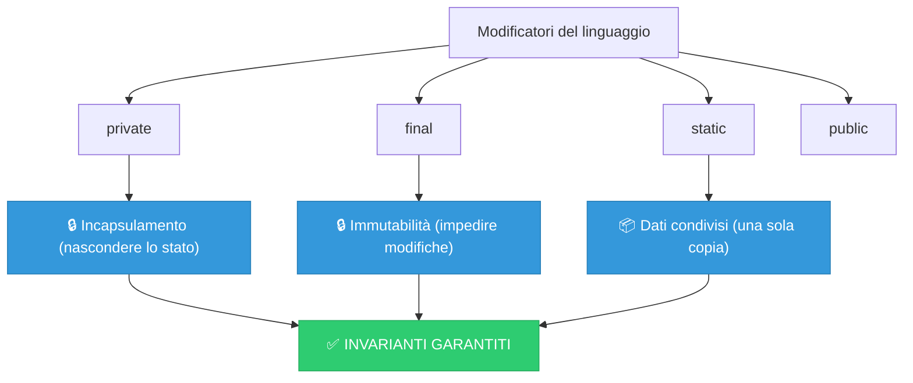

---

### Invarianti nella classe `Player`

Ripensiamo alla classe `Player` della [[Lezione 03 - Package, Visibilità, Final, Static|Lezione 03]]:

> [!success] Invarianti di `Player`
> 1. `poisonDamage()` **non fa nulla** se `this` non è avvelenato → `isPoisoned` è `private`, solo `poison()` lo setta
> 2. `poisonDamage()` **non fa danno** se vita < 2 → il veleno NON uccide il giocatore (come in Minecraft!)
> 3. `health` è `private` → solo `damage()` e `poisonDamage()` possono modificarlo → **nessun bypass dell'armatura!**

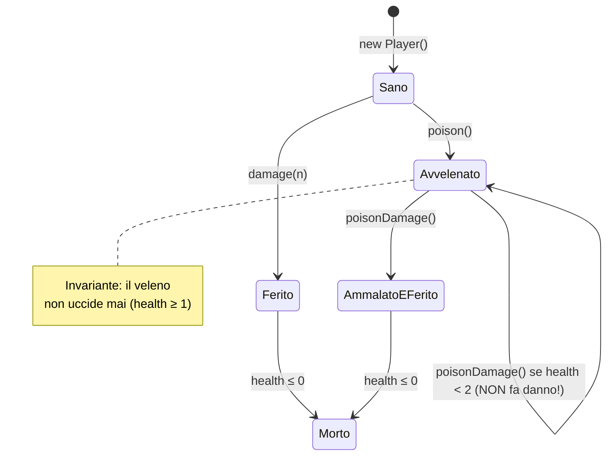

> [!exercise] Esercizi del Prof
> - Come faresti un effetto di **rigenerazione**?
> - Come faresti una **Golden Apple**?
> - Controlla di non farli in modo che qualcuno possa **barare** e ottenere più del dovuto!

---

### Invarianti nella classe `TNT`

Per capire gli invarianti ci chiediamo: **c'è del comportamento che NON dovremmo permettere?**

> [!question] Domande per ragionare sugli invarianti della TNT
> | Domanda | Risposta |
> |---|---|
> | Ha senso far calare il fuso senza che sia innescata? | **NO** |
> | Ha senso farla esplodere senza che sia innescata? | **NO** |
> | Il fuso può essere un valore negativo? | **NO** |
> | Si può innescare più volte? | **NO** |
> | Si può far esplodere prima del tempo? | **NO** |
> | Il fuso deve calare di valori arbitrari? | **NO** |

> [!success] Come garantiamo gli invarianti
> - `fuseLength` è **`private`** → nessuno può scrivere `tnt.fuseLength = -100`
> - `ignite()` controlla se già innescata prima di procedere
> - `tick()` funziona **solo** se innescata **E** fuso > 0
> - `tick()` decrementa di **1** (non valori arbitrari)
> - `explode()` è **`private`** → solo la classe TNT stessa decide quando esplodere

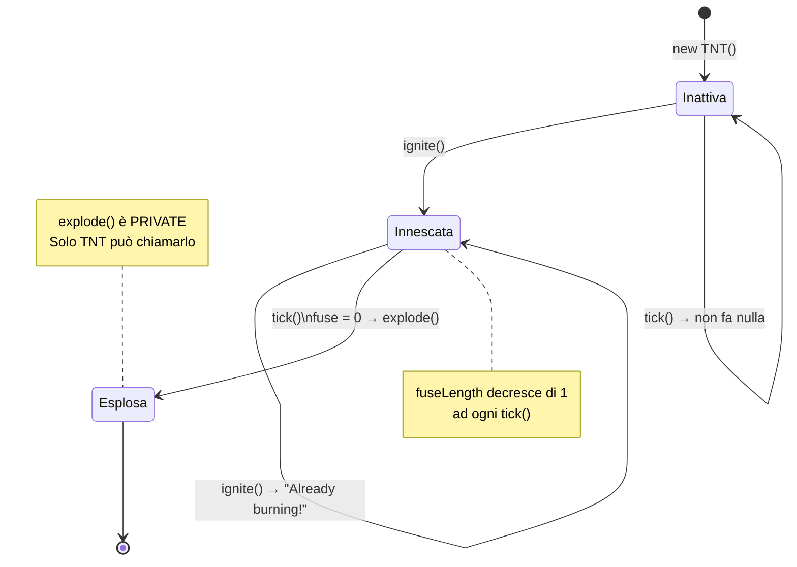

### Esempio: invarianti

```java
    public static void invariants() {
        TNT standardTNT = new TNT();
        // standardTNT.fuseLength = -100; → ERRORE DI COMPILAZIONE! fuseLength è private
        // Utilizzo corretto: la TNT deve scoppiare solo quando il fuso arriva a 0
        standardTNT.ignite();     // Innesca (correttamente)
        standardTNT.tick();       // Il fuso si riduce di 1 (correttamente)
    }
```

> [!warning] Cosa NON si può fare
> ```java
> standardTNT.fuseLength = -100; // ❌ COMPILER ERROR! fuseLength è private
> ```
> Senza `private`, un qualunque pezzo di codice potrebbe rompere gli invarianti.

---

## Passaggio dei Valori

> [!info] I tre tipi di valori in Java
> In Java ci sono **tre categorie** di valori, allocati in posti diversi e passati in modi diversi:
> 
> | Tipo di valore | Dove allocato | Come viene passato |
> |---|---|---|
> | **Tipo Primitivo** (`int`, `boolean`, ...) | [[Stack]] | Per **COPIA** (il valore è duplicato) |
> | **Tipo Classe** (`Player`, `TNT`, ...) | [[Heap]] | Per **RIFERIMENTO** (si passa il puntatore) |
> | **Tipo Array** (`int[]`, `TNT[]`, ...) | [[Heap]] | Per **RIFERIMENTO** (si passa il puntatore) |

> [!question] 📱 Quiz del Prof
> Dove sono allocati i valori primitivi, di tipo classe e di tipo array?

> [!success] Risposta
> - **Primitivi** → Stack (occupano uno o pochi registri)
> - **Classi e Array** → Heap (potrebbero occupare molti registri, quindi si passa un puntatore)

### [[Passaggio per Valore]] vs [[Passaggio per Riferimento]]

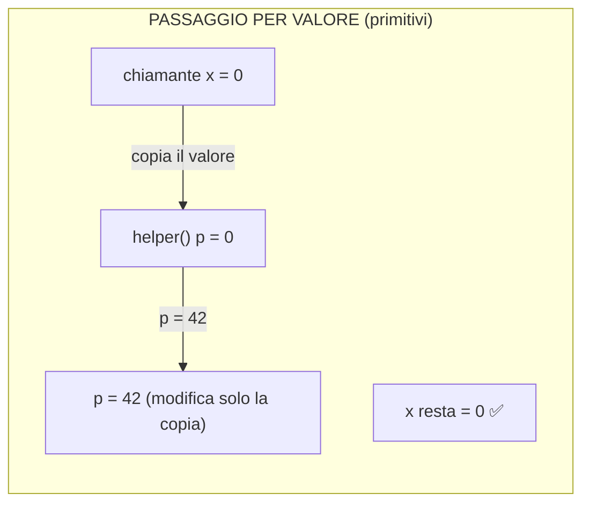

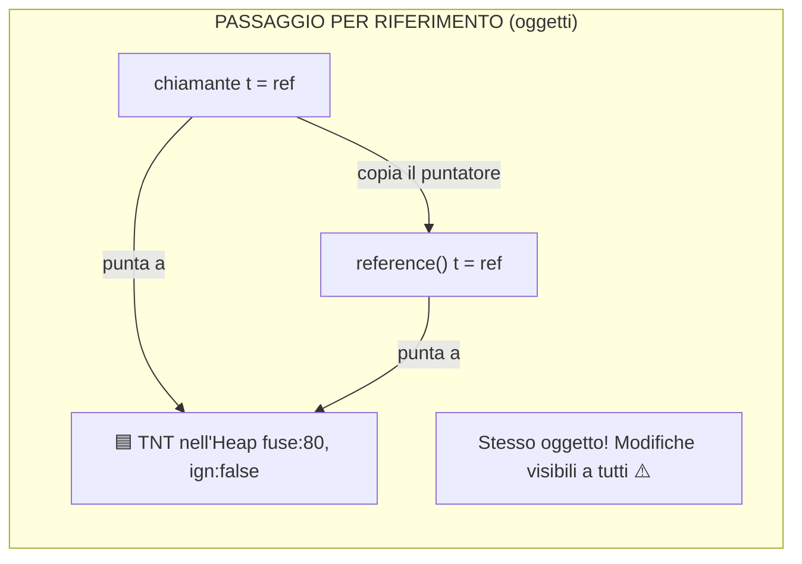

> [!tip] Java nasconde i puntatori
> Non c'è [[Aritmetica dei puntatori]] in Java. Quando una variabile "contiene" un oggetto, in realtà contiene un **[[Puntatore]]** a quell'oggetto. Java inserisce automaticamente i [[Dereference]] quando lavoriamo con oggetti e array. Un puntatore occupa tipicamente un solo registro.

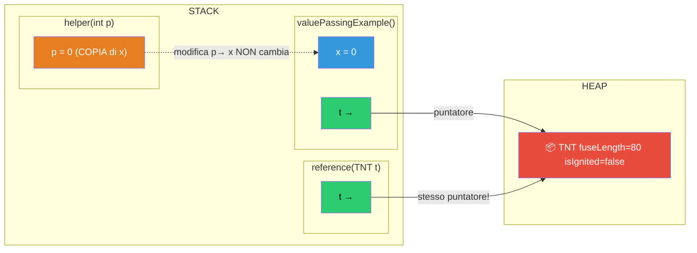

---

### Esempio pratico

```java
    private static void valuePassingExample(){
        // x è una variabile locale (tipo primitivo → nello stack)
        int x = 0;
        // x viene COPIATA nello stack frame di helper.
        // Se helper modifica la sua copia, x NON cambia.
        helper(x);

        // t è una variabile locale che contiene un PUNTATORE
        // alla locazione di memoria dove è allocata la TNT (nell'heap)
        TNT t = new TNT();
        // Il RIFERIMENTO di t viene passato a reference().
        // Se reference() modifica l'oggetto puntato, il cambiamento
        // sarà visibile anche qui!
        reference(t);

        // arrT è una variabile locale che al momento contiene null
        TNT[] arrT;
        // A questo punto la variabile punta alla locazione di memoria
        // dove è allocato l'ARRAY di 5 celle (nell'heap)
        arrT = new TNT[5];

        // Questo ciclo inizializza ogni cella dell'array a una nuova TNT
        for (int i = 0 ; i < 5 ; i++){
            arrT[i] = new TNT();
        }
    }
    private static void helper(int p){}
    private static void reference(TNT t){}
```

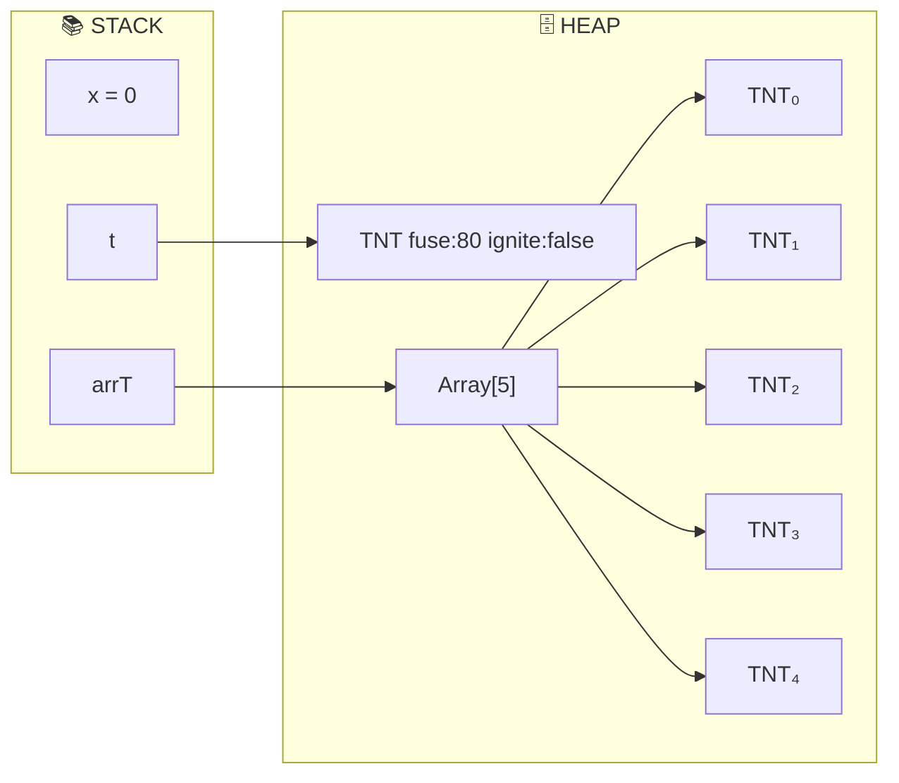

```
  Stato della memoria dopo valuePassingExample():

  STACK                              HEAP
  ┌──────────────┐            ┌─────────────────────────────────┐
  │  x = 0       │            │                                 │
  │  t ──────────────────────►│  TNT { fuse:80, ign:false }     │
  │  arrT ───────────────┐    │                                 │
  └──────────────┘       │    │                                 │
                         │    │  ┌─────┬─────┬─────┬─────┬─────┐│
                         └──► │  │ [0] │ [1] │ [2] │ [3] │ [4] ││
                              │  │     │     │     │     │     ││
                              │  └──┼──┴──┼──┴──┼──┴──┼──┴──┼──┘│
                              │     ▼     ▼     ▼     ▼     ▼   │
                              │   TNT   TNT   TNT   TNT   TNT   │
                              └─────────────────────────────────┘
```

---

## Layout di Classi e Oggetti in Memoria

> [!info] Le 4 sezioni della memoria
> Quando un programma viene caricato, classi e oggetti vengono distribuiti in diverse **sezioni della memoria**:
> 
> | Sezione | Contenuto |
> |---|---|
> | **[[Code Section]]** | Codice dei metodi (static e non-static), costruttori. Condiviso tra tutti gli oggetti |
> | **[[Read-Only Section]]** (data segment) | Campi `static` (e `static final`). Una sola copia, condivisa |
> | **[[Stack]]** | Variabili locali, parametri, stack frame |
> | **[[Heap]]** | Oggetti allocati con `new`. Ogni oggetto ha: v-table + campi non-static |

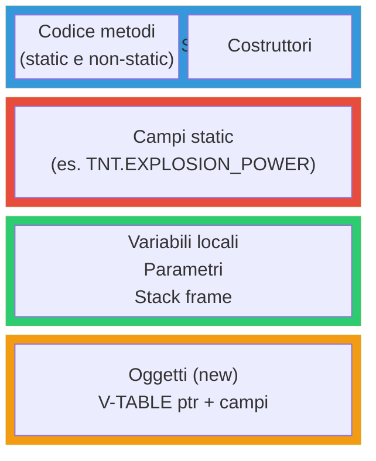

> [!question] Domande guida del Prof
> Consideriamo le classi `Witch`, `Player`, `TNT`:
> - Quando viene caricato il programma: **dove sono i metodi** di ogni classe? E i metodi `static`?
> - **Dove sono** i campi `static`?
> - Quando viene eseguito `layoutTest`, **che oggetti** vengono creati?
> - Come viene creato un oggetto di tipo `Witch`? E uno di `Player`? E uno di `TNT`?

---

### Layout di `Witch`

La classe `Witch` contiene solo **2 metodi** e nessun campo.

```
  Witch:
  ┌───────────────────────────────────────────┐
  │  CODE SECTION                             │
  │  ┌───────────────────────────────────┐    │
  │  │ fakeAttack(Player p) { ... }      │    │
  │  │ attack(Player p)     { ... }      │    │
  │  └───────────────────────────────────┘    │
  │                                           │
  │  READ-ONLY SECTION: (nulla)               │
  │                                           │
  │  V-TABLE per Witch:                       │
  │  ┌─────────────────┐                      │
  │  │ → fakeAttack    │   offset 0           │
  │  │ → attack        │   offset 1           │
  │  └─────────────────┘                      │
  └───────────────────────────────────────────┘
```

---

### Layout di `Player`

La classe `Player` contiene **4 campi** (tutti non-static) e **6 metodi** (tutti non-static).

```
  Player:
  ┌───────────────────────────────────────────┐
  │  CODE SECTION                             │
  │  ┌───────────────────────────────────┐    │
  │  │ setPoisoned(boolean p) { ... }    │    │
  │  │ getUsername()          { ... }    │    │
  │  │ damage(int amount)     { ... }    │    │
  │  │ isAlive()              { ... }    │    │
  │  │ poison()               { ... }    │    │
  │  │ poisonDamage()         { ... }    │    │
  │  └───────────────────────────────────┘    │
  │                                           │
  │  READ-ONLY SECTION: (nulla — nessun campo │
  │                       static)             │
  │                                           │
  │  V-TABLE per Player:                      │
  │  ┌─────────────────┐                      │
  │  │ → setPoisoned   │   offset 0           │
  │  │ → getUsername   │   offset 1           │
  │  │ → damage        │   offset 2           │
  │  │ → isAlive       │   offset 3           │
  │  │ → poison        │   offset 4           │
  │  │ → poisonDamage  │   offset 5           │
  │  └─────────────────┘                      │
  └───────────────────────────────────────────┘
```

---

### Layout di `TNT`

La classe TNT contiene: **2 campi `static`**, **2 [[Campo|campi]]** non-static, **1 [[Costruttore]]** e **3 [[Metodo|metodi]]**.

```
  TNT:
  ┌────────────────────────────────────────────────┐
  │  CODE SECTION                                  │
  │  ┌──────────────────────────────────────┐      │
  │  │ TNT()       (costruttore)  { ... }   │      │
  │  │ ignite()                   { ... }   │      │
  │  │ tick()                     { ... }   │      │
  │  │ explode()   (private)      { ... }   │      │
  │  └──────────────────────────────────────┘      │
  │  (i metodi static, se ci fossero,              │
  │   andrebbero anch'essi nella code section)     │
  │                                                │
  │  READ-ONLY SECTION (campi static):             │
  │  ┌──────────────────────────────────────┐      │
  │  │ EXPLOSION_POWER = 100    (final)     │      │
  │  │ DEFAULT_FUSE_LENGTH = 80             │      │
  │  └──────────────────────────────────────┘      │
  │                                                │
  │  V-TABLE per TNT:                              │
  │  ┌─────────────────┐                           │
  │  │ → ignite        │   offset 0                │
  │  │ → tick          │   offset 1                │
  │  │ → explode       │   offset 2                │
  │  └─────────────────┘                           │
  └────────────────────────────────────────────────┘
```

> [!exercise] Domanda del Prof
> I metodi `static` vanno nella v-table?

> [!success] Risposta
> **No.** I metodi `static` vengono risolti **staticamente** a compile time (il compilatore sa già quale codice eseguire). La v-table serve per la [[Risoluzione dinamica]] dei metodi a runtime, che diventa fondamentale con l'[[ereditarietà]] e il [[polimorfismo]].

---

### La [[V-Table]]

 Ogni classe contiene una **v-table** (virtual method table): un elenco di **puntatori** alle implementazioni dei metodi. È la struttura che permette a Java di sapere **quale codice eseguire** quando si chiama un metodo su un oggetto.

> [!warning] Ordinamento dei metodi
> L'ordinamento dei metodi nella v-table **non** è quello definito dal programmatore — è determinato dal compilatore e interagisce con l'[[ereditarietà]]. Per ora basta sapere che i metodi sono ordinati, ma non sappiamo come.

**V-TABLE di `Witch`** (supponendo `fakeAttack` @ `0x000010`, `attack` @ `0x000040`):

| Indice | Indirizzo | Metodo |
|---|---|---|
| offset 0 | `0x000010` | → `fakeAttack` |
| offset 1 | `0x000040` | → `attack` |

Il compilatore sa: `fakeAttack` = offset `0`, `attack` = offset `1`.

**V-TABLE di `Player`** (supponendo metodi @ `0x0000A0` ... `0x0000F0`):

| Indice | Indirizzo | Metodo |
|---|---|---|
| offset 0 | `0x0000A0` | → `setPoisoned` |
| offset 1 | `0x0000B0` | → `getUsername` |
| offset 2 | `0x0000C0` | → `damage` |
| offset 3 | `0x0000D0` | → `isAlive` |
| offset 4 | `0x0000E0` | → `poison` |
| offset 5 | `0x0000F0` | → `poisonDamage` |

> [!exercise] Domanda del Prof
> Come potrebbe essere fatta la v-table di `TNT`? Contate che alcuni metodi sono `static`.

> [!success] Risposta
> La v-table di `TNT` conterrebbe solo i metodi **non-static**: `ignite`, `tick`, `explode` (3 entries). Il costruttore `TNT()` non va nella v-table (i costruttori non sono dispatched dinamicamente).

---

### Layout degli Oggetti (istanze)

> [!info] Layout comune di un oggetto
> Ogni oggetto in [[heap]] segue questo **layout standard**:
> 
> | Posizione | Contenuto |
> |---|---|
> | 1ª parola | **Puntatore → V-TABLE** della sua classe |
> | 2ª parola | Campo 1 (non-static) |
> | 3ª parola | Campo 2 (non-static) |
> | ... | ... |

**Come avviene l'invocazione di un metodo** (es. `w1.fakeAttack(p)`):

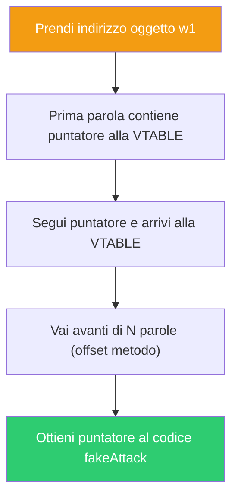

> [!exercise] Esercizio del Prof
> Ragionate su come viene fatta l'invocazione dei metodi di `TNT` e di `Player`.

> [!tip] Suggerimento per l'esercizio
> Seguite gli stessi 5 passi dell'esempio di `Witch`:
> - Per `TNT.ignite()`: offset 0 nella v-table di TNT → segui il puntatore → codice di `ignite`
> - Per `Player.damage(5)`: offset 2 nella v-table di Player → segui il puntatore → codice di `damage`

---

### Esempio completo: `layoutTest()`

```java
    private static void layoutTest(){
        Witch w1 = new Witch();
        Witch w2 = new Witch();
        Player p1 = new Player();
        Player p2 = new Player();
        p1.setPoisoned(true);
        p2.damage(10);
        TNT t1 = new TNT();
        TNT t2 = new TNT();
        t1.ignite();
        t2.tick();
    }
}
```

Vediamo **passo-passo** l'evoluzione della memoria:

#### Passo 1: Creazione di `w1` e `w2`

> [!note] Gli oggetti `Witch` non hanno campi — solo il link alla v-table!

```
  STACK (layoutTest)             HEAP
  ┌────────────────┐
  │ w1 ─────────────────────► ┌──────────────┐
  │                │          │ → V-TABLE_W  │  Witch non ha campi,
  │ w2 ─────────────────────► └──────────────┘  solo il link alla v-table
  │                │          ┌──────────────┐
  │                │          │ → V-TABLE_W  │
  └────────────────┘          └──────────────┘
```

#### Passo 2: Creazione di `p1` e `p2`, poi `p1.setPoisoned(true)`

```
  STACK                       HEAP

  p1 ────────────────────────► ┌──────────────────┐
                               │ → V-TABLE_P      │
                               │ username: null   │
                               │ health: 20       │
                               │ isPoisoned: false│  ← diventerà true!
                               │ fakeHealth: 10   │
                               └──────────────────┘

  p2 ────────────────────────► ┌──────────────────┐
                               │ → V-TABLE_P      │
                               │ username: null   │
                               │ health: 20       │
                               │ isPoisoned: false│
                               │ fakeHealth: 10   │
                               └──────────────────┘
```

Supponendo che la v-table di Player sia all'indirizzo `0x00A000`:

**Layout di `p1` PRIMA di `setPoisoned(true)`:**

| [[Offset]] | Contenuto  | [[Campo]]  |
| ---------- | ---------- | ---------- |
| 0          | `0x00A000` | → V-TABLE  |
| 1          | `null`     | username   |
| 2          | `20`       | health     |
| 3          | `false`    | isPoisoned |
| 4          | `10`       | fakeHealth |

**Layout di `p1` DOPO `setPoisoned(true)`:**

| [[Offset]] | Contenuto              | [[Campo]]     |
| ---------- | ---------------------- | ------------- |
| 0          | `0x00A000`             | → [[V-Table]] |
| 1          | `null`                 | username      |
| 2          | `20`                   | health        |
| 3          | **`true`** ← cambiato! | isPoisoned    |
| 4          | `10`                   | fakeHealth    |

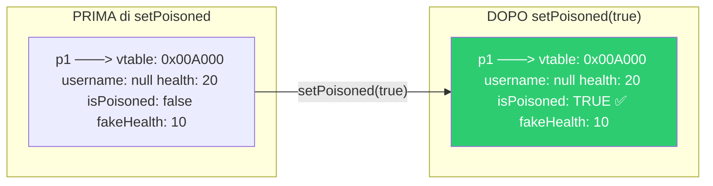

#### Passo 3: Creazione di `t1` e `t2`, poi `t1.ignite()` e `t2.tick()`

> [!warning] Ricorda
> I campi `static` (`EXPLOSION_POWER` e `DEFAULT_FUSE_LENGTH`) **NON** sono nell'oggetto — sono nella **Read-Only Section**!

```
  t1 ────────────────────────► ┌──────────────────┐
                               │ → V-TABLE_T      │
                               │ fuseLength: 80   │ ← diventa 79 dopo ignite+tick
                               │ isIgnited: false │ ← diventerà true con ignite()
                               └──────────────────┘

  t2 ────────────────────────► ┌──────────────────┐
                               │ → V-TABLE_T      │
                               │ fuseLength: 80   │
                               │ isIgnited: false │  ← tick() non fa nulla
                               └──────────────────┘    (non è innescata!)
```

> [!exercise] Esercizio del Prof
> Pensate al layout completo di `t1` dopo `ignite()` e poi `tick()`, e di `t2` dopo `tick()`.

> [!success] Risposta
>
> **`t1` dopo `ignite()` + `tick()`:**
>
> | Offset | Contenuto |
> | ------ | --------- |
> | 0 | `→ V-TABLE_T` |
> | 1 | `79` (fuseLength decrementato di 1) |
> | 2 | `true` (isIgnited = true dopo ignite) |
>
> **`t2` dopo `tick()`:**
>
> | Offset | Contenuto |
> | ------ | --------- |
> | 0 | `→ V-TABLE_T` |
> | 1 | `80` (fuseLength **invariato**!) |
> | 2 | `false` (isIgnited è false → tick non fa nulla) |


#### Visione d'insieme della memoria

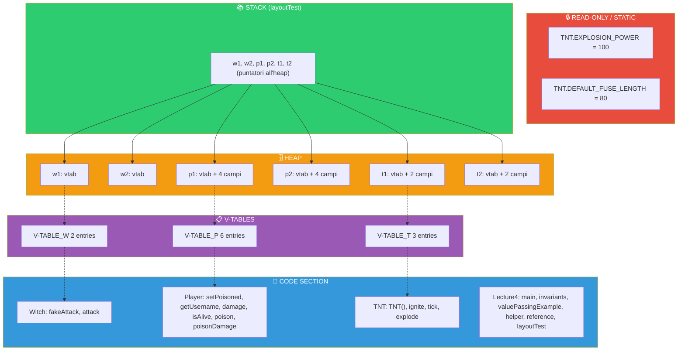

```
  ╔═══════════════════════════════════════════════════════════╗
  ║                  MEMORIA COMPLETA (ASCII)                 ║
  ╠═══════════════════════════════════════════════════════════╣
  ║                                                           ║
  ║  CODE SECTION                                             ║
  ║  ┌─────────────────────────────────────────────────┐      ║
  ║  │ Witch: fakeAttack, attack                       │      ║
  ║  │ Player: setPoisoned, getUsername, damage,       │      ║
  ║  │         isAlive, poison, poisonDamage           │      ║
  ║  │ TNT: TNT(), ignite, tick, explode               │      ║
  ║  │ Lecture4: main, invariants, valuePassingExample,│      ║
  ║  │           helper, reference, layoutTest         │      ║
  ║  └─────────────────────────────────────────────────┘      ║
  ║                                                           ║
  ║  READ-ONLY / STATIC DATA                                  ║
  ║  ┌─────────────────────────────────────────────────┐      ║
  ║  │ TNT.EXPLOSION_POWER = 100                       │      ║
  ║  │ TNT.DEFAULT_FUSE_LENGTH = 80                    │      ║
  ║  └─────────────────────────────────────────────────┘      ║
  ║                                                           ║
  ║  V-TABLES                                                 ║
  ║  ┌────────────┐  ┌────────────┐  ┌────────────┐           ║
  ║  │ V-TABLE_W  │  │ V-TABLE_P  │  │ V-TABLE_T  │           ║
  ║  │  2 entries │  │  6 entries │  │  3 entries │           ║
  ║  └────────────┘  └────────────┘  └────────────┘           ║
  ║                                                           ║
  ║  STACK (layoutTest)                                       ║
  ║  ┌───────────────────────┐                                ║
  ║  │ w1, w2, p1, p2, t1, t2 │  (puntatori)                  ║
  ║  └───────────────────────┘                                ║
  ║                                                           ║
  ║  HEAP                                                     ║
  ║  ┌─────┐ ┌─────┐ ┌──────────┐ ┌──────────┐ ┌─────┐ ┌─────┐║
  ║  │ w1  │ │ w2  │ │ p1       │ │ p2       │ │ t1  │ │ t2  │║
  ║  │vtab │ │vtab │ │vtab+4fld │ │ vtab+4fld│ │vt+2f│ │vt+2f│║
  ║  └─────┘ └─────┘ └──────────┘ └──────────┘ └─────┘ └─────┘║
  ║                                                           ║
  ╚═══════════════════════════════════════════════════════════╝
```

---

## Concetti Chiave per Collegamenti Obsidian

| Concetto                       | Descrizione                                              |
| ------------------------------ | -------------------------------------------------------- |
| [[Incapsulamento]]             | Information hiding, nascondere i dettagli implementativi |
| [[Invariante]]                 | Proprietà che è SEMPRE vera per una classe/oggetto       |
| [[Passaggio per Copia]]        | Tipi primitivi, il valore viene duplicato                |
| [[Passaggio per Riferimento]]  | Oggetti e array, si passa il puntatore                   |
| [[Stack]]                      | Dove vivono le variabili locali e i parametri            |
| [[Heap]]                       | Dove vengono allocati gli oggetti (con `new`)            |
| [[Puntatore]]                  | Indirizzo di memoria (Java lo nasconde)                  |
| [[null]]                       | Assenza di valore, default per oggetti e array           |
| [[V-Table]]                    | Tabella virtuale, elenco di puntatori ai metodi          |
| [[Layout in Memoria]]          | Come classi e oggetti sono organizzati in memoria        |
| [[Code Section]]               | Dove risiede il codice eseguibile dei metodi             |
| [[Read-Only Section]]          | Dove risiedono i campi static                            |
| [[Modificatori di Visibilità]] | `public`, `private`, `protected`, package-private        |
| [[Keyword final]]              | Rende un campo costante                                  |
| [[Keyword static]]             | Campi e metodi appartenenti alla classe                  |

---

> **Lezione precedente:** [[Lezione 03 - Package, Visibilità, Final, Static]]
> **Prossima lezione:** [[Lezione 05 - Ereditarietà, Polimorfismo, Object|Lezione 05]] ([[Ereditarietà]])
