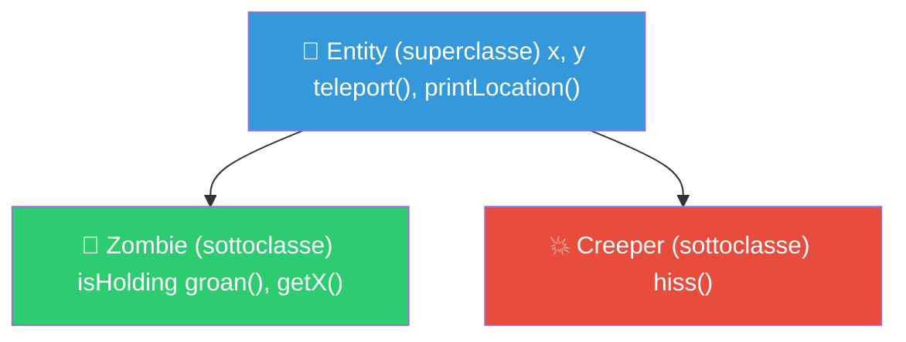
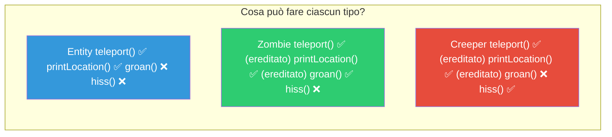
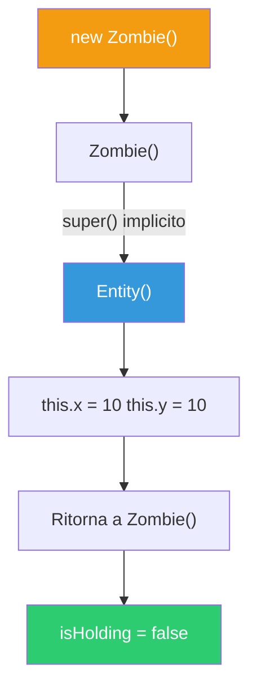
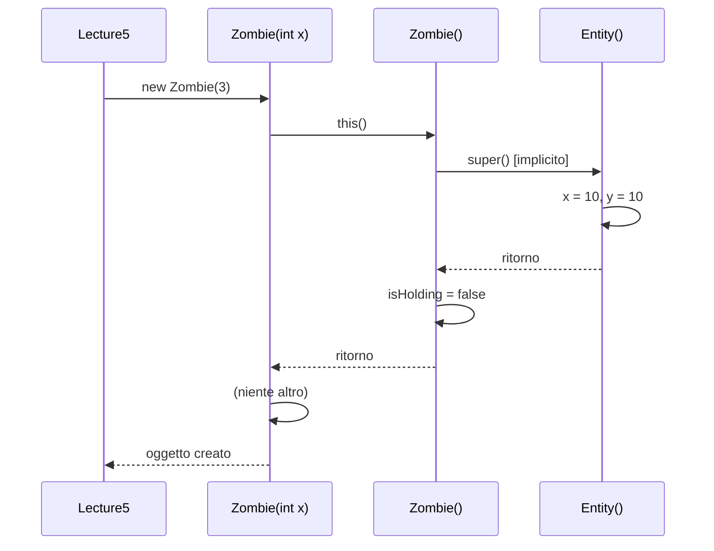
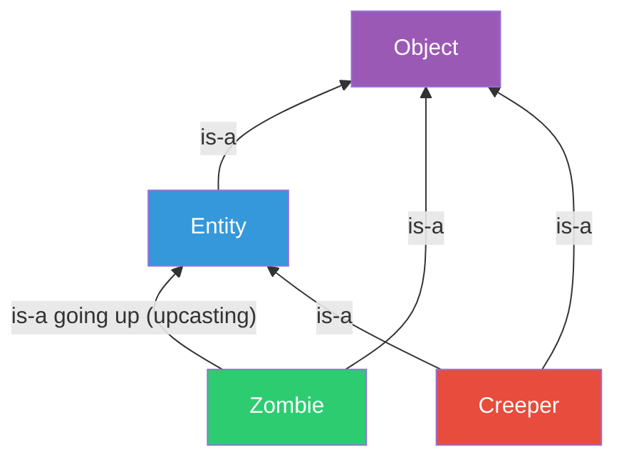
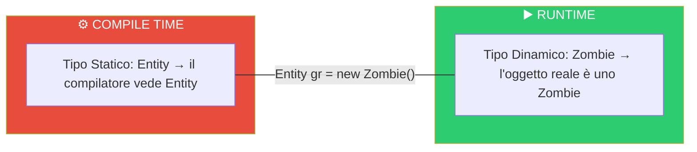
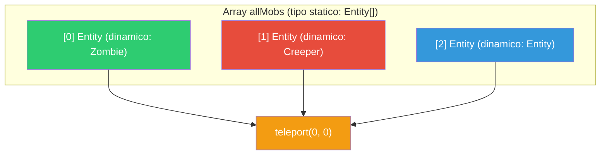
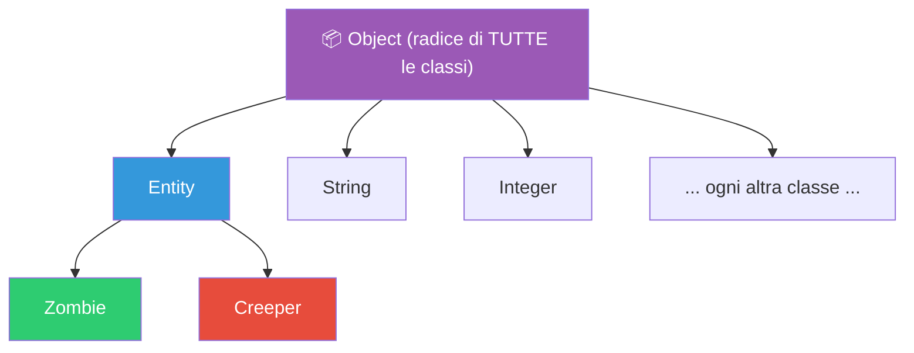
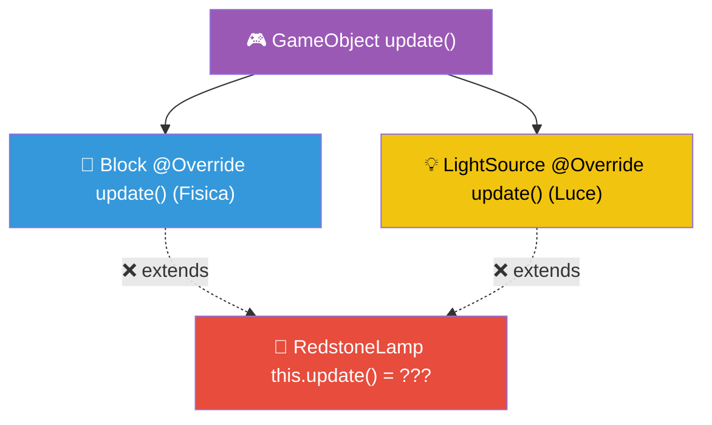

> [!abstract] Panoramica
> **Bloom's Taxonomy:** Understand, Analyse, Apply
>
> In questa lezione introduciamo l'**[[Ereditarietà]]** — uno dei pilastri fondamentali della [[Programmazione Orientata agli Oggetti|OOP]] — mostrando come strutturare le classi in gerarchie con **superclassi** e **sottoclassi** tramite la keyword `extends`. Poi vediamo il **[[Polimorfismo]]** di sottotipo (upcasting, relazione "is-a"), la classe **Object** come radice dell'albero di ereditarietà e il **Diamond Problem**.

---

## Indice

- [[#Ereditarietà — Riuso del codice]]
  - [[#La superclasse `Entity`]]
  - [[#La sottoclasse `Zombie`]]
  - [[#La sottoclasse `Creeper`]]
  - [[#Esempio: `inheritanceExample()`]]
  - [[#Cosa si eredita e cosa no]]
- [[#Costruttori e `super()`]]
  - [[#Regole sul `super()`]]
  - [[#Esempio: `inheritanceAndConstructorsExample()`]]
- [[#Polimorfismo di Sottotipo]]
  - [[#I tre tipi di polimorfismo]]
  - [[#La relazione "is-a" e l'Upcasting]]
  - [[#Tipo Statico vs Tipo Dinamico]]
  - [[#Esempio: `subtypingExample()`]]
- [[#La classe Object]]
  - [[#Metodi principali di Object]]
  - [[#Esempio: `classObjectExample()`]]
- [[#Il Diamond Problem]]
  - [[#Perché Java vieta l'ereditarietà multipla]]
- [[#Concetti Chiave per Collegamenti Obsidian]]

---

## File principale — `Lecture5.java`

> [!note] Dipendenze
> La Lezione 05 definisce le proprie classi nel package `lecture05.inheritance` (`Entity`, `Zombie`, `Creeper`).

```java
package lecture05;
import lecture05.inheritance.*;

public class Lecture5 {
    public static void main(String[] args) {
        System.out.println("---------------- Ereditarieta` ----------------");
        inheritanceExample();
        inheritanceAndConstructorsExample();
        System.out.println("---------------- Polimorfismo di sottotipo ----------------");
        subtypingExample();
        System.out.println("---------------- La classe Object ----------------");
        classObjectExample();
        System.out.println("---------------- Il Diamond Problem ----------------");
    }
```

---

## Ereditarietà — Riuso del codice

L'**[[Ereditarietà]]** è un pilastro dell'OOP il cui obiettivo principale è il **riuso del codice**. Permette di organizzare le classi in un **albero gerarchico**:

- La **superclasse** (o classe **padre**) definisce campi e metodi comuni
- Le **sottoclassi** (o classi **figlie**) **ereditano** campi e metodi dalla superclasse e possono **aggiungere** stato e comportamento specifico

Java permette l'ereditarietà singola: per ogni classe c'è al massimo una superclasse, mentre il numero di sottoclassi non è limitato



```
  Gerarchia di ereditarietà:

          ┌──────────────────────┐
          │       Entity         │  ← superclasse
          │  x, y                │
          │  teleport()          │
          │  printLocation()     │
          └──────────┬───────────┘
                     │ extends
          ┌──────────┴───────────┐
          │                      │
  ┌───────┴──────┐     ┌────────┴─────┐
  │    Zombie     │     │    Creeper   │  ← sottoclassi
  │  isHolding    │     │  hiss()      │
  │  groan()      │     └──────────────┘
  │  getX()       │
  └───────────────┘
```

> [!info] Cosa si eredita?
> Le sottoclassi ereditano i campi e metodi `public` e [[protected]] della superclasse, ma **non** quelli `private`. La keyword per stabilire la relazione di ereditarietà è **`extends`**.

> [!tip] Vantaggi
> Il codice di `teleport()`, ad esempio, viene scritto **una sola volta** in `Entity`. Se va debuggato, c'è **un solo posto** dove intervenire, anche se sia `Zombie` che `Creeper` ne dispongono.

---

### La superclasse `Entity`

La superclasse definisce lo stato e il comportamento **comune** a tutte le entità del gioco:

```java
package lecture05.inheritance;

public class Entity { // superclasse comune
    protected double x; // posizione x
    protected double y; // posizione y

    public void teleport(double newX, double newY) {
        this.x = newX;
        this.y = newY;
    }

    public void printLocation(){
        System.out.println("Entity " + this.getClass().toString().substring(28)
                + " at: " + this.x + " " + this.y);
    }

    public Entity(){
        this.x = 10;
        this.y = 10;
        System.out.print(" in Entity() ");
    }

    public Entity(int x, int y){
        this.x = x;
        this.y = y;
        System.out.print(" in Entity(x,y) ");
    }
}
```

> [!warning] Perché `protected` e non `private` o `public`?
> - Se i campi `x` e `y` fossero **`private`**, le sottoclassi (`Zombie`, `Creeper`) **non** li vedrebbero e non potrebbero usarli direttamente
> - Se fossero **`public`**, **chiunque** potrebbe leggerli e modificarli, violando l'[[Incapsulamento]]
> - **[[protected]]** è il compromesso: visibile alla classe stessa, allo stesso [[Package]] e alle **classi figlie** (sottoclassi) → lo vedo io e le mie sottoclassi

| Modificatore | Classe | Package | Figli | Tutti |
|---|---|---|---|---|
| `private` | ✅ | ❌ | ❌ | ❌ |
| `protected` | ✅ | ✅ | ✅ | ❌ |
| `public` | ✅ | ✅ | ✅ | ✅ |

---

### La sottoclasse `Zombie`

`Zombie` **estende** **Entity**: eredita `x`, `y`, `teleport()` e `printLocation()`, e **aggiunge** un campo (`isHolding`) e metodi propri (`groan()`, `getX()`).
Un V-Table per ogni oggetto.
Zombie è un estensione di **Entity**

```java
package lecture05.inheritance;

public class Zombie extends Entity { // sottoclasse di Entity 
    private boolean isHolding; // private → locale solo alla classe

    public void groan() {
        System.out.println("Zombie at [" + this.x + ", " + this.y + "] says: Groaaaann...");
    }

    public double getX(){
        return this.x;
    }

    public Zombie(){
        isHolding = false;
        System.out.print(" in Zombie() ");
    }

    public Zombie(int x){
        this();
        System.out.print(" in Zombie(x) ");
    }
}
```

> [!tip] `this.x` e `this.y` in `groan()`
> Dentro `Zombie`, possiamo usare `this.x` e `this.y` anche se **non sono definiti** in `Zombie` — li ereditiamo da `Entity` grazie al modificatore [[protected]]. È come se fossero "nostri", ma la definizione sta nella superclasse.

> [!info] Campo aggiunto
> `isHolding` è un campo **`private`** specifico di `Zombie`. La superclasse `Entity` non lo vede, ma eventuali sottoclassi di `Zombie` potrebbero vederlo se fosse `protected`.

> [!question] 📱 Quiz del Prof
> Considerate `Drowned` come sottoclasse di `Zombie`. `Drowned` ha accesso a `isHolding`?

> [!success] Risposta
> **No!** `isHolding` è `private` → solo `Zombie` stesso può accedervi. Se si volesse renderlo visibile ai figli, bisognerebbe cambiarlo in `protected`.

---

### La sottoclasse `Creeper`

`Creeper` estende `Entity` e aggiunge il metodo `hiss()`:

```java
package lecture05.inheritance;

public class Creeper extends Entity {
    public void hiss() {
        System.out.println("Hisss");
    }

    public Creeper(int x){
        System.out.print(" in Creeper() ");
    }

    public Creeper(int x, int y){
        super(x, y); // chiama il costruttore della superclasse
        System.out.print(" in Creeper(x,y) ");
    }
}
```

*super* chiama il primo nell'ereditarietà. **Costruttori** NON SONO **METODI** → non si propagano nella gerarchia dell'ereditarietà. NON si ereditano.

---

### Esempio: `inheritanceExample()`

```java
    private static void inheritanceExample() {
        Zombie z = new Zombie();
        Creeper c = new Creeper(0);

        z.teleport(10, 64);   // teleport() è definito in Entity, ma Zombie lo eredita
        c.teleport(20, 64);   // anche Creeper eredita teleport()

        z.groan();             // groan() appart solo a 'Creeper', non a Entity
        c.hiss();              // hiss() è specifico di Creeper ✅

        Entity e = new Entity();
    }
```




```
  Accessibilità dei metodi per tipo:

  ┌──────────────────┬────────────┬────────────┬────────────┐
  │     Metodo       │   Entity   │   Zombie   │  Creeper   │
  ├──────────────────┼────────────┼────────────┼────────────┤
  │ teleport()       │     ✅     │ ✅ (ered.) │ ✅ (ered.) │
  │ printLocation()  │     ✅     │ ✅ (ered.) │ ✅ (ered.) │
  │ groan()          │     ❌     │     ✅     │     ❌     │
  │ hiss()           │     ❌     │     ❌     │     ✅     │
  │ getX()           │     ❌     │     ✅     │     ❌     │
  └──────────────────┴────────────┴────────────┴────────────┘
```

> [!warning] Attenzione
> - Da `Lecture5.java` non possiamo fare `z.x` perché `x` è [[protected]] e `Lecture5` non è né `Entity` né una sua sottoclasse, né nello stesso package
> - `Zombie` **può** accedere a `this.x` dentro i suoi metodi (come fa in `groan()`) perché è figlio di `Entity`
> - Non possiamo chiamare `z.hiss()` (Zombie non ha `hiss()`) né `c.groan()` (Creeper non ha `groan()`)

---

### Cosa si eredita e cosa no

```
  ╔═══════════════════════════════════════════════════════════╗
  ║               COSA SI EREDITA?                            ║
  ╠═══════════════════════════════════════════════════════════╣
  ║                                                           ║
  ║  ✅ SI EREDITANO:                                         ║
  ║     • Campi public e protected                            ║
  ║     • Metodi public e protected                           ║
  ║                                                           ║
  ║  ❌ NON SI EREDITANO:                                     ║
  ║     • Campi e metodi private                              ║
  ║     • COSTRUTTORI (mai!)                                  ║
  ║                                                           ║
  ║  ⚠️ NOTA:                                                 ║
  ║     I campi private ESISTONO nell'oggetto figlio          ║
  ║     (occupano spazio in memoria), ma non sono             ║
  ║     ACCESSIBILI dalla sottoclasse                         ║
  ║                                                           ║
  ╚═══════════════════════════════════════════════════════════╝
```

> [!info] Ereditarietà singola in Java
> [[Java]] permette **ereditarietà singola**: ogni classe può avere al massimo **una** superclasse, ma il numero di sottoclassi non è limitato. Altri linguaggi (come [[C++]]) permettono l'ereditarietà multipla, ma questo può causare problemi (vedi [[#Il Diamond Problem]]).

---

## Costruttori e `super()`

I **[[Costruttore|costruttori]] non si ereditano mai**. La sottoclasse deve definire i propri costruttori. Tuttavia, dalla sottoclasse possiamo **richiamare** i costruttori della superclasse con la keyword **`super()`**.



> [!warning] Non confondere `super()` con `super`!
> - **`super()`** (con parentesi) → chiama un **costruttore** della superclasse
> - **`super`** (senza parentesi) → riferimento alla superclasse stessa (lo vedremo più avanti con l'overriding)

---

### Regole sul `super()`

```
  ╔═══════════════════════════════════════════════════════════╗
  ║                REGOLE SU super()                          ║
  ╠═══════════════════════════════════════════════════════════╣
  ║                                                           ║
  ║  1. Deve essere la PRIMA riga del costruttore             ║
  ║                                                           ║
  ║  2. Non può chiamare costruttori PRIVATE della            ║
  ║     superclasse                                           ║
  ║                                                           ║
  ║  3. Non può coesistere con this() nello stesso            ║
  ║     costruttore (entrambi devono essere la prima riga)    ║
  ║                                                           ║
  ║  4. Se non è presente esplicitamente, il compilatore      ║
  ║     inserisce automaticamente una chiamata a super()      ║
  ║     (costruttore di default della superclasse)            ║
  ║                                                           ║
  ╚═══════════════════════════════════════════════════════════╝
```

> [!tip] Regola implicita
> Se non scrivi `super(...)` come prima riga, Java inserisce automaticamente `super()` (senza argomenti). Questo significa che la superclasse **deve** avere un [[Costruttore di default]] disponibile, altrimenti il codice non compilerà!

Vediamo come `super()` e `this()` vengono usati nelle nostre classi:

| Costruttore | Prima riga | Chiama |
|---|---|---|
| `Entity()` | — | Nessun super (è la radice, o meglio chiama `Object()`) |
| `Entity(int x, int y)` | — | Nessun super esplicito |
| `Zombie()` | `super()` implicito | → `Entity()` |
| `Zombie(int x)` | `this()` | → `Zombie()` → `Entity()` |
| `Creeper(int x)` | `super()` implicito | → `Entity()` |
| `Creeper(int x, int y)` | `super(x, y)` esplicito | → `Entity(int x, int y)` |

---

### Esempio: `inheritanceAndConstructorsExample()`

```java
    private static void inheritanceAndConstructorsExample(){
        System.out.println("Attraversiamo i costruttori");

        Zombie z1 = new Zombie();
        z1.printLocation();
        // Stampa: "in Entity()  in Zombie()" poi "Entity Zombie at: 10.0 10.0"
        // → Zombie() chiama implicitamente super() → Entity() setta x=10, y=10

        Zombie z2 = new Zombie(3);
        z2.printLocation();
        // Stampa: "in Entity()  in Zombie()  in Zombie(x)" poi "Entity Zombie at: 10.0 10.0"
        // → Zombie(3) chiama this() → Zombie() → Entity() → x=10, y=10

        Entity e1 = new Entity();
        e1.printLocation();
        // Stampa: "in Entity()" poi "Entity Entity at: 10.0 10.0"

        Entity e2 = new Entity(4, 4);
        e2.printLocation();
        // Stampa: "in Entity(x,y)" poi "Entity Entity at: 4.0 4.0"

        Creeper c1 = new Creeper(7);
        c1.printLocation();
        // Stampa: "in Entity()  in Creeper()" poi "Entity Creeper at: 10.0 10.0"
        // → Creeper(7) chiama implicitamente super() → Entity() → x=10, y=10

        Creeper c2 = new Creeper(7,7);
        c2.printLocation();
        // Stampa: "in Entity(x,y)  in Creeper(x,y)" poi "Entity Creeper at: 7.0 7.0"
        // → Creeper(7,7) chiama super(7,7) → Entity(7,7) → x=7, y=7
    }
```

Analizziamo la catena di costruttori per `new Zombie(3)`:



```
  Catena dei costruttori per new Zombie(3):

  new Zombie(3)
       │
       ▼
  Zombie(int x) ──── this() ────► Zombie()
                                      │
                                      ▼ super() [implicito]
                                  Entity()
                                      │
                                      ▼
                                  x = 10, y = 10
                                      │ ritorna
                                      ▼
                                  isHolding = false
                                      │ ritorna
                                      ▼
                                  stampa: " in Entity()  in Zombie()  in Zombie(x) "
```

> [!question] 📱 Quiz del Prof
> Cosa stampa se commentiamo `super(x, y)` dentro a `Creeper(int x, int y)`?

> [!success] Risposta
> Il compilatore inserisce automaticamente `super()` (senza argomenti) → viene chiamato `Entity()` che setta `x=10, y=10` — **non** i valori passati! Quindi `new Creeper(7,7)` avrebbe comunque posizione `(10, 10)` e non `(7, 7)`.

> [!question] 📱 Quiz del Prof
> Posso creare uno `Zombie` facendo `new Zombie(0, 0)`, visto che `Entity` ha il costruttore `Entity(int x, int y)`?

> [!success] Risposta
> **No!** I costruttori **non si ereditano**. `Zombie` ha solo `Zombie()` e `Zombie(int x)`. Per poter fare `new Zombie(0, 0)` bisognerebbe definire esplicitamente un costruttore `Zombie(int x, int y)` nella classe `Zombie`.

---

## Polimorfismo di Sottotipo

Ora che sappiamo *come funziona* l'ereditarietà, vediamo le **proprietà** che ci dà — in particolare il **[[Polimorfismo]]**.

### I tre tipi di polimorfismo

```
  ╔═══════════════════════════════════════════════════════════╗
  ║               I 3 TIPI DI POLIMORFISMO                    ║
  ╠═══════════════════════════════════════════════════════════╣
  ║                                                           ║
  ║  1. AD-HOC (Overloading)                                  ║
  ║     → Più metodi con lo stesso nome ma firma diversa      ║
  ║     → Es: Zombie() e Zombie(int x) — stessa classe,       ║
  ║        [[Firma]] diversa                                  ║
  ║                                                           ║
  ║  2. DI SOTTOTIPO (quello che vediamo ora)                 ║
  ║     → Una variabile di tipo A può contenere valori il     ║
  ║       cui tipo è sottotipo di A                           ║
  ║                                                           ║
  ║  3. PARAMETRICO (Generics)                                ║
  ║     → Lo vedremo nelle prossime lezioni                   ║
  ║                                                           ║
  ╚═══════════════════════════════════════════════════════════╝
```

---

### La [[relazione "is-a"]] e l'Upcasting

Il polimorfismo di sottotipo nasce dalla **[[relazione "is-a"]]** (è-un → **sottotipo**):

> Ogni oggetto **è del proprio tipo**, ma è anche **di ogni suo supertipo**.

Un `Zombie` **is-a** `Zombie`, ma anche **is-a** `Entity` e **is-a** `Object`.



Questa relazione induce l'**upcasting**: una variabile di un certo sottotipo viene "upcast-ata", cioè messa in e considerata come di un suo supertipo. Vado in su⤒ nella gerarchia dell'ereditarietà.

```java
Entity gr = new Zombie();   // ✅ Zombie "is-a" Entity → upcasting
```

```
  ┌──────────────────────────────────────────────────┐
  │                  UPCASTING                       │
  │                                                  │
  │  Entity gr = new Zombie();                       │
  │                                                  │
  │  Tipo STATICO di gr:   Entity                    │
  │  (quello che vede il compilatore)                │
  │                                                  │
  │  Tipo DINAMICO di gr:  Zombie                    │
  │  (il tipo reale dell'oggetto a runtime)          │
  │                                                  │
  │  Il compilatore tratta gr come Entity            │
  │  → puoi chiamare solo metodi di Entity su gr     │
  │  → NON puoi chiamare groan() su gr!              │
  └──────────────────────────────────────────────────┘
```

---

### Tipo [[Statico]] vs Tipo [[Dinamico]]

Questo è un concetto **fondamentale**: ogni variabile in Java ha due tipi:

| | Tipo **Statico** | Tipo **Dinamico** |
|---|---|---|
| **Quando** | A compile time | A runtime |
| **Determinato da** | La dichiarazione della variabile | L'oggetto effettivamente assegnato con `new` |
| **Chi lo usa** | Il [[Compilatore]] | La JVM (per la [[Risoluzione dinamica]]) |



> [!warning] Conseguenze pratiche
> Se `gr` è dichiarato come `Entity`, il **compilatore** permette solo di chiamare metodi definiti in `Entity` (es. `teleport()`), anche se l'oggetto è in realtà uno `Zombie`. Non possiamo chiamare `gr.groan()` — per il compilatore `gr` è un `Entity` e `Entity` non ha `groan()`.

---

### Esempio: `subtypingExample()`

```java
    private static void subtypingExample() {
        Entity gr = new Zombie();    // gr ha tipo statico Entity, tipo dinamico Zombie

        Entity[] allMobs = new Entity[3]; // si trova dentro lo stack
        allMobs[0] = new Zombie();   // Upcasting: Zombie → Entity
        allMobs[1] = new Creeper(0); // Upcasting: Creeper → Entity
        allMobs[2] = new Entity(10, 10);   // Nessun upcasting necessario

        System.out.println(">> Moving all mobs...");
        for (Entity e : allMobs) {
            gotoSpawn(e);
            z.groan();
            // allMobs[0].groan();   // SBAGLIATO pk allMobs è di tipo Entity
        }
        
        private static void gotoSpawn(Entity e) {
	        e.teleport(0, 0);       // ✅ teleport() è definito in Entity
        }
    }
```




```
  Array allMobs — contenuto a runtime:

  ┌───────────┬───────────┬───────────┐
  │  [0]      │  [1]      │  [2]      │
  │  Zombie   │  Creeper  │  Entity   │
  │  is-a     │  is-a     │  is-a     │
  │  Entity ✅│  Entity ✅│  Entity ✅│
  └───────────┴───────────┴───────────┘
       │            │            │
       └────────────┼────────────┘
                    │
            teleport(0, 0) ✅
            (definito in Entity)
```

> [!tip] La potenza del polimorfismo
> Grazie al polimorfismo, possiamo scrivere **un solo ciclo** che chiama `teleport()` su **tutti** gli elementi dell'array, indipendentemente dal loro tipo dinamico. Se domani aggiungiamo un `Skeleton extends Entity`, non dobbiamo cambiare il ciclo! Questo è il cuore del riuso del codice con l'ereditarietà.

> [!question] 📱 Quiz del Prof
> Possiamo fare `Zombie z = new Entity()`?

> [!success] Risposta
> **No!** Questo sarebbe **downcasting** — non è automatico. Un `Entity` **non è** necessariamente uno `Zombie`. Solo il contrario è vero: uno `Zombie` **è** sempre un `Entity`.

---

## La classe [[Object]]

**Tutte** le classi in [[Java]] estendono implicitamente la classe `Object`. Se una classe non dichiara `extends ...`, Java inserisce automaticamente `extends Object`. [[Object]] è una classe standard di java → tutte le classi estendono a Object.
getClass() → **ASSOLUTAMENTE VIETATO**.



```
  Albero di ereditarietà (semplificato):

              ┌──────────┐
              │  Object  │  ← radice implicita
              └─────┬────┘
        ┌───────────┼───────────┐
        │           │           │
  ┌─────┴─────┐ ┌──┴───┐  ┌───┴────┐
  │  Entity   │ │String│  │Integer │  ...
  └─────┬─────┘ └──────┘  └────────┘
    ┌───┴───┐
    │       │
 Zombie  Creeper
```

> [!info] Conseguenza
> Ogni oggetto in Java **è-un** `Object`. Questo significa che possiamo mettere qualunque oggetto in una variabile di tipo `Object`, e che ogni oggetto ha accesso ai metodi definiti in `Object`.

---

### Metodi principali di Object

| Metodo             | Descrizione                                                                                                         |
| ------------------ | ------------------------------------------------------------------------------------------------------------------- |
| `getClass()`       | Restituisce la [[Classe]] dell'oggetto. Da usare **solo per debug**, non per logica di programma → vietato al'esame |
| `toString()`       | Restituisce una rappresentazione testuale dell'oggetto (vedi [[Override toString]])                                 |
| `equals(Object o)` | Dice se due oggetti sono allo **stesso indirizzo** di memoria (di default)                                          |
| `hashCode()`       | Restituisce un codice numerico (quasi) univoco per l'oggetto                                                        |

> [!warning] `getClass()` e produzione
> Non si dovrebbe **mai** usare `getClass()` in codice di produzione (solo per debug o per override di `equals`). Il motivo diventerà chiaro quando si parlerà di [[Polimorfismo]], casting e `instanceof`.

---

### Esempio: `classObjectExample()`

```java
    private static void classObjectExample(){
        Object o = new Object();
        System.out.println( o.getClass() );   // class java.lang.Object
										      // → Vietato l'uso
        System.out.println( o.toString() );    // java.lang.Object@<hashcode>
        System.out.println( o.equals(o) );     // true (stesso indirizzo!)
        System.out.println( o.hashCode() );    // un numero intero
    }
```

> [!tip] toString()
> Di default, `toString()` restituisce `NomeClasse@hashCode`. Per avere una stampa leggibile, si fa l'[[Override toString]] nella propria classe (come visto con `ToolTier` nella [[Lezione 02 - Introduzione all'OOP|Lezione 02]]).

---

## Il Diamond Problem

Il **Diamond Problem** è un problema di **ambiguità** che nasce nei linguaggi che permettono l'**ereditarietà multipla** — cioè che una classe estenda **più di una superclasse** contemporaneamente.

### Perché Java vieta l'ereditarietà multipla

Consideriamo le classi definite nel file `DiamondProblem.java`:

```java
package lecture05;

public class DiamondProblem {
    class GameObject {
        void update() {
            System.out.println("Generic Object Update");
        }
    }

    class Block extends GameObject {
        @Override
        void update() {
            System.out.println(">> Calculating Physics (Gravity, Collision)");
        }
    }

    class LightSource extends GameObject {
        @Override
        void update() {
            System.out.println(">> Calculating Light Levels (Raytracing)");
        }
    }
    // Se potessimo fare: class RedstoneLamp extends Block, LightSource { ... }
    // Problema: this.update() → quale update() chiama?
}
```



```
  Il Diamond Problem:

              ┌──────────────┐
              │  GameObject  │
              │  update()    │
              └──────┬───────┘
              ┌──────┴───────┐
              │              │
      ┌───────┴──────┐ ┌─────┴─────────┐
      │    Block     │ │  LightSource  │
      │ update()     │ │  update()     │
      │ (Fisica)     │ │  (Luce)       │
      └───────┬──────┘ └─────┬─────────┘
              │              │
              └──────┬───────┘
                     │ ❓
           ┌─────────┴─────────┐
           │   RedstoneLamp    │
           │   this.update()   │
           │   = ???           │
           └───────────────────┘

  Chiama Block.update()? LightSource.update()?
  Entrambi? In che ordine? → AMBIGUITÀ!
```

> [!danger] Il problema
> Se `RedstoneLamp` potesse estendere sia `Block` che `LightSource`, chiamare `this.update()` sarebbe **ambiguo**:
> - Chiama `Block.update()` (fisica)?
> - Chiama `LightSource.update()` (luce)?
> - Entrambi? In che ordine?
>
> **Java risolve il problema alla radice**: vieta l'ereditarietà multipla. Ogni classe può avere **al massimo una** superclasse.

> [!info] [[C++]] e il Diamond Problem
> In [[C++]] l'ereditarietà multipla è permessa, e il Diamond Problem è un rischio reale. Esistono meccanismi come l'**[[ereditarietà virtuale]]** per gestirlo, ma aggiungono complessità. Java ha fatto una scelta di design più semplice e sicura.

> [!tip] Le interfacce (anticipazione)
> Java offre le **[[interfacce]]** come alternativa all'ereditarietà multipla. Una classe può implementare **più [[interfacce]]** senza ambiguità, perché le interfacce (di base) non forniscono implementazioni dei metodi. Le vedremo nelle prossime lezioni.

---

## Concetti Chiave per Collegamenti Obsidian

| Concetto | Descrizione |
| --- | --- |
| [[Ereditarietà]] | Meccanismo per cui una classe figlia eredita campi e metodi dalla classe padre |
| [[Polimorfismo]] | Capacità di un oggetto di essere trattato come istanza di un suo supertipo |
| [[Classe]] | Tipo definito dall'utente, "stampo" per creare oggetti |
| [[Costruttore]] | Metodo speciale per inizializzare un oggetto. Non si eredita |
| [[Costruttore di default]] | Costruttore senza parametri, inserito dal compilatore se non si definisce nessun costruttore |
| [[protected]] | Modificatore di visibilità: visibile a classe, package e classi figlie |
| [[Modificatori di Visibilità]] | `public`, `private`, `protected`, package-private |
| [[Incapsulamento]] | Nascondere i dettagli implementativi, esporre solo l'interfaccia pubblica |
| [[Statico vs Dinamico]] | Differenza tra ciò che vede il compilatore e ciò che accade a runtime |
| [[Statico]] | Aspetto del programma a compile time |
| [[Dinamico]] | Aspetto del programma a runtime |
| [[Risoluzione dinamica]] | Meccanismo per selezionare il metodo corretto a runtime |
| [[V-Table]] | Tabella dei puntatori ai metodi, usata per il dispatch dinamico |
| [[Programmazione Orientata agli Oggetti]] | Paradigma basato su oggetti, classi, ereditarietà, polimorfismo |
| [[Keyword this]] | Riferimento all'oggetto corrente |
| [[Oggetto]] | Istanza di una classe, con proprio stato |
| [[Heap]] | Area di memoria dove vengono allocati gli oggetti |
| [[Stack]] | Area di memoria per variabili locali e parametri |
| [[Java]] | Linguaggio OOP fortemente tipato con ereditarietà singola |
| [[C++]] | Linguaggio che permette ereditarietà multipla |
| [[Override toString]] | Sovrascrittura del metodo `toString()` per stampe leggibili |
| [[Firma]] | Tipo e numero dei parametri di un metodo |

---

> **Lezione precedente:** [[Lezione 04 - Incapsulamento, Passaggio Valori, Layout in Memoria]]
> **Prossima lezione:** [[Lezione 06 - Classi Astratte, Overriding, Overloading]]
