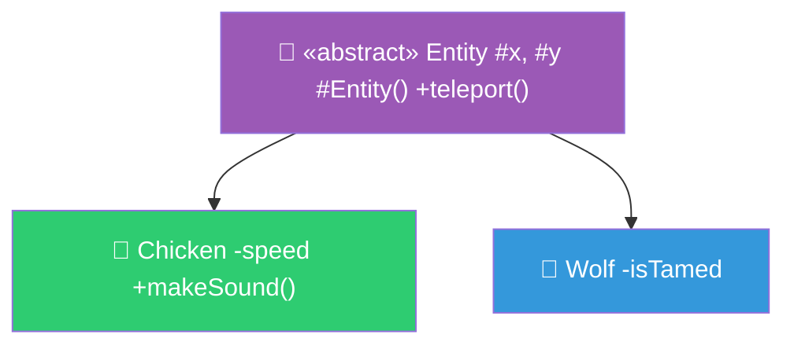
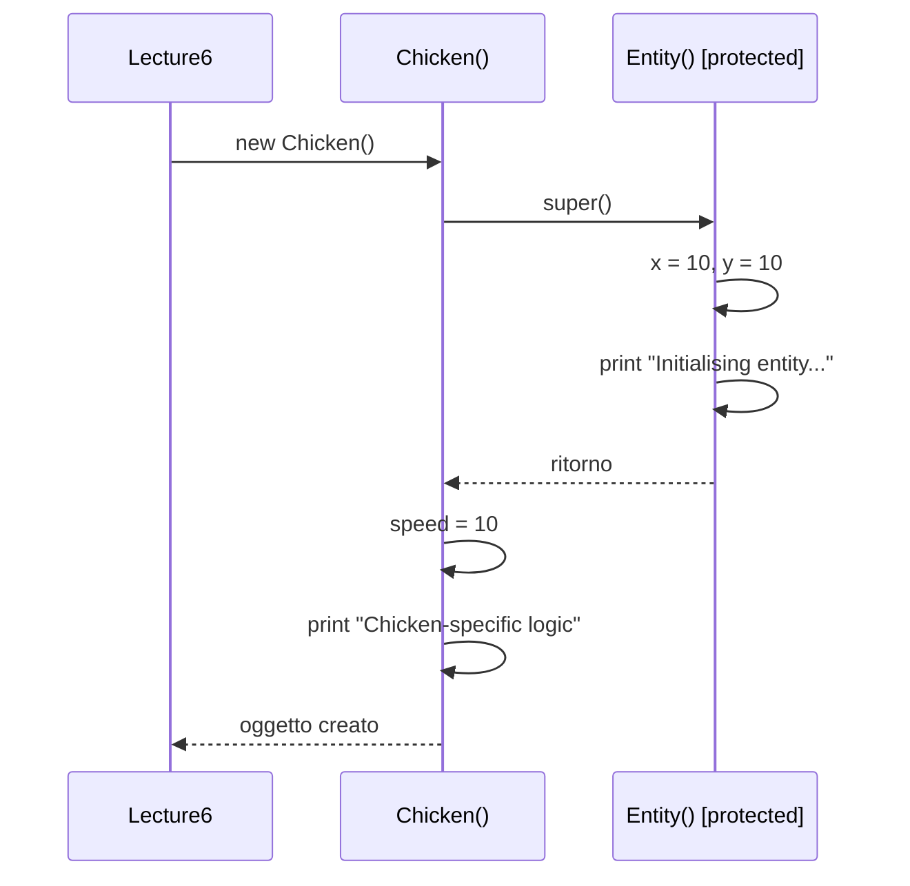
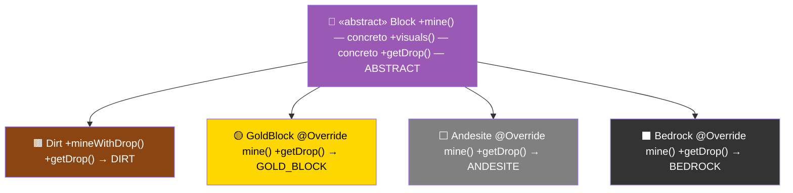
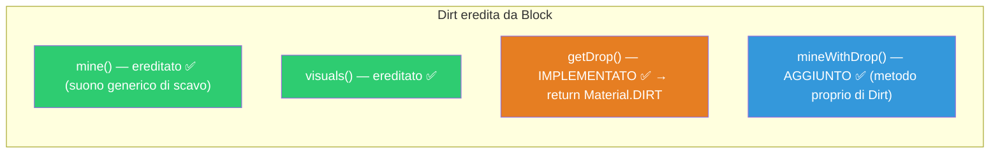
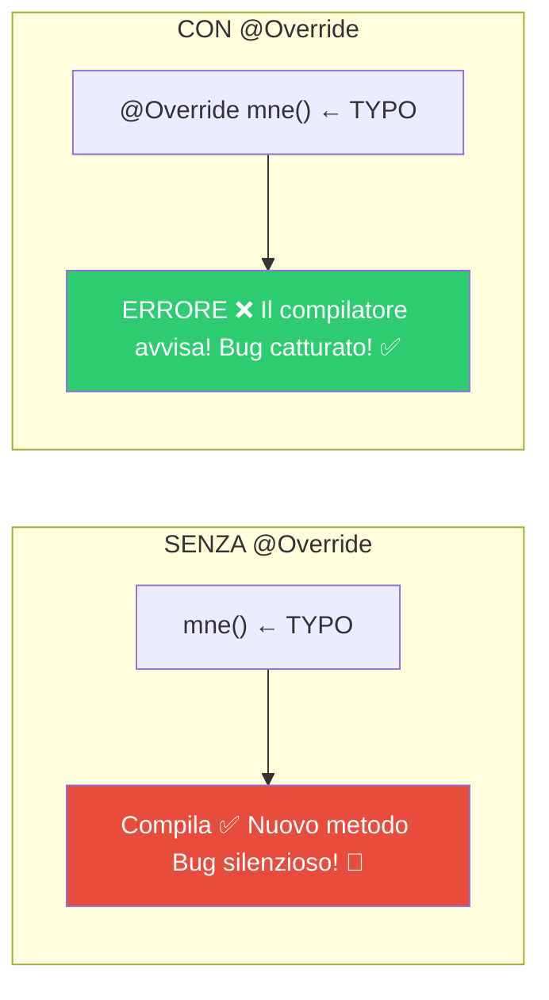
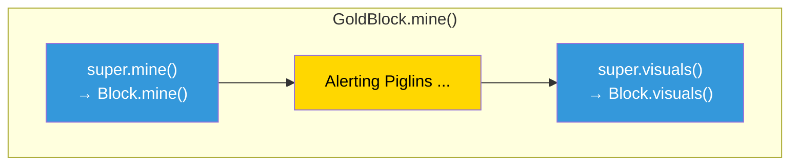
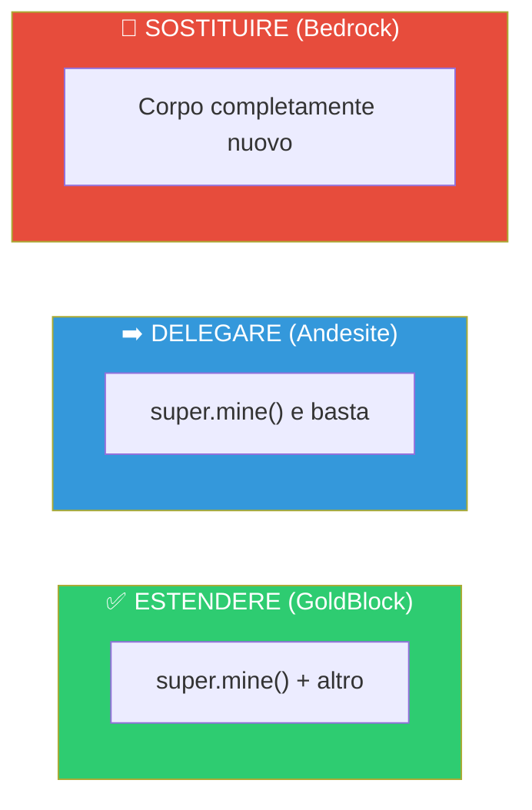
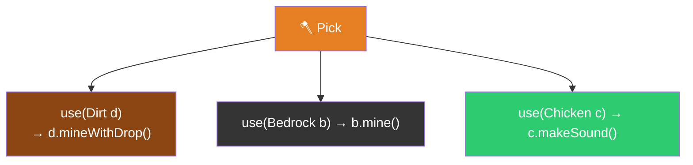
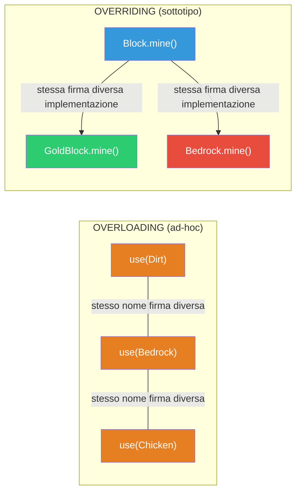

> [!abstract] Panoramica
> **Bloom's Taxonomy:** Understand, Apply
>
> In questa lezione introduciamo le **classi astratte** e i **metodi astratti** — strumenti per definire gerarchie dove la superclasse stabilisce un **contratto** che le sottoclassi devono rispettare. Poi vediamo l'**overriding** (riscrittura di metodi ereditati con la keyword `super`) e l'**overloading** (metodi con stesso nome ma [[Firma]] diversa). Questi concetti completano il quadro dell'[[Ereditarietà]] iniziato nella [[Lezione 05 - Ereditarietà, Polimorfismo, Object|Lezione 05]].

---

## Indice

- [[#Classi Astratte]]
  - [[#La classe astratta `Entity`]]
  - [[#Costruttori di classi astratte]]
  - [[#Sottoclassi concrete: `Chicken` e `Wolf`]]
  - [[#Esempio: `abstractExample()`]]
- [[#Metodi Astratti]]
  - [[#La classe astratta `Block`]]
  - [[#La sottoclasse `Dirt` — Implementare un metodo astratto]]
  - [[#Esempio: `abstractMethodsExample()`]]
- [[#Overriding — Riscrittura dei metodi]]
  - [[#L'annotazione `@Override`]]
  - [[#La keyword `super` (senza parentesi)]]
  - [[#`GoldBlock` — Estendere il comportamento ereditato]]
  - [[#`Andesite` — Delegare completamente alla superclasse]]
  - [[#`Bedrock` — Sostituire completamente il comportamento]]
  - [[#Esempio: `overridingExample()`]]
- [[#Overloading — Stesso nome, firma diversa]]
  - [[#La classe `Pick`]]
  - [[#Overloading vs Overriding]]
  - [[#Esempio: `overloadingExample()`]]
- [[#Concetti Chiave per Collegamenti Obsidian]]

---

## File principale — `Lecture6.java`

> [!note] Dipendenze
> La Lezione 06 utilizza classi dai package `lecture06.abstracts`, `lecture06.overriding` e `lecture06.overloading`.

```java
package lecture06;
import lecture06.abstracts.blocks.Dirt;
import lecture06.abstracts.entities.Chicken;
import lecture06.abstracts.entities.Wolf;
import lecture06.overloading.Pick;
import lecture06.overriding.Andesite;
import lecture06.overriding.Bedrock;
import lecture06.overriding.GoldBlock;

public class Lecture6 {
    public static void main(String[] args) {
        System.out.println("---------------- Classi astratte ----------------");
        abstractExample();
        System.out.println("---------------- Metodi astratti ----------------");
        abstractMethodsExample();
        System.out.println("---------------- Overriding e super ----------------");
        overridingExample();
        System.out.println("---------------- Overloading ----------------");
        overloadingExample();
    }
```

Struttura del package:

```
  lecture06/
  ├── Lecture6.java              ← file principale (runner)
  ├── abstracts/
  │   ├── Entity.java            ← abstract class Entity
  │   ├── Block.java             ← abstract class Block (con metodo abstract)
  │   ├── entities/
  │   │   ├── Chicken.java       ← extends Entity
  │   │   └── Wolf.java          ← extends Entity
  │   └── blocks/
  │       └── Dirt.java          ← extends Block
  ├── overriding/
  │   ├── GoldBlock.java         ← extends Block (override + super)
  │   ├── Andesite.java          ← extends Block (override delega)
  │   └── Bedrock.java           ← extends Block (override totale)
  └── overloading/
      └── Pick.java              ← overloading di use()
```

---

## [[Classi Astratte]]

Una **[[Classi Astratte|classe astratta]]** è una [[Classe]] che ha il modificatore `abstract`. Serve a **raggruppare funzionalità e logica comune** alle sue sottoclassi, ma **non può essere istanziata** direttamente con `new`.

```
  ╔═══════════════════════════════════════════════════════════╗
  ║               CLASSI ASTRATTE — REGOLE                    ║
  ╠═══════════════════════════════════════════════════════════╣
  ║                                                           ║
  ║  1. Si dichiarano con la keyword "abstract"               ║
  ║                                                           ║
  ║  2. NON possono essere istanziate con new                 ║
  ║     → new Entity() ❌ ERRORE di compilazione              ║
  ║                                                           ║
  ║  3. Possono contenere:                                    ║
  ║     • Campi (come le classi normali)                      ║
  ║     • Metodi concreti (con corpo)                         ║
  ║     • Metodi astratti (senza corpo)                       ║
  ║     • Costruttori (tipicamente protected)                 ║
  ║                                                           ║
  ║  4. Le regole dell'ereditarietà si applicano              ║
  ║     normalmente                                           ║
  ║                                                           ║
  ║  5. Una classe PUÒ essere abstract anche SENZA            ║
  ║     metodi abstract (ma se ha un metodo abstract,         ║
  ║     la classe DEVE essere abstract)                       ║
  ║                                                           ║
  ╚═══════════════════════════════════════════════════════════╝
```

> [!tip] Quando usare una classe astratta?
> Quando vuoi definire un "modello" con logica comune, ma sai che **non ha senso creare un oggetto generico** di quel tipo. Nel nostro esempio: ha senso creare un `Chicken` o un `Wolf`, ma non una generica `Entity` senza specificare che animale sia.

---

### La classe astratta `Entity`

```java
package lecture06.abstracts;

public abstract class Entity {
    protected int x, y;

    protected Entity(){
        this.x = 10;
        this.y = 10;
        System.out.println("Initialising entity common fields and other shared logic");
    }

    public void teleport(int x, int y) {
        this.x = x;
        this.y = y;
        System.out.println(this.getClass().getSimpleName() + " moved to " + x + ", " + y);
    }
}
```



> [!warning] Non istanziabile!
> Non possiamo fare `new Entity()` da fuori. La classe `Entity` è `abstract` — esiste solo come "base" per le sue sottoclassi. L'IDE e il compilatore segnalano le classi `abstract` in modo diverso dalle classi concrete.

**[[Metodo|Metodi]]** astratti deve essere in una classe abstract

---

### Costruttori di classi astratte

> [!info] Perché il costruttore è `protected`?
> Il [[Costruttore]] di `Entity` è [[protected]] perché:
> - **Non** è `public` → nessuno può fare `new Entity()` direttamente (e comunque `abstract` lo impedirebbe)
> - È `protected` e non `private` → le **sottoclassi** possono richiamarlo con `super()` per inizializzare i campi ereditati (`x`, `y`)
>
> Questo è un pattern molto comune: il costruttore della classe astratta contiene la **logica di inizializzazione condivisa**, e le sottoclassi la riusano.



---

### Sottoclassi concrete: `Chicken` e `Wolf`

Queste sono classi **concrete** (non `abstract`) → possono essere istanziate con `new`.

**Chicken:**

```java
package lecture06.abstracts.entities;
import lecture06.abstracts.Entity;

public class Chicken extends Entity {
    private int speed;

    public Chicken(){
        super();   // Chiama Entity() → inizializza x, y
        System.out.println("Chicken-specific logic");
        this.speed = 10;
    }

    public void makeSound() {
        System.out.println("Chicken: Cluck Cluck!");
    }
}
```

**Wolf:**

```java
package lecture06.abstracts.entities;
import lecture06.abstracts.Entity;

public class Wolf extends Entity {
    private boolean isTamed;

    public Wolf(){
        super();   // Chiama Entity() → inizializza x, y
        System.out.println("Wolf-specific logic");
        this.isTamed = false;
    }
}
```

> [!tip] Riuso del costruttore
> Entrambe le sottoclassi chiamano `super()` per riutilizzare la logica di inizializzazione definita in `Entity`. Poi aggiungono la propria logica specifica (impostare `speed` per `Chicken`, `isTamed` per `Wolf`). Questo è il pattern standard per le classi astratte.

---

### Esempio: `abstractExample()`

```java
    private static void abstractExample(){
        Chicken c = new Chicken();
        Wolf w = new Wolf();

        c.teleport(10, 20);   // teleport() è definito in Entity, ereditato ✅
        w.teleport(20, 30);   // anche Wolf lo eredita ✅

        c.makeSound();         // makeSound() è specifico di Chicken ✅
        // new Entity();       // ❌ ERRORE! Entity è abstract
    }
```

> [!question] 📱 Quiz del Prof
> Posso decommentare `new Entity()`?

> [!success] Risposta
> **No!** `Entity` è `abstract` — non si può istanziare direttamente. Il compilatore darà errore: `Cannot instantiate the type Entity`.

---

## [[metodo astratto|Metodi Astratti]]

Un **[[metodo astratto]]** è un [[Metodo]] dichiarato con `abstract` e **senza corpo** (senza le `{}`). Definisce un **obbligo** (contratto) per le sottoclassi: ogni sottoclasse **concreta** (non abstract) che estende la classe **deve** implementarlo.

```
  ╔═══════════════════════════════════════════════════════════╗
  ║              METODI ASTRATTI — REGOLE                     ║
  ╠═══════════════════════════════════════════════════════════╣
  ║                                                           ║
  ║  1. Dichiarati con "abstract" e SENZA corpo               ║
  ║     → public abstract Material getDrop();                 ║
  ║                                                           ║
  ║  2. Se una classe ha almeno UN metodo abstract,           ║
  ║     la classe DEVE essere abstract                        ║
  ║                                                           ║
  ║  3. Le sottoclassi CONCRETE devono implementarlo          ║
  ║     (con @Override)                                       ║
  ║                                                           ║
  ║  4. Le sottoclassi ABSTRACT possono NON implementarlo     ║
  ║     → l'obbligo viene passato ai loro figli               ║
  ║                                                           ║
  ║  5. Se una sottoclasse concreta NON lo implementa         ║
  ║     → ERRORE di compilazione!                             ║
  ║                                                           ║
  ╚═══════════════════════════════════════════════════════════╝
```

---

### La classe astratta `Block`

```java
package lecture06.abstracts;

public abstract class Block {

    public enum Material {
        DIRT,
        BEDROCK,
        ANDESITE,
        GOLD_BLOCK
    }

    public void mine() {
        System.out.println(">> *Crackle* (Generic Digging Sound)");
        System.out.println(">> *Particles fly*");
        System.out.println("-------------------------------");
    }

    public void visuals(){}

    public abstract Material getDrop();   // ← metodo ASTRATTO: nessun corpo!
}
```



> [!info] Perché `Block` è abstract?
> `Block` **deve** essere `abstract` perché contiene il metodo astratto `getDrop()`. Il metodo `getDrop()` ci dice che ogni blocco deve restituire un materiale, ma **non esiste un'implementazione di default** — ogni tipo di blocco sa cosa "droppa".
>
> Se potessimo istanziare `Block` direttamente, che codice eseguiremmo per `getDrop()`? Non ce n'è! Ecco perché la classe deve essere abstract.
>
>Non hanno le V-table

> [!tip] Metodi concreti in classi astratte
> `Block` contiene anche metodi **concreti** (`mine()` e `visuals()`). Questo è perfettamente valido: una classe astratta può avere sia metodi con corpo che metodi senza corpo. I metodi concreti vengono ereditati normalmente.

---

### La sottoclasse `Dirt` — Implementare un metodo astratto

```java
package lecture06.abstracts.blocks;
import lecture06.abstracts.Block;

public class Dirt extends Block {

    public Material mineWithDrop(){
        this.mine();          // mine() è ereditato da Block (concreto) ✅
        return this.getDrop();
    }

    public Material getDrop() {
        return Material.DIRT;  // Implementazione obbligatoria di getDrop()
    }
}
```

> [!warning] Cosa succede se rimuoviamo `getDrop()` da `Dirt`?
> Il compilatore dà **errore**: `The type Dirt must implement the inherited abstract method Block.getDrop()`. Questo ci **garantisce** a compile time che non possiamo creare un sottotipo di blocco e dimenticarci di definire cosa droppa!



Prima i metodi della super-classe e poi i metodi della sotto-classe vengono ereditati.

---

### Esempio: `abstractMethodsExample()`

```java
    private static void abstractMethodsExample(){
        Dirt d = new Dirt();
        System.out.println("Received: " + d.mineWithDrop());
    }
```

> [!question] 📱 Quiz del Prof
> Quale codice viene eseguito nella chiamata `d.mineWithDrop()`?

> [!success] Risposta
> 1. `mineWithDrop()` chiama `this.mine()` → esegue il `mine()` ereditato da `Block` (stampa suoni di scavo)
> 2. Poi chiama `this.getDrop()` → esegue il `getDrop()` implementato in `Dirt` → ritorna `Material.DIRT`
> 3. Il `main` stampa: `"Received: DIRT"`
>
> ```
>   Flusso di esecuzione di d.mineWithDrop():
>
>   d.mineWithDrop()
>       │
>       ├── this.mine()          ← ereditato da Block
>       │     │
>       │     ├── ">> *Crackle* (Generic Digging Sound)"
>       │     ├── ">> *Particles fly*"
>       │     └── "-------------------------------"
>       │
>       └── this.getDrop()       ← implementato in Dirt
>             │
>             └── return Material.DIRT
>
>   Output finale: "Received: DIRT"
> ```

---

## Overriding — Riscrittura dei metodi

L'**overriding** (riscrittura) è il meccanismo con cui una sottoclasse **ridefinisce** un metodo **ereditato dalla superclasse**, fornendo una **nuova implementazione** con lo stesso nome e la stessa [[Firma]].

```
  ╔═══════════════════════════════════════════════════════════╗
  ║                  OVERRIDING — REGOLE                      ║
  ╠═══════════════════════════════════════════════════════════╣
  ║                                                           ║
  ║  1. Il metodo nella sottoclasse deve avere STESSA         ║
  ║     firma (nome + parametri) del metodo nella             ║
  ║     superclasse                                           ║
  ║                                                           ║
  ║  2. Si usa l'annotazione @Override (opzionale ma          ║
  ║     fortemente consigliata)                               ║
  ║                                                           ║
  ║  3. Con super.metodo() si può richiamare                  ║
  ║     l'implementazione della superclasse                   ║
  ║                                                           ║
  ║  4. Non si possono concatenare i super:                   ║
  ║     super.super.mine() ❌ NON esiste                      ║
  ║                                                           ║
  ╚═══════════════════════════════════════════════════════════╝
```

---

### L'annotazione `@Override`

L'annotazione `@Override` è **opzionale** ma è **buona pratica** usarla sempre. Dice al [[Compilatore]]: "sto intenzionalmente riscrivendo un metodo della superclasse".

> [!tip] Perché usare `@Override`?
> Se fai un **typo** nel nome del metodo (es. `mne()` invece di `mine()`), senza `@Override` il compilatore crea un metodo **nuovo** silenziosamente. Con `@Override`, il compilatore ti avvisa che non stai riscrivendo nulla → errore di compilazione → bug catturato!



---

### La keyword `super` (senza parentesi)

> [!warning] Non confondere con `super()`!
> - **`super()`** (con parentesi) → chiama un [[Costruttore]] della superclasse (visto nella [[Lezione 05 - Ereditarietà, Polimorfismo, Object|Lezione 05]])
> - **`super`** (senza parentesi) → **riferimento** alla superclasse, usato per richiamare **metodi** della superclasse
>
> | Sintassi | Significato | Dove si usa |
> |---|---|---|
> | `super()` | Chiama il costruttore della superclasse | Prima riga di un costruttore |
> | `super.metodo()` | Chiama il metodo così com'è nella superclasse | Ovunque nella sottoclasse |

> [!danger] Limite di `super`
> Non si possono **concatenare** i `super` per risalire la gerarchia: `super.super.mine()` **non esiste** in [[Java]]. Si può usare `super` **una sola volta**.

---

### `GoldBlock` — Estendere il comportamento ereditato

`GoldBlock` fa override di `mine()` per **aggiungere** comportamento al di sopra di quello ereditato:

```java
package lecture06.overriding;
import lecture06.abstracts.Block;

public class GoldBlock extends Block {
    @Override
    public void mine() {
        super.mine();                        // 1. Esegue mine() di Block (suono + particelle)
        System.out.println("Alerting Piglins ...");  // 2. Aggiunge allerta ai Piglin
        super.visuals();                     // 3. Chiama visuals() di Block
    }

    @Override
    public Material getDrop() {
        return Material.GOLD_BLOCK;
    }
}
```



```
  GoldBlock.mine() — Flusso di esecuzione:

  ┌─────────────────────────────────────────────────┐
  │  1. super.mine()  →  Block.mine()               │
  │     ├── ">> *Crackle* (Generic Digging Sound)"  │
  │     ├── ">> *Particles fly*"                    │
  │     └── "-------------------------------"       │
  │                                                 │
  │  2. "Alerting Piglins ..."   ← AGGIUNTO!        │
  │                                                 │
  │  3. super.visuals()  →  Block.visuals()         │
  └─────────────────────────────────────────────────┘
```

> [!tip] Pattern: Estendere il comportamento
> Questo è uno dei pattern più comuni dell'overriding: chiamare `super.metodo()` per **riutilizzare** il comportamento della superclasse e poi **aggiungere** logica specifica. Il codice della superclasse non viene duplicato!

> [!question] 📱 Quiz del Prof
> Se **non** facciamo override di `mine()` in `GoldBlock`, cosa succede?

> [!success] Risposta
> Viene chiamato direttamente `Block.mine()` — il comportamento generico (suono di scavo + particelle). **Non** verrebbero allertati i Piglin. L'[[Ereditarietà]] fa sì che il metodo della superclasse venga ereditato automaticamente se non viene riscritto.

---

### `Andesite` — Delegare completamente alla superclasse

```java
package lecture06.overriding;
import lecture06.abstracts.Block;

public class Andesite extends Block {
    public void mine() {
        super.mine();   // Delega tutto a Block.mine()
    }

    @Override
    public Material getDrop() {
        return Material.ANDESITE;
    }
}
```

> [!info] Override che delega
> In questo caso `Andesite.mine()` fa esattamente la stessa cosa di `Block.mine()`. L'override non aggiunge logica — si potrebbe anche **non fare override** e il risultato sarebbe identico (il metodo ereditato viene chiamato direttamente).

> [!question] 📱 Quiz del Prof
> Posso cancellare il metodo `mine()` dentro `Andesite`?

> [!success] Risposta
> **Sì!** Se rimuoviamo `mine()` da `Andesite`, l'ereditarietà farà sì che venga chiamato `Block.mine()` automaticamente. Il comportamento è identico.

---

### `Bedrock` — Sostituire completamente il comportamento

```java
package lecture06.overriding;
import lecture06.abstracts.Block;

public class Bedrock extends Block {
    @Override
    public void mine() {
        System.out.println(">> *CLINK!* (Too hard to break!)");
        // NON chiama super.mine()! Il comportamento è completamente sostituito.
    }

    @Override
    public Block.Material getDrop() {
        return Material.BEDROCK;
    }
}
```

> [!warning] Nessun `super.mine()`!
> `Bedrock` **non** chiama `super.mine()`. Il comportamento ereditato (suono generico di scavo) viene **completamente sostituito** con uno nuovo (la bedrock è troppo dura per essere scavata).

Confronto dei tre tipi di override:

```
  ╔═══════════════════════════════════════════════════════════════╗
  ║              TRE STRATEGIE DI OVERRIDING                      ║
  ╠════════════════╦═════════════════════════════════════════════╣
  ║  GoldBlock     ║  ESTENDE: super.mine() + logica aggiuntiva ║
  ╠════════════════╬═════════════════════════════════════════════╣
  ║  Andesite      ║  DELEGA: super.mine() (identico)           ║
  ╠════════════════╬═════════════════════════════════════════════╣
  ║  Bedrock       ║  SOSTITUISCE: ignora super, nuovo corpo    ║
  ╚════════════════╩═════════════════════════════════════════════╝
```



---

### Esempio: `overridingExample()`

```java
    private static void overridingExample() {
        GoldBlock gb = new GoldBlock();
        gb.mine();
        // Stampa: suono generico + particelle + "Alerting Piglins ..."

        Andesite a = new Andesite();
        a.mine();
        // Stampa: suono generico + particelle (come Block.mine())

        Bedrock br = new Bedrock();
        br.mine();
        // Stampa: ">> *CLINK!* (Too hard to break!)"
    }
```

```
  Output di overridingExample():

  ── gb.mine() (GoldBlock) ──
  >> *Crackle* (Generic Digging Sound)
  >> *Particles fly*
  -------------------------------
  Alerting Piglins ...

  ── a.mine() (Andesite) ──
  >> *Crackle* (Generic Digging Sound)
  >> *Particles fly*
  -------------------------------

  ── br.mine() (Bedrock) ──
  >> *CLINK!* (Too hard to break!)
```

> [!tip] `@Override` anche per metodi astratti
> Nota che `getDrop()` è implementato in tutte le sottoclassi con `@Override`. Anche quando si implementa un metodo abstract della superclasse, `@Override` va (e dovrebbe) essere usato!

---

## Overloading — Stesso nome, firma diversa

L'**overloading** è un concetto completamente diverso dall'overriding. Significa definire **più metodi con lo stesso nome** ma con **[[Firma]] diversa** (diversi parametri di input).

> [!danger] Non confondere Overriding e Overloading!
> | | **Overriding** | **Overloading** |
> |---|---|---|
> | **Cosa** | Stessa firma, diversa implementazione | Stesso nome, diversa firma |
> | **Dove** | Sottoclasse ridefinisce metodo della superclasse | Nella stessa classe (o tra classi) |
> | **Risoluzione** | A **runtime** ([[Risoluzione dinamica]], [[V-Table]]) | A **compile time** ([[Statico]]) |
> | **Polimorfismo** | Di sottotipo | Ad-hoc |

---

### La classe `Pick`

```java
package lecture06.overloading;
import lecture06.abstracts.blocks.Dirt;
import lecture06.abstracts.entities.Chicken;
import lecture06.overriding.Bedrock;

public class Pick {
    public void use(Dirt d){
        d.mineWithDrop();
    }

    public void use(Bedrock b){
        b.mine();
    }

    public void use(Chicken c){
        c.makeSound();
    }
}
```



```
  Pick — Overloading di use():

  ┌─────────────────┬──────────────────────────────┐
  │  Firma          │  Comportamento               │
  ├─────────────────┼──────────────────────────────┤
  │  use(Dirt)      │  Scava e droppa il blocco    │
  │  use(Bedrock)   │  Tenta di scavare (fallisce) │
  │  use(Chicken)   │  Il pollo fa il verso        │
  └─────────────────┴──────────────────────────────┘

  Tutte si chiamano "use" ma hanno firme diverse!
  Il compilatore sceglie quale chiamare in base al tipo
  dell'argomento (risoluzione STATICA).
```

> [!info] Risoluzione a compile time
> Il [[Compilatore]] decide **quale** `use()` chiamare guardando il **tipo** dell'argomento passato. Questo è il **[[Polimorfismo]] ad-hoc**: non serve il dispatch dinamico ([[V-Table]]), perché la scelta è fatta a compile time.

---

### Overloading vs Overriding



> [!warning] Vincolo sull'overloading
> Le firme **non possono** avere stesso input e output diverso. Per variare il tipo di output, deve variare anche l'input. Altrimenti il compilatore non saprebbe quale metodo chiamare.

> [!question] 📱 Quiz del Prof
> Possiamo aggiungere `public int use(Dirt d)` a `Pick` (ritorna `int` invece di `void`)?

> [!success] Risposta
> **No!** Esiste già `use(Dirt d)` con ritorno `void`. Due metodi con **stesso input** ma **diverso output** creano ambiguità: il compilatore non saprebbe quale chiamare. La [[Firma]] di un metodo si distingue per **tipo e ordine dei parametri**, non per il tipo di ritorno.

---

### Esempio: `overloadingExample()`

```java
    private static void overloadingExample(){
        Pick p = new Pick();
        p.use(new Dirt());      // Chiama use(Dirt) → scava e droppa
        p.use(new Bedrock());   // Chiama use(Bedrock) → *CLINK!*
        p.use(new Chicken());   // Chiama use(Chicken) → Cluck Cluck!
    }
```

> [!tip] Come il compilatore sceglie
> Quando scriviamo `p.use(new Dirt())`, il compilatore vede che l'argomento è di tipo `Dirt` → sceglie `use(Dirt d)`. Per `new Bedrock()` sceglie `use(Bedrock b)`, ecc. Tutto è risolto [[Statico|staticamente]] a compile time, senza bisogno della [[V-Table]].

---

## Concetti Chiave per Collegamenti Obsidian

| Concetto | Descrizione |
| --- | --- |
| [[Ereditarietà]] | Meccanismo per cui una classe figlia eredita campi e metodi dalla classe padre |
| [[Polimorfismo]] | Capacità di un oggetto di essere trattato come istanza di un supertipo. Tre tipi: ad-hoc, sottotipo, parametrico |
| [[Classe]] | Tipo definito dall'utente. Può essere `abstract` se non deve essere istanziata |
| [[Metodo]] | Comportamento definito da una classe. Può essere `abstract` (senza corpo) |
| [[Firma]] | Tipo e numero dei parametri. Distingue un metodo da un altro nell'overloading |
| [[Costruttore]] | Metodo speciale per inizializzare un oggetto. Nelle classi astratte è tipicamente `protected` |
| [[protected]] | Modificatore di visibilità: visibile a classe, package e classi figlie |
| [[Modificatori di Visibilità]] | `public`, `private`, `protected`, package-private |
| [[Incapsulamento]] | Nascondere i dettagli implementativi, esporre solo l'interfaccia pubblica |
| [[Compilatore]] | Risolve l'overloading a compile time; segnala errori su `@Override` errati |
| [[V-Table]] | Usata per l'overriding (risoluzione dinamica), non per l'overloading |
| [[Risoluzione dinamica]] | Meccanismo con cui la JVM sceglie quale versione di un metodo eseguire a runtime |
| [[Statico]] | A compile time — l'overloading è risolto staticamente |
| [[Dinamico]] | A runtime — l'overriding è risolto dinamicamente |
| [[Statico vs Dinamico]] | Differenza fondamentale tra ciò che decide il compilatore e ciò che decide la JVM |
| [[Programmazione Orientata agli Oggetti]] | Paradigma basato su oggetti, classi, ereditarietà, polimorfismo |
| [[Keyword this]] | Riferimento all'oggetto corrente |
| [[Java]] | Linguaggio OOP con ereditarietà singola e classi astratte |

---

> **Lezione precedente:** [[Lezione 05 - Ereditarietà, Polimorfismo, Object]]
> **Prossima lezione:** Lezione 07
