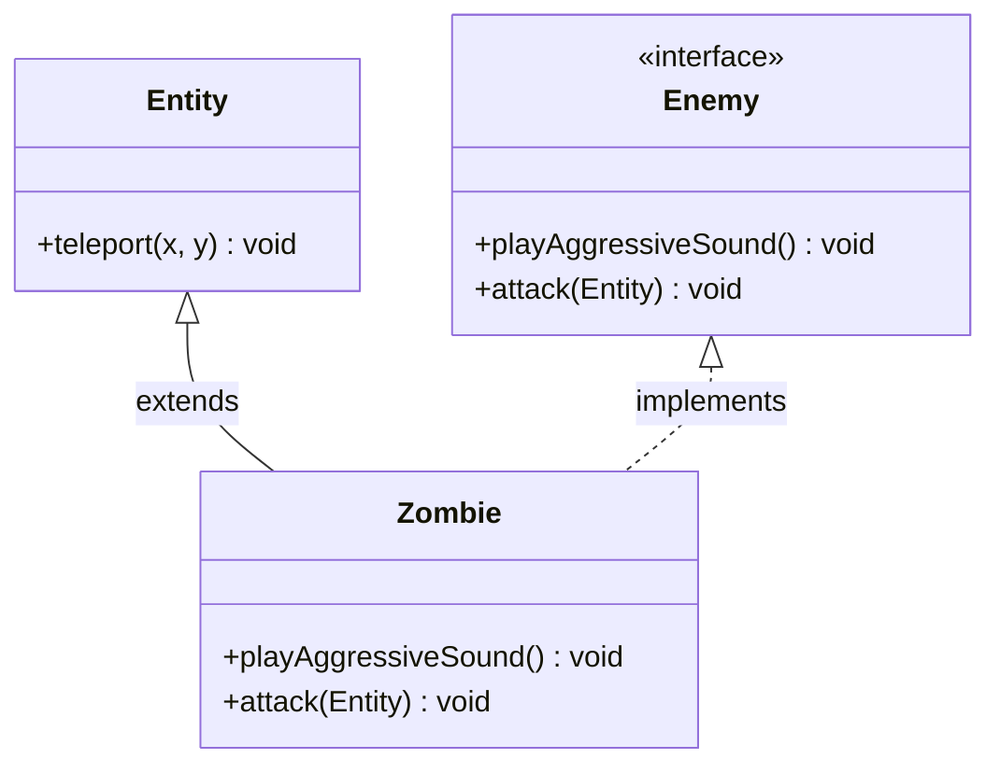
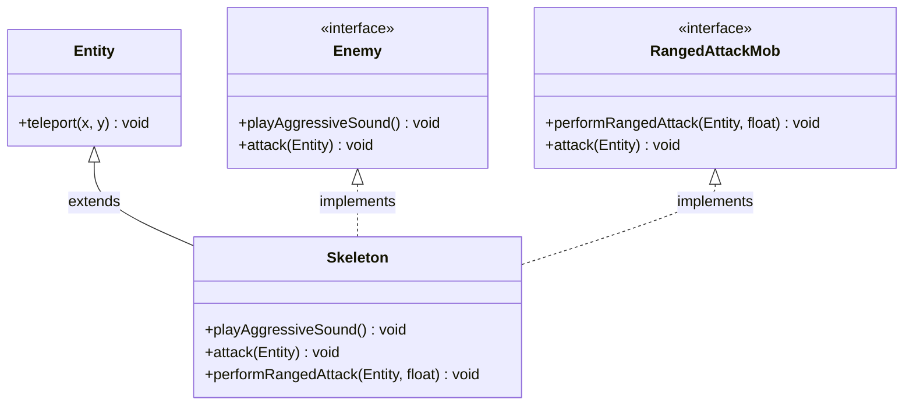
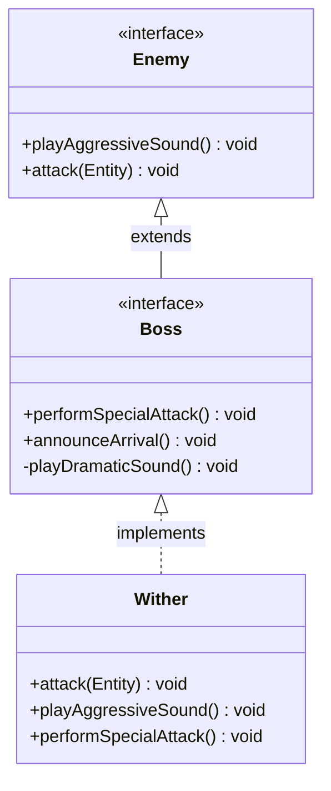
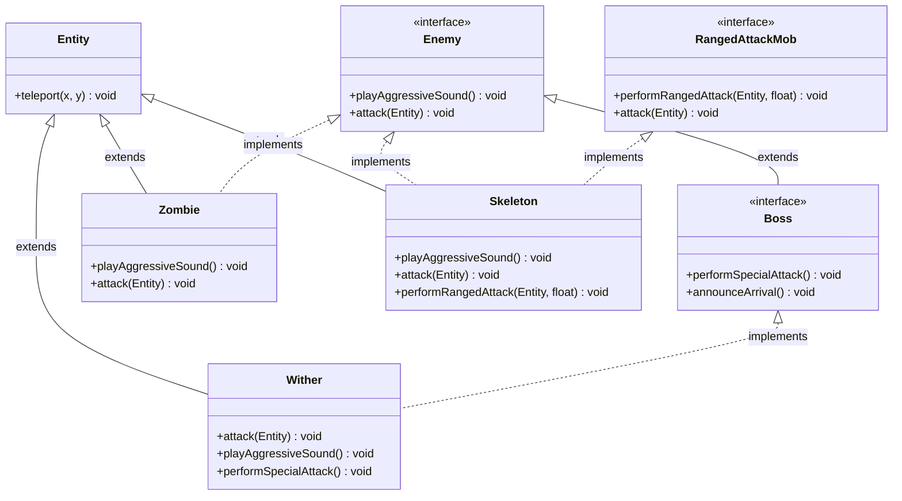

> **Argomenti:** Interfacce · Default Methods · Polimorfismo · Ereditarietà  
> **Prerequisiti:** [[Lezione 06 - Classi Astratte, Overriding, Overloading|Lezione 06 - Classi Astratte]] · [[Lezione 05 - Ereditarietà, Polimorfismo, Object|Lezione 05 - Ereditarietà]] · [[Lezione 04 - Incapsulamento, Passaggio Valori, Layout in Memoria|Lezione 04 - Classi]]  
> **Bloom's Taxonomy:** Understand · Apply · Analyse

---

## Indice

- [[#1. Cosa sono le Interfacce?|1. Cosa sono le Interfacce?]]
- [[#2. L'interfaccia Enemy|2. L'interfaccia Enemy]]
- [[#3. L'interfaccia RangedAttackMob|3. L'interfaccia RangedAttackMob]]
- [[#4. La classe Zombie — Implementare un'interfaccia|4. La classe Zombie]]
- [[#5. La classe Skeleton — Contratti multipli|5. La classe Skeleton]]
- [[#6. Interfacce e Polimorfismo|6. Interfacce e Polimorfismo]]
- [[#7. Default Methods — L'interfaccia Boss|7. Default Methods]]
- [[#8. La classe Wither|8. La classe Wither]]
- [[#9. Ragionare come Chiamante e come Chiamato|9. Chiamante e Chiamato]]
- [[#10. Limiti delle Interfacce|10. Limiti delle Interfacce]]
- [[#11. Recap Visuale|11. Recap Visuale]]

---

## 1. Cosa sono le Interfacce?

Le **interfacce** sono file Java separati dalle classi, ma si comportano anch'esse come **tipi** — proprio come le classi. Non si ha uno stato → non possono definire né campi né costruttori.

>Sono solo metodi astratti → il linguaggio riconosce da solo.

>Possono fare ereditarietà multipla → non vengono colpiti dal [[Diamond Problem]] → pk sono **obblighi**.

I metodi sono public. La differenza fondamentale è nel *contenuto*:

> **Intuizione:** Le interfacce sono **contratti**(requisito → tutto ciò che funziona per quell'interfaccia). Come una presa elettrica che definisce forma e voltaggio — al muro non interessa se è attaccato un microonde o una TV, l'importante è che abbiano la spina giusta.

Nel contesto di Minecraft:
- Essere una `Entity` dà *informazioni sullo stato* (le coordinate)
- Essere un `Enemy` dà *informazioni sul comportamento* (attacca)
- Un `Wolf` è una `Entity`, ma potrebbe anche essere un `Enemy`

| Caratteristica | Classe | Interfaccia |
|---|---|---|
| Campi di istanza | ✅ Sì | ❌ No |
| Costruttori | ✅ Sì | ❌ No |
| Metodi con corpo | ✅ Sì | ⚠️ Solo `default` (da Java 8) |
| Metodi astratti | ⚠️ Se `abstract` | ✅ Tutti (implicitamente) |
| Ereditarietà multipla | ❌ No (`extends` uno solo) | ✅ Sì (`implements` più interfacce) |
| Modificatore `public` | Esplicito | Implicito per tutti i metodi |

### Relazione is-a

La relazione **is-a** — che lega una sottoclasse alla sua superclasse — si **crea** anche **tra una classe e un'interfaccia** che implementa:

```
Zombie extends Entity      →  uno Zombie  is-a  Entity
Zombie implements Enemy    →  uno Zombie  is-a  Enemy
```

### Gerarchia Verticale vs Orizzontale

Le [[metodo astratto|Classi Astratte]] danno una visione **verticale** della gerarchia: risalendo l'albero capiamo tutti i tipi che un oggetto *è*.
Le interfacce definiscono una gerarchia **orizzontale** di abilità: ci dicono tutto quello che un oggetto *può fare*.

```
         ┌───────────────────────────────────────────────────────┐
         │            Gerarchia VERTICALE (extends)              │
         │                                                       │
         │                   Object                              │
         │                     │                                 │
         │                  Entity                               │
         │                ┌────┴────┐                            │
         │             Zombie    Skeleton                        │
         └───────────────────────────────────────────────────────┘

         ┌───────────────────────────────────────────────────────┐
         │         Gerarchia ORIZZONTALE (implements)            │
         │                                                       │
         │   Zombie    ──────────────────▶  Enemy                │
         │   Skeleton  ──▶  Enemy                                │
         │   Skeleton  ──▶  RangedAttackMob                      │
         │   Wither    ──▶  Boss  ──▶  Enemy                     │
         └───────────────────────────────────────────────────────┘
```

---

## 2. L'[[interfaccia]] `Enemy`

```java
package lecture07.interfaces;
import lecture06.abstracts.Entity;

public interface Enemy {
    void playAggressiveSound();   // implicitamente public abstract
    void attack(Entity target);   // implicitamente public abstract
}
```

Tutti i metodi di un'interfaccia sono `public` — non è necessario scriverlo esplicitamente. L'interfaccia `Enemy` stipula un contratto: le classi che la implementano devono fornire due comportamenti **obbligatori**: `attack` e `playAggressiveSound`.

```
┌─────────────────────────────────┐
│         <<interface>>           │
│             Enemy               │
├─────────────────────────────────┤
│ + playAggressiveSound() : void  │
│ + attack(Entity) : void         │
└─────────────────────────────────┘
```

---

## 3. L'interfaccia `RangedAttackMob`

```java
package lecture07.interfaces;
import lecture06.abstracts.Entity;

public interface RangedAttackMob {
    void performRangedAttack(Entity target, float distanceFactor);
    void attack(Entity target);
}
```

Questa interfaccia stipula un contratto diverso: `attack` e `performRangedAttack`.

Le due interfacce sono **scorrelate**:

```
  Non tutti gli Enemy sono RangedAttackMob  →  es. lo Zombie
  Non tutti i RangedAttackMob sono Enemy    →  es. lo Snow Golem
```

> **Nota chiave:** Sia `Enemy` che `RangedAttackMob` dichiarano `attack(Entity)` con la stessa firma. Questo **non causa il [[Diamond Problem]]** perché le interfacce non portano implementazione — una singola implementazione nella classe soddisferà entrambi i contratti.

---

## 4. La classe `Zombie` — Implementare un'interfaccia

```java
package lecture07.interfaces;
import lecture06.abstracts.Entity;

public class Zombie extends Entity implements Enemy { //Regola di essere un Enemy

    @Override
    public void playAggressiveSound() {
        System.out.println("Zombie: GROAAAN! (Targeting Player)");
    }

    @Override
    public void attack(Entity target) {
        System.out.println("Zombie attacks: *Melee Punch* (Dealing 3 damage)");
    }
}
```

### Sintassi — `implements`

```
public class NomeClasse extends Superclasse implements Interfaccia1, Interfaccia2
                                                  ▲
                                         nuova keyword, seguita dal
                                         nome dell'interfaccia implementata
```

Dopo `extends` troviamo la nuova keyword `implements`, seguita dal nome dell'interfaccia. Il contratto che riceviamo ci dice di fornire l'implementazione a tutti i metodi dichiarati nell'interfaccia.

> **Nota sull'import:** La riga `import lecture06.abstracts.Entity;` specifica esattamente da quale package viene `Entity`, evitando ambiguità se esistessero più classi con lo stesso nome.

Il metodo `intefacesExample` nel runner mostra che possiamo chiamare i metodi definiti nell'interfaccia `Enemy` su un oggetto `Zombie`:

```java
private static void intefacesExample() {
    Zombie z = new Zombie();
    z.attack(z);
    z.playAggressiveSound();
}
```



---

> [!question] Quiz — Cosa succede se commento `attack` dentro a `Zombie`?
> 
> ```java
> public class Zombie extends Entity implements Enemy {
>     @Override
>     public void playAggressiveSound() { ... }
> 
>     // @Override
>     // public void attack(Entity target) { ... }   ← COMMENTATO
> }
> ```
> 
> **Risposta:**
> 
> **Errore di compilazione.** Il contratto dell'interfaccia `Enemy` obbliga tutte le classi che la implementano a fornire un'implementazione di `attack(Entity)`. Se `Zombie` non lo implementa, viola il contratto e il compilatore lo segnala:
> 
> ```
> error: Zombie is not abstract and does not override abstract method attack(Entity) in Enemy
> ```
> 
> L'unica alternativa è dichiarare `Zombie` come `abstract` — ma allora non sarà più istanziabile con `new Zombie()`.

---

## 5. La classe `Skeleton` — Contratti multipli

```java
package lecture07.interfaces;
import lecture06.abstracts.Entity;

public class Skeleton extends Entity implements Enemy, RangedAttackMob {

    @Override
    public void playAggressiveSound() {
        System.out.println("Skeleton: *Bone Rattle*");
    }

    @Override
    public void attack(Entity target) {
        // Una sola implementazione soddisfa ENTRAMBI i contratti
        System.out.println("Skeleton attacks: *Shoots Arrow*");
    }

    @Override
    public void performRangedAttack(Entity target, float distanceFactor) {
        System.out.println(">> Skeleton draws bow...");
        System.out.println(">> Fired arrow at target! (Power: " + distanceFactor + ")");
    }
}
```

Il vincolo di estendere **una sola classe** non si applica alle interfacce — si possono implementare più interfacce. Lo `Skeleton` è sia un `Enemy` che un `RangedAttackMob`: ha quindi gli obblighi derivanti dai contratti di entrambe.



### Ereditarietà multipla di tipo (non di stato)

Le interfacce permettono **ereditarietà multipla di tipo**, ma non di stato (campi) né di comportamento (implementazioni). Per questo non si presenta il [[Diamond Problem]]:

```
  CON LE CLASSI (problema del Diamond):    CON LE INTERFACCE (nessun problema):

    A { metodo() { ... } }                   <<I_A>> { metodo(); }
    ▲             ▲                          <<I_B>> { metodo(); }
    B             C                                  ▲          ▲
    ▲             ▲                                  └────┬─────┘
    └──── D ──────┘                                   Skeleton
    (quale metodo eredita D?                   (una implementazione,
     → ERRORE in Java)                          soddisfa entrambi)
```

> **Nota Bene:** Esistono altri costrutti nei linguaggi di programmazione che vanno oltre: i **[[Mixins]]** permettono ereditarietà multipla di *stato*, i **[[Traits]]** permettono ereditarietà multipla di *comportamento*.

---

> [!question] Quiz — Cosa devo fare per `attack` in `Skeleton`?
> 
> `Skeleton` implementa sia `Enemy` che `RangedAttackMob`. Entrambe dichiarano `attack(Entity)`. Quante implementazioni di `attack` devo scrivere?
> 
> **Risposta:**
> 
> **Una sola implementazione** soddisfa entrambi i contratti, perché la firma è identica in entrambe le interfacce.
> 
> Non c'è ambiguità perché le interfacce non portano codice — solo la dichiarazione. La singola implementazione in `Skeleton` viene associata ad entrambi i contratti dal compilatore:
> 
> ```java
> @Override
> public void attack(Entity target) {
>     System.out.println("Skeleton attacks: *Shoots Arrow*");
>     // ✅ soddisfa Enemy.attack()
>     // ✅ soddisfa RangedAttackMob.attack()
> }
> ```

---

## 6. Interfacce e Polimorfismo

```java
private static void interfacesPolymorphismExample() {
    Skeleton skelly = new Skeleton();

    Entity n = skelly;               // alias come Entity
    n.teleport(0, 0);                // ✅ teleport è in Entity

    Enemy badGuy = skelly;           // alias come Enemy
    badGuy.playAggressiveSound();    // ✅ definito in Enemy

    RangedAttackMob sniper = skelly; // alias come RangedAttackMob
    sniper.performRangedAttack(null, 1.0f);

    skelly.performRangedAttack(null, 1.0f); // ✅ tipo Skeleton conosce tutto
}
```

### Aliasing

> **Aliasing:** la capacità di avere più riferimenti (variabili) che puntano **allo stesso oggetto** in memoria. È una caratteristica fondante della programmazione orientata agli oggetti.

```
  Heap:
  ┌──────────────────────────────┐
  │       Oggetto Skeleton       │
  │  x:0, y:0                    │
  │  attack(), teleport(), ...   │
  └──────────────────────────────┘
        ▲         ▲         ▲   ▲
        │         │         │   └──────────── n (Entity)
     skelly    badGuy    sniper
   (Skeleton)  (Enemy)  (RangedAttackMob)

  Stessa zona di memoria — quattro nomi diversi.
```

Il **tipo della variabile** determina quali metodi sono visibili al compilatore, non l'oggetto in memoria:

| Variabile | Tipo statico      | Metodi accessibili                                                        |
| --------- | ----------------- | ------------------------------------------------------------------------- |
| `skelly`  | `Skeleton`        | tutti: `attack`, `teleport`, `playAggressiveSound`, `performRangedAttack` |
| `n`       | `Entity`          | solo: `teleport` (e altri di Entity)                                      |
| `badGuy`  | `Enemy`           | solo: `attack`, `playAggressiveSound`                                     |
| `sniper`  | `RangedAttackMob` | solo: `attack`, `performRangedAttack`                                     |

> **Aliasing e ragionamento sul codice:** L'aliasing è utile ma rende difficile ragionare sul programma — non sai mai chi altro ha un riferimento allo stesso oggetto e potrebbe modificarlo. Questo problema ha portato allo sviluppo del sistema di **ownership** in [[Rust]].

---

> [!question] Quiz — Posso usare una classe astratta come tipo?
> 
> ```java
> Entity e = new Zombie();
> ```
> 
> **Risposta:**
> 
> **Sì.** Le classi astratte sono tipi validi per le variabili. Non puoi istanziarle direttamente (`new Entity()` dà errore), ma puoi usarle come tipo per riferirti a oggetti di sottoclassi concrete.
> 
> ```java
> Entity e = new Zombie();  // ✅ OK: Zombie is-a Entity
> e.teleport(0, 0);         // ✅ OK: teleport è in Entity
> // e.attack(null);        // ❌ ERRORE: attack non è in Entity
> ```

---

> [!question] Quiz — Posso usare un'interfaccia come tipo?
> 
> ```java
> Enemy badGuy = new Zombie();
> ```
> 
> **Risposta:**
> 
> **Sì.** Le interfacce sono tipi validi in Java — è uno dei pilastri del polimorfismo. Puoi riferirsi a qualsiasi oggetto che implementa l'interfaccia tramite il tipo dell'interfaccia stessa.
> 
> ```java
> Enemy badGuy = new Zombie();    // ✅ OK: Zombie implements Enemy
> badGuy.playAggressiveSound();   // ✅ OK: definito in Enemy
> // badGuy.teleport(0,0);        // ❌ ERRORE: teleport non è in Enemy
> ```

---

> [!question] Quiz — Posso chiamare `teleport` su `badGuy`?
> 
> ```java
> Skeleton skelly = new Skeleton();
> Enemy badGuy = skelly;
> badGuy.teleport(0, 0);   // ???
> ```
> 
> **Risposta:**
> 
> **No — errore di compilazione.** Il tipo statico di `badGuy` è `Enemy`. Il compilatore vede solo i metodi dichiarati in `Enemy`: `playAggressiveSound()` e `attack()`. Il metodo `teleport()` è definito in `Entity`, che non ha nessuna relazione con `Enemy`.
> 
> Anche se a runtime `badGuy` punta a uno `Skeleton` che è anche una `Entity` — e quindi ha `teleport()` — il **compilatore non lo sa**: ragiona esclusivamente sul tipo statico della variabile.
> 
> Per chiamare `teleport` hai due opzioni:
> 
> ```java
> // Opzione 1: usa una variabile di tipo Entity
> Entity n = skelly;
> n.teleport(0, 0);   // ✅ OK
> 
> // Opzione 2: cast esplicito (rischio ClassCastException a runtime)
> ((Entity) badGuy).teleport(0, 0);   // ✅ OK solo se badGuy è davvero una Entity
> ```

---

## 7. [[default|Default]] Methods — L'interfaccia `Boss`

Le interfacce possono essere organizzate in una **gerarchia** tra loro, tramite la keyword `extends`. Si creano così sotto-interfacce e sopra-interfacce.

```java
package lecture07.defaults;
import lecture07.interfaces.Enemy;

public interface Boss extends Enemy {           // Boss è una sotto-interfaccia di Enemy

    void performSpecialAttack();                // contratto aggiuntivo (astratto)

    default void announceArrival() {            // implementazione di DEFAULT
        System.out.println(">> [BOSS BAR]: A powerful enemy has appeared!");
        playDramaticSound();
    }

    private void playDramaticSound() {          // helper privato (Java 9+)
        System.out.println(">> (Orchestral Music Starts...)");
    }
}
```

`Boss extends Enemy` perché tutti i `Boss` sono `Enemy` — un Boss deve potersi comportare come un Enemy, e in più fare qualcosa di speciale.

La keyword `default` permette di dare un **corpo** a un **metodo dell'interfaccia**. L'implementazione è **automaticamente disponibile** per **tutte le classi** che implementano `Boss`, senza che debbano fare override. Una classe può comunque fornire la sua implementazione, che avrà la precedenza sul default.

Non si possono inizializzare le interfacce.

> **Tecnicamente:** I metodi `default` rendono le interfacce Java molto più simili ai **[[Traits]]** come concetto dei Linguaggi di Programmazione — ereditarietà multipla di comportamento senza stato.

> **Attenzione:** I metodi default **non sono accessibili tramite `super`** dalle sottoclassi.



---

## 8. La classe `Wither`

```java
package lecture07.defaults;
import lecture06.abstracts.Entity;

public class Wither extends Entity implements Boss {

    @Override
    public void attack(Entity target) {
        System.out.println("Wither shoots a skull!");
    }

    @Override
    public void playAggressiveSound() {
        System.out.println("Wither: ... (Ghostly sound)");
    }

    @Override
    public void performSpecialAttack() {
        System.out.println(">> Wither Effect Applied!");
    }

    // announceArrival() non è implementato → usa il default di Boss
}
```

Il `Wither` non ha implementato `announceArrival()` — usa quindi l'implementazione di default fornita da `Boss`.

### Da dove vengono gli obblighi del Wither?

```
  Boss  extends  Enemy
  Wither  implements  Boss

  ┌─────────────────────────────────────────────────────┐
  │  Obbligo           │  Provenienza                   │
  ├─────────────────────────────────────────────────────┤
  │  attack()          │  Enemy  (ereditato da Boss)    │
  │  playAggressive()  │  Enemy  (ereditato da Boss)    │
  │  performSpecial()  │  Boss   (dichiarato in Boss)   │
  │  announceArrival() │  Boss   (DEFAULT — gratis)     │
  └─────────────────────────────────────────────────────┘
```

---

> [!question] Quiz — Da quale interfaccia arriva l'obbligo `attack`?
> 
> **Risposta:**
> 
> Da **`Enemy`**, tramite la catena `Wither implements Boss` → `Boss extends Enemy`. Poiché `Boss` estende `Enemy`, eredita anche i suoi contratti e li passa a `Wither`.

---

> [!question] Quiz — Da quale interfaccia arriva l'obbligo `playAggressiveSound`?
> 
> **Risposta:**
> 
> Anche questo da **`Enemy`**, per lo stesso motivo: `Boss extends Enemy`, quindi `Wither` eredita tutti gli obblighi di `Enemy` attraverso `Boss`.

---

> [!question] Quiz — Da quale interfaccia arriva l'obbligo `performSpecialAttack`?
> 
> **Risposta:**
> 
> Da **`Boss`** direttamente. È un metodo astratto dichiarato in `Boss` e non ereditato da nessun'altra interfaccia — è il contratto *aggiuntivo* che `Boss` introduce rispetto a `Enemy`.

---

## 9. **[[Chiamante e Chiamato|Ragionare come Chiamante e come Chiamato]]**

```java
private static void caller_calleeExample() {
    Zombie z = new Zombie();
    takeSound(z);            // Zombie  is-a  Enemy ✅

    Wither w = new Wither();
    takeSound(w);            // Wither  is-a  Enemy ✅

    Skeleton sk = new Skeleton();
    takeSound(sk);           // Skeleton  is-a  Enemy ✅
}

private static void takeSound(Enemy r) {   // parametro di tipo Enemy
    r.playAggressiveSound();
}
```

La gerarchia di ereditarietà definisce i tipi che possiamo usare nel programma — sia per le variabili che come parametri dei metodi. Ci sono due punti di vista da cui ragionare:

```
  ┌──────────────────────────────────────────────────────────────┐
  │  CHIAMATO (implementatore del metodo)                        │
  │                                                              │
  │  Domanda: "Quale tipo metto al parametro?"                   │
  │                                                              │
  │  Risposta: il tipo PIÙ GENERALE che garantisce i metodi      │
  │  che mi servono all'interno del metodo.                      │
  │                                                              │
  │  takeSound ha bisogno SOLO di playAggressiveSound()          │
  │  → Enemy è sufficiente e il più generale possibile           │
  └──────────────────────────────────────────────────────────────┘

  ┌──────────────────────────────────────────────────────────────┐
  │  CHIAMANTE (chi usa il metodo)                               │
  │                                                              │
  │  Domanda: "Che oggetto posso passare?"                       │
  │                                                              │
  │  Risposta: qualsiasi oggetto il cui tipo is-a Enemy.         │
  │                                                              │
  │  Zombie   is-a Enemy ✅                                      │
  │  Wither   is-a Enemy ✅  (tramite Boss)                      │
  │  Skeleton is-a Enemy ✅                                      │
  └──────────────────────────────────────────────────────────────┘
```

Se avessimo scritto `takeSound(Zombie r)` invece di `takeSound(Enemy r)`, l'implementazione interna del metodo non sarebbe cambiata, ma avremmo perso tutta la flessibilità: non avremmo potuto chiamarlo con un `Wither` o uno `Skeleton`.

**Regola:** usa il tipo **più generale possibile** per i parametri, basandoti su quali metodi usi effettivamente all'interno del metodo.

---

## 10. Limiti delle Interfacce

### Contratti — il vantaggio principale

Il game engine non si preoccupa se un oggetto è uno `Zombie`, uno `Skeleton` o un `Creeper`. Sapere che un oggetto implementa `Enemy` garantisce l'esistenza di `attack()`.

### Capacità — composizione orizzontale

Con le interfacce si possono comporre oggetti complessi aggiungendo più "tag". Uno `Skeleton`:
- eredita lo stato (e alcuni comportamenti) da `Entity` → is-a `Entity`
- adotta `playAggressiveSound` da `Enemy`
- adotta `performRangedAttack` da `RangedAttackMob`

**Esempio del mondo reale:** uno Smartphone è un Telefono, una Telecamera, un Lettore di Musica e un Web Browser. Se fossero classi, come si organizzerebbe una gerarchia di ereditarietà? Ma queste non devono essere classi — possono essere interfacce che dicono cosa ci si aspetta da un oggetto.

### Limite 1 — Nessuno Stato

```java
public interface Enemy {
    int health = 100;  // ❌ NON è un campo di istanza
                       // è implicitamente: public static final int health = 100
                       // cioè una COSTANTE, non uno stato per ogni oggetto
}
```

Se serve stato condiviso tra oggetti, si deve usare una [[Classi Astratte|Classe Astratta]].

### Limite 2 — Nessun Costruttore

Poiché non c'è stato, non ci sono costruttori. `new Enemy()` è impossibile.

### Limite 3 — API Fragili

```java
// Interfaccia originale — 50 classi la implementano
public interface Enemy {
    void attack(Entity target);
    void playAggressiveSound();
}

// Aggiunta di un nuovo metodo...
public interface Enemy {
    void attack(Entity target);
    void playAggressiveSound();
    void sleep();   // ← ROMPE tutte le 50 classi immediatamente
}
```

Aggiungere un metodo astratto a un'interfaccia già usata rompe tutte le classi che la implementano. Per questo Java 8 ha introdotto i metodi `default` — permettono di aggiungere comportamento nuovo senza rompere il codice esistente.

### Riepilogo Comparativo

```
                    Classe       Classe        Interfaccia
                    Concreta     Astratta
                  ─────────────────────────────────────────
Campi istanza         ✅           ✅              ❌
Costruttore           ✅           ✅              ❌
Metodi concreti       ✅           ✅        solo default/private
Metodi astratti       ❌           ✅              ✅
Ereditarietà mult.    ❌           ❌         ✅ (implements)
Istanziabile          ✅           ❌              ❌
```

---

## 11. Recap Visuale

### Gerarchia Completa — Lezione 7



### Mappa delle Abilità per Classe

```
              ┌─────────────────────────────────────────────────────┐
              │                   ABILITÀ                           │
              │  Enemy           RangedAttackMob       Boss         │
              ├─────────────────────────────────────────────────────┤
              │  attack()        performRangedAttack() announce()   │
              │  playAggressive  attack()              performSpec() │
              ├─────────────────────────────────────────────────────┤
   Zombie     │     ✅                  ❌                  ❌      │
   Skeleton   │     ✅                  ✅                  ❌      │
   Wither     │  ✅ (via Boss)          ❌                  ✅      │
              └─────────────────────────────────────────────────────┘
```

---

## Concetti Collegati

- [[Classi Astratte]] — alternativa alle interfacce quando serve stato condiviso
- [[Polimorfismo]] — il meccanismo che rende utile l'aliasing
- [[Ereditarietà]] — la base su cui si costruiscono le interfacce
- [[Diamond Problem]] — problema di ereditarietà multipla tra classi, assente con le interfacce
- [[Lezione 08 - StrategyPattern|Lezione 08 - Design Pattern Strategy]] — pattern che sfrutta le interfacce
- [[Mixins]] — costrutto che permette ereditarietà multipla di stato
- [[Traits]] — costrutto che permette ereditarietà multipla di comportamento
- [[Rust]] — linguaggio che risolve il problema dell'aliasing tramite ownership

---

## Link Utili

- [Oracle Docs: Interfaces and Inheritance](https://docs.oracle.com/javase/tutorial/java/IandI/createinterface.html)
- [Codice — Lecture7.java](https://github.com/squera/-unitn-Programmazione2/blob/main/src/lecture07/Lecture7.java)
- [Codice — Enemy.java](https://github.com/squera/-unitn-Programmazione2/blob/main/src/lecture07/interfaces/Enemy.java)
- [Codice — RangedAttackMob.java](https://github.com/squera/-unitn-Programmazione2/blob/main/src/lecture07/interfaces/RangedAttackMob.java)
- [Codice — Zombie.java](https://github.com/squera/-unitn-Programmazione2/blob/main/src/lecture07/interfaces/Zombie.java)
- [Codice — Skeleton.java](https://github.com/squera/-unitn-Programmazione2/blob/main/src/lecture07/interfaces/Skeleton.java)
- [Codice — Boss.java](https://github.com/squera/-unitn-Programmazione2/blob/main/src/lecture07/defaults/Boss.java)
- [Codice — Wither.java](https://github.com/squera/-unitn-Programmazione2/blob/main/src/lecture07/defaults/Wither.java)

---

*Tags: #java #interfacce #OOP #polimorfismo #contratti #default-methods #programmazione2*
