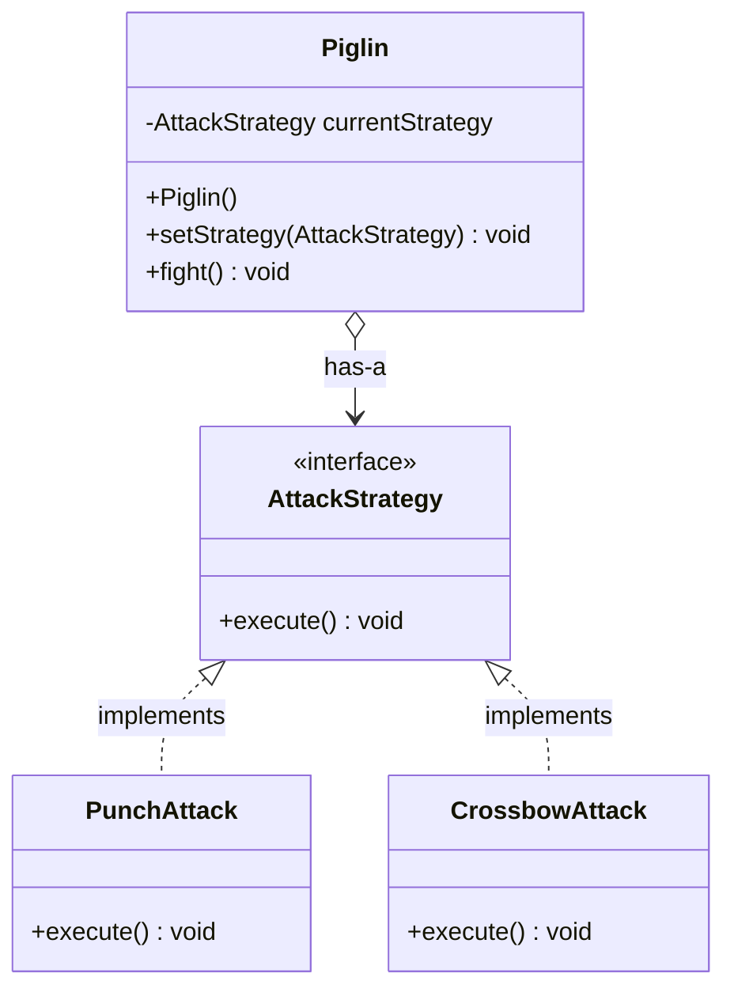
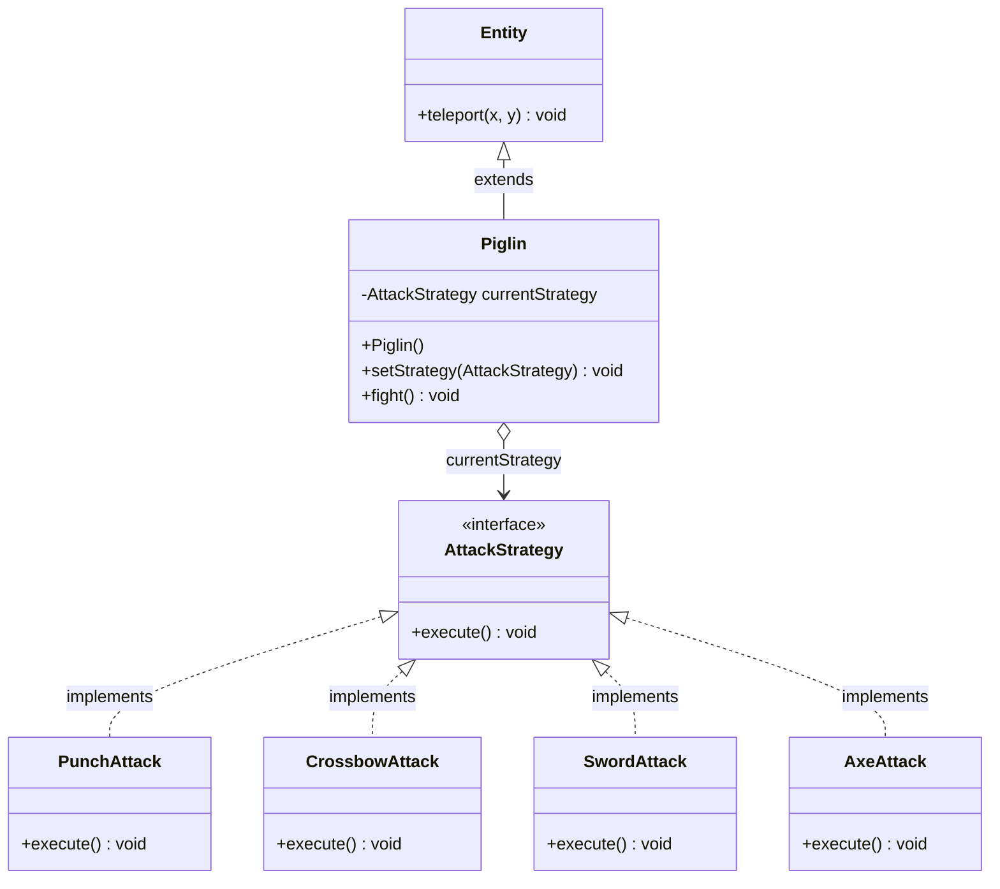
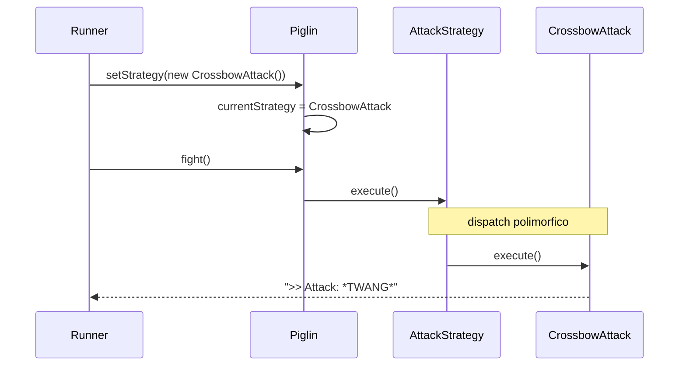

> **Argomenti:** Composizione · Strategy Pattern · Ereditarietà vs Composizione  
> **Prerequisiti:** [[Lezione 07 - Interfacce]] · [[Lezione 06 - Classi Astratte, Overriding, Overloading|Lezione 06 - Classi Astratte]] · [[Lezione 05 - Ereditarietà, Polimorfismo, Object|Lezione 05 - Ereditarietà]]  
> **Bloom's Taxonomy:** Understand · Apply · Evaluate · Analyse

---

## Indice

- [[#1. Ereditarietà vs Composizione|1. Ereditarietà vs Composizione]]
- [[#2. Il Problema — il Piglin|2. Il Problema — il Piglin]]
- [[#3. La Soluzione — Strategy Pattern|3. La Soluzione — Strategy Pattern]]
- [[#4. L'interfaccia AttackStrategy|4. L'interfaccia AttackStrategy]]
- [[#5. PunchAttack e CrossbowAttack|5. PunchAttack e CrossbowAttack]]
- [[#6. La classe Piglin|6. La classe Piglin]]
- [[#7. Il Runner — Strategy Pattern in azione|7. Il Runner — Strategy in azione]]
- [[#8. Struttura Completa del Pattern|8. Struttura Completa del Pattern]]
- [[#9. Quando usare cosa|9. Quando usare cosa]]

---

## 1. Ereditarietà vs Composizione

L'[[Ereditarietà]] è uno strumento potente, ma **rigida**: crea un albero statico basato sulla relazione [[relazione "is-a"|is-a]]. Questa rigidità diventa un problema quando un oggetto ha più "dimensioni" indipendenti di variazione.

### Il problema dell'esplosione combinatoria

Riprendiamo l'esempio dello Smartphone dalla [[Lezione 07 - Interfacce]]: uno smartphone è un Telefono, una Telecamera, un Lettore Musicale e un Browser. Se volessimo modellare queste combinazioni con sole classi, la gerarchia esploderebbe:

```
                         Dispositivo
                             │
              ┌──────────────┼──────────────┐
           Telefono      Telecamera      Lettore
              │               │              │
     ┌────────┴──┐        ┌───┴───┐      ┌───┴───┐
  TelefonoCam  TelMusica CamLett CamTel ...     ...
              │
        TelefonoCamLett
              │
       TelefonoCamLettBrowser
              └── ... (combinatoria infinita)
```

> Questo problema si chiama **[[Fragile Base Class Problem]]** — la base rigida dell'ereditarietà rende il codice fragile e difficile da estendere.

### La soluzione — [[Composizione]]

La **[[Composizione|composizione]]** è un principio secondo cui un oggetto è *composto* da tanti sotto-oggetti di tipo diverso([[relazione 'has-a']]), salvati nei suoi campi. L'oggetto poi **delega** il comportamento specifico ai vari sotto-oggetti.

Questo introduce una relazione diversa dall'[[Ereditarietà|ereditarietà]]:

```
  Ereditarietà   →   relazione  is-a   ("uno Skeleton IS-A Entity")
  Composizione   →   relazione  has-a  ("un Piglin HAS-A AttackStrategy")
```

```
  EREDITARIETÀ (rigida, statica):        COMPOSIZIONE (flessibile, dinamica):

  Skeleton  ──is-a──▶  Entity            Piglin  ──has-a──▶  AttackStrategy
                                                             ▲          ▲
  La classe "Skeleton" non può                        PunchAttack  CrossbowAttack
  cambiare cosa "è" a runtime.
                                         Il Piglin può CAMBIARE strategia
                                         mentre il programma gira!
```

---

> [!question] Quiz — Perché non si può scrivere `class ZombiePiglin extends Piglin, Zombie`?
>
> **Risposta:**
>
> Perché **Java non supporta l'ereditarietà multipla tra classi**. Una classe può estendere una sola superclasse. Questo è una scelta deliberata del linguaggio per evitare il [[Diamond Problem]]:
>
> ```
>        Entity
>        ▲    ▲
>        │    │
>      Zombie Piglin
>        ▲    ▲
>        └────┘
>      ZombiePiglin
>
>   Se sia Zombie che Piglin definissero attack() in modo diverso,
>   quale versione erediterebbe ZombiePiglin? → AMBIGUITÀ irrisolvibile
> ```
>
> Con le **interfacce** l'ereditarietà multipla di tipo è permessa proprio perché non portano implementazione — non c'è ambiguità da risolvere. Ma le classi hanno stato e implementazioni concrete, e Java preferisce vietare l'ereditarietà multipla piuttosto che lasciare questa ambiguità al programmatore.

---

## 2. Il Problema — il Piglin

Supponiamo di voler scrivere la classe `Piglin` in Minecraft. Il problema che emerge subito è la **rigidità a runtime**:

```
  Il Piglin ha una crossbow  →  attacco ranged
  Si rompe la crossbow       →  attacco melee (pugno)
  Raccoglie una spada        →  attacco sword
  Diventa un Brute           →  attacco ascia
```

Se provassimo a risolvere questo con l'ereditarietà:

```
                 Piglin
                   │
        ┌──────────┼──────────┐
        │          │          │
  RangedPiglin  PunchPiglin SwordPiglin
                             │
                        BrutePiglin?
```

Questa soluzione ha problemi seri:

```
  ┌─────────────────────────────────────────────────────────────┐
  │  PROBLEMA 1 — Rigidità a runtime                            │
  │  Un oggetto non può cambiare classe mentre il programma     │
  │  gira. Se il Piglin perde la crossbow, non può "diventare"  │
  │  un PunchPiglin — dovremmo distruggerlo e ricrearlo.        │
  ├─────────────────────────────────────────────────────────────┤
  │  PROBLEMA 2 — Esplosione combinatoria                       │
  │  RangedPiglin + BrutePiglin = RangedBrutePiglin?            │
  │  Il numero di classi cresce esponenzialmente.               │
  ├─────────────────────────────────────────────────────────────┤
  │  PROBLEMA 3 — Duplicazione del codice                       │
  │  La logica dell'attacco crossbow va replicata in ogni       │
  │  classe che ne ha bisogno.                                  │
  └─────────────────────────────────────────────────────────────┘
```

> **La risposta giusta** non è creare tante sottoclassi, ma usare la **composizione**: il `Piglin` *ha una* strategia di attacco, e quella strategia può cambiare nel tempo.

---

## 3. La Soluzione — Strategy Pattern

Lo **Strategy Pattern** è un design pattern comportamentale che risolve il problema della rigidità separando un *comportamento variabile* dalla classe che lo usa, incapsulandolo in oggetti intercambiabili.

### Idea di base

```
  Invece di:                          Facciamo così:

  class Piglin {                      class Piglin {
      void crossbowAttack() {...}         AttackStrategy strategy;
      void punchAttack()   {...}          void fight() {
      void swordAttack()   {...}              strategy.execute();
  }                                       }
                                      }
  ← logica hardcoded nella classe     ← logica DELEGATA al sotto-oggetto
  ← non cambiabile a runtime          ← cambiabile a runtime con setStrategy()
```

### I partecipanti del pattern

```
  ┌─────────────────────────────────────────────────────────────────┐
  │                       STRATEGY PATTERN                          │
  │                                                                 │
  │  ┌───────────────┐         ┌──────────────────────┐             │
  │  │    Context    │ has-a   │  <<interface>>       │             │
  │  │    Piglin     │────────▶│  AttackStrategy      │             │
  │  │               │         │  + execute() : void  │             │
  │  │ - strategy    │         └──────────────────────┘             │
  │  │ + fight()     │                  ▲         ▲                 │
  │  │ + setStrategy │                  │         │                 │
  │  └───────────────┘         ┌────────┴──┐  ┌───┴───────────┐     │
  │                            │PunchAttack│  │CrossbowAttack │     │
  │                            │+execute() │  │+execute()     │     │
  │                            └───────────┘  └───────────────┘     │
  └─────────────────────────────────────────────────────────────────┘

  Context     = la classe che usa la strategia (Piglin)
  Strategy    = l'interfaccia comune a tutte le strategie (AttackStrategy)
  ConcreteStrategy = le implementazioni specifiche (PunchAttack, CrossbowAttack)
```

### Struttura dei package

```
  lecture08/
  ├── Lecture8.java                    ← Runner
  └── strategy/
      ├── Piglin.java                  ← Context
      └── strategies/
          ├── AttackStrategy.java      ← Strategy (interfaccia)
          ├── PunchAttack.java         ← ConcreteStrategy
          └── CrossbowAttack.java      ← ConcreteStrategy
```

---

## 4. L'interfaccia `AttackStrategy`

```java
package lecture08.strategy.strategies;

public interface AttackStrategy {
    void execute();
}
```

Questa interfaccia rappresenta l'**obbligo di saper eseguire un attacco**. Definisce solo un'azione: `execute()`. Il contratto è minimalista e preciso:

> Qualsiasi variabile di tipo `AttackStrategy` deve poter fare `execute()` — nulla di più, nulla di meno.

```
┌─────────────────────────┐
│     <<interface>>       │
│     AttackStrategy      │
├─────────────────────────┤
│ + execute() : void      │
└─────────────────────────┘
         ▲         ▲
         │         │
  PunchAttack  CrossbowAttack
  (+ altre strategie future)
```

L'interfaccia è il **punto di estensione** del pattern: per aggiungere un nuovo tipo di attacco, basta creare una nuova classe che la implementa, senza toccare `Piglin` o le strategie esistenti.

---

## 5. `PunchAttack` e `CrossbowAttack`

```java
package lecture08.strategy.strategies;

public class PunchAttack implements AttackStrategy {
    @Override
    public void execute() {
        System.out.println(">> Attack: *Punch* (Melee Hit)");
    }
}
```

```java
package lecture08.strategy.strategies;

public class CrossbowAttack implements AttackStrategy {
    @Override
    public void execute() {
        System.out.println(">> Attack: *TWANG* (Fired Arrow)");
    }
}
```

Queste classi **incapsulano** ciascuna la propria logica di attacco. Ogni classe specializza `execute()` con il proprio comportamento specifico. Il `Piglin` non sa nulla di questi dettagli — li delega completamente.

```
  PunchAttack    →  logica melee (contatto diretto, danno fisso)
  CrossbowAttack →  logica ranged (calcolo distanza, consumo frecce, ...)
  SwordAttack    →  (da aggiungere) logica spada
  AxeAttack      →  (da aggiungere per i Brute) logica ascia
```

---

> [!question] Quiz — Come possiamo modellare la logica della crossbow che si rompe?
>
> **Risposta:**
>
> La crossbow che si rompe è un comportamento che appartiene alla **strategia stessa**, non al `Piglin`. Si può aggiungere uno stato interno a `CrossbowAttack` che traccia la durabilità, e quando si esaurisce la strategia si "auto-sostituisce" notificando il Piglin, oppure più semplicemente il Piglin controlla e cambia strategia dopo ogni uso.
>
> Approccio 1 — **durabilità nella strategia**:
>
> ```java
> public class CrossbowAttack implements AttackStrategy {
>     private int durability = 3;  // si rompe dopo 3 colpi
>
>     @Override
>     public void execute() {
>         if (durability > 0) {
>             System.out.println(">> *TWANG* (Fired Arrow) — durability: " + durability);
>             durability--;
>         } else {
>             System.out.println(">> Crossbow is broken! No attack.");
>         }
>     }
>
>     public boolean isBroken() { return durability <= 0; }
> }
> ```
>
> Approccio 2 — **il Piglin controlla e cambia strategia**:
>
> ```java
> public void fight() {
>     currentStrategy.execute();
>     if (currentStrategy instanceof CrossbowAttack cb && cb.isBroken()) {
>         System.out.println("Crossbow broke! Switching to melee.");
>         setStrategy(new PunchAttack());
>     }
> }
> ```
>
> Il punto chiave è che **nessun cambiamento è necessario nella struttura del pattern** — si estende solo il comportamento della strategia concreta.

---

> [!question] Quiz — Come facciamo la sword strategy?
>
> **Risposta:**
>
> Basta creare una nuova classe che implementa `AttackStrategy`. Non si tocca né `Piglin` né le altre strategie:
>
> ```java
> public class SwordAttack implements AttackStrategy {
>     @Override
>     public void execute() {
>         System.out.println(">> Attack: *SLASH* (Sword Strike)");
>     }
> }
> ```
>
> E per usarla nel runner:
>
> ```java
> monster.setStrategy(new SwordAttack());
> monster.fight();   // Piglin acts: >> Attack: *SLASH* (Sword Strike)
> ```
>
> Questo è esattamente il vantaggio del pattern: il sistema è **aperto all'estensione** (nuove strategie) ma **chiuso alla modifica** (non si tocca il codice esistente). Questo principio si chiama [[Open-Closed Principle]] ed è uno dei principi [[SOLID]].

---

> [!question] Quiz — Come possiamo modellare un Brute?
>
> **Risposta:**
>
> Un `PiglinBrute` è sempre un `Piglin` — la sua identità non cambia — ma usa una strategia diversa (l'ascia). Si modella in due modi:
>
> **Opzione A — nuova strategia + stesso Piglin:**
>
> ```java
> public class AxeAttack implements AttackStrategy {
>     @Override
>     public void execute() {
>         System.out.println(">> Attack: *CHOP* (Axe Strike — +50% damage)");
>     }
> }
>
> // Nel runner:
> Piglin brute = new Piglin();
> brute.setStrategy(new AxeAttack());
> ```
>
> **Opzione B — sottoclasse PiglinBrute con strategia di default diversa:**
>
> ```java
> public class PiglinBrute extends Piglin {
>     public PiglinBrute() {
>         super();
>         this.setStrategy(new AxeAttack());  // strategia di default è l'ascia
>     }
> }
> ```
>
> L'opzione B ha senso se il `PiglinBrute` ha anche **stato aggiuntivo** (più vita, più danno base, ecc.). In quel caso l'ereditarietà modella l'identità (`PiglinBrute IS-A Piglin`) mentre la composizione modella il comportamento (`PiglinBrute HAS-A AxeAttack`). Le due tecniche si **combinano**.

---

## 6. La classe `Piglin`

```java
package lecture08.strategy;
import lecture08.strategy.strategies.AttackStrategy;
import lecture08.strategy.strategies.PunchAttack;

public class Piglin {

    private AttackStrategy currentStrategy;   // has-a relation → composizione

    public Piglin() {
        this.currentStrategy = new PunchAttack();   // strategia di default
    }

    public void setStrategy(AttackStrategy newStrategy) {
        this.currentStrategy = newStrategy;
        System.out.println("Piglin changed strategy to " +                                                  newStrategy.getClass().getSimpleName());
    }

    public void fight() {
        if (currentStrategy == null) {
            System.out.println("Piglin stands still (No Strategy).");
            return;
        }
        System.out.print("Piglin acts: ");
        currentStrategy.execute(); // DELEGA al sotto-oggetto → senza questa non                                       è una strategy
    }
}
```

### Analisi dei componenti chiave

```
  ┌──────────────────────────────────────────────────────────────┐
  │  private AttackStrategy currentStrategy;                     │
  │                                                              │
  │  Il campo è di tipo INTERFACCIA, non di tipo concreto.       │
  │  Il Piglin non sa se dentro c'è un PunchAttack, un           │
  │  CrossbowAttack o altro — gli basta sapere che può           │
  │  chiamare execute() su di esso.                              │
  └──────────────────────────────────────────────────────────────┘

  ┌──────────────────────────────────────────────────────────────┐
  │  public void setStrategy(AttackStrategy newStrategy)         │
  │                                                              │
  │  Il setter permette di CAMBIARE la strategia a runtime.      │
  │  Questo è il cuore del pattern: comportamento dinamico       │
  │  senza cambiare la classe Piglin.                            │
  └──────────────────────────────────────────────────────────────┘

  ┌──────────────────────────────────────────────────────────────┐
  │  currentStrategy.execute();                                  │
  │                                                              │
  │  La DELEGA. Il Piglin non implementa la logica dell'attacco  │
  │  — la chiede al sotto-oggetto. Questo è il momento in cui    │
  │  il polimorfismo entra in gioco: execute() chiamerà          │
  │  l'implementazione della strategia corrente.                 │
  └──────────────────────────────────────────────────────────────┘
```

> **Nota Bene:** Il `Piglin` non sa *come* fare danno — delega interamente questo comportamento al contenuto di `currentStrategy`. Questo è il principio di **[[Separation of Concerns]]**: il Piglin gestisce la propria identità e stato, la strategia gestisce il comportamento d'attacco.



---

## 7. Il Runner — Strategy Pattern in azione

```java
package lecture08;
import lecture08.strategy.strategies.*;
import lecture08.strategy.Piglin;

public class Lecture8 {
    public static void main(String[] args) {
        System.out.println("--- Strategy pattern ---");
        strategyPatternExample();
    }

    public static void strategyPatternExample() {
        Piglin monster = new Piglin();          // strategia di default: PunchAttack

        System.out.println("\n--- Round 1: Default Behavior ---");
        monster.fight();
        // Output: Piglin acts: >> Attack: *Punch* (Melee Hit)

        System.out.println("\n--- Round 2: Picking up a crossbow ---");
        monster.setStrategy(new CrossbowAttack());   // cambio di strategia a runtime
        monster.fight();
        // Output: Piglin changed strategy to CrossbowAttack
        //         Piglin acts: >> Attack: *TWANG* (Fired Arrow)
    }
}
```

### Esecuzione passo per passo

```
  1. new Piglin()
     → costruttore chiama: this.currentStrategy = new PunchAttack()
     → stato iniziale:  [Piglin | strategy → PunchAttack]

  2. monster.fight()
     → chiama currentStrategy.execute()
     → dispatch polimorfico → PunchAttack.execute()
     → stampa: "Piglin acts: >> Attack: *Punch* (Melee Hit)"

  3. monster.setStrategy(new CrossbowAttack())
     → currentStrategy ora punta a CrossbowAttack
     → stato aggiornato: [Piglin | strategy → CrossbowAttack]
     → il vecchio PunchAttack viene abbandonato (GC lo raccoglierà)

  4. monster.fight()
     → chiama currentStrategy.execute()
     → dispatch polimorfico → CrossbowAttack.execute()
     → stampa: "Piglin acts: >> Attack: *TWANG* (Fired Arrow)"
```

---

## 8. Struttura Completa del Pattern

### Diagramma UML completo



### Flusso di una chiamata `fight()`



### ASCII — confronto prima e dopo il pattern

```
  PRIMA (senza Strategy Pattern):
  ──────────────────────────────
  Piglin
  ├── crossbowAttack() { ... logica crossbow ... }
  ├── punchAttack()    { ... logica pugno ... }
  └── swordAttack()   { ... logica spada ... }

  Per aggiungere l'ascia → modifica Piglin
  Per cambiare a runtime → if/else gigantesco dentro fight()


  DOPO (con Strategy Pattern):
  ─────────────────────────────
  Piglin
  └── fight() { currentStrategy.execute() }   ← mai da modificare

  AttackStrategy  ←  PunchAttack    { execute() { pugno } }
                  ←  CrossbowAttack { execute() { freccia } }
                  ←  SwordAttack    { execute() { spadata } }
                  ←  AxeAttack      { execute() { ascia } }

  Per aggiungere l'ascia → nuova classe, zero modifiche al resto
  Per cambiare a runtime → setStrategy(new AxeAttack())
```

---

## 9. Quando usare cosa

### Regola pratica — identità vs comportamento

```
  ┌────────────────────────────────────────────────────────────────┐
  │  USA L'EREDITARIETÀ per modellare l'IDENTITÀ                   │
  │                                                                │
  │  "Cosa è questo oggetto?"                                      │
  │  → Piglin IS-A Entity (ha coordinate, interagisce col motore)  │
  │  → Zombie IS-A Entity                                          │
  │                                                                │
  │  Implementa con: extends + classi astratte per lo stato        │
  └────────────────────────────────────────────────────────────────┘

  ┌────────────────────────────────────────────────────────────────┐
  │  USA LA COMPOSIZIONE per modellare il COMPORTAMENTO            │
  │                                                                │
  │  "Cosa fa questo oggetto? Come lo fa?"                         │
  │  → Piglin HAS-A AttackStrategy                                 │
  │  → il comportamento può variare nel tempo                      │
  │                                                                │
  │  Implementa con: interfacce + campi che le contengono          │
  └────────────────────────────────────────────────────────────────┘
```

> **Minecraft come esempio reale:** Minecraft usa `extends` per `Block`, `Item` ed `Entity` perché queste classi gestiscono logica del game engine (rendering, collisioni, networking) che non cambia — è *identità*. Il comportamento specifico di ogni mob (attacco, AI, drop) è invece più variabile e si presta alla composizione.

### Vantaggi e svantaggi a confronto

```
                      Ereditarietà     Composizione
                      ────────────     ────────────
Riuso del codice          ✅               ✅
Cambiamento a runtime     ❌               ✅
Esplosione combinatoria   ❌ (problema)    ✅ (evitata)
Leggibilità               ✅ (semplice)    ⚠️ (più pezzi)
Accoppiamento             ❌ (alto)        ✅ (basso)
Estendibilità             ⚠️               ✅
```

---

## Recap Visuale — Lezione 8

```
  PROBLEMA:
  Il comportamento di un Piglin cambia a runtime (crossbow → pugno → spada).
  L'ereditarietà non può gestire questo senza esplodere in sottoclassi.

  SOLUZIONE — Strategy Pattern:
  ┌─────────────────────────────────────────────────┐
  │                                                 │
  │  Piglin  ──has-a──▶  AttackStrategy             │
  │  (Context)           (interfaccia Strategy)     │
  │                           ▲     ▲     ▲         │
  │                      Punch Cross Sword ...      │
  │                      (ConcreteStrategies)       │
  │                                                 │
  │  Piglin.fight() → delega a currentStrategy.execute()
  │  Cambio strategia → setStrategy(nuovaStrategia) │
  │                                                 │
  └─────────────────────────────────────────────────┘

  PRINCIPIO CHIAVE:
  "Favorire la composizione rispetto all'ereditarietà"
  → Composition over Inheritance
```

---

## Concetti Collegati

- [[Lezione 07 - Interfacce]] — le interfacce sono il meccanismo che rende possibile lo Strategy Pattern
- [[Ereditarietà]] — la tecnica che lo Strategy Pattern affianca e talvolta sostituisce
- [[Diamond Problem]] — il problema che l'ereditarietà multipla introduce, evitato con la composizione
- [[Design Pattern]] — lo Strategy è uno dei 23 pattern classici del libro [[Gang of Four]]
- [[SOLID]] — lo Strategy Pattern applica l'[[Open-Closed Principle]] (aperto all'estensione, chiuso alla modifica)
- [[Separation of Concerns]] — il Piglin non sa come fare danno, lo delega
- [[Fragile Base Class Problem]] — il problema architetturale che la composizione risolve
- [[Polimorfismo]] — il dispatch polimorfico su `execute()` è ciò che rende il pattern funzionante
- [[Lezione 09]] — prossima lezione

---

## Link Utili

- [Wikipedia: Composition over inheritance](https://en.wikipedia.org/wiki/Composition_over_inheritance)
- [StackOverflow: Why favor composition over inheritance?](https://stackoverflow.com/questions/49002/prefer-composition-over-inheritance) — discussione classica, ancora rilevante
- [GameProgrammingPatterns: Component Pattern](https://gameprogrammingpatterns.com/component.html) — versione game-oriented dello stesso principio
- [Wikipedia: Fragile Base Class Problem](https://en.wikipedia.org/wiki/Fragile_base_class) — nome architetturale del problema della rigidità
- [Codice — Lecture8.java](https://github.com/squera/-unitn-Programmazione2/blob/main/src/lecture08/Lecture8.java)
- [Codice — Piglin.java](https://github.com/squera/-unitn-Programmazione2/blob/main/src/lecture08/strategy/Piglin.java)
- [Codice — AttackStrategy.java](https://github.com/squera/-unitn-Programmazione2/blob/main/src/lecture08/strategy/strategies/AttackStrategy.java)
- [Codice — CrossbowAttack.java](https://github.com/squera/-unitn-Programmazione2/blob/main/src/lecture08/strategy/strategies/CrossbowAttack.java)
- [Codice — PunchAttack.java](https://github.com/squera/-unitn-Programmazione2/blob/main/src/lecture08/strategy/strategies/PunchAttack.java)

---

*Tags: #java #strategy-pattern #composizione #OOP #design-patterns #programmazione2*
